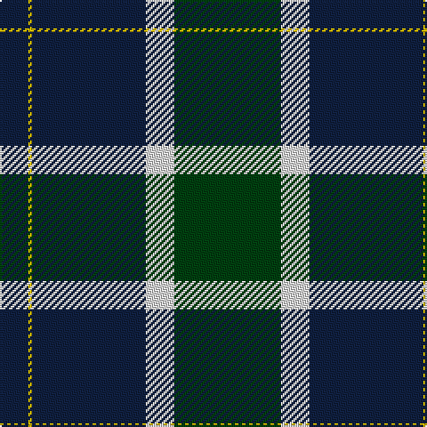

In pattern [BYBWG](/patterns/bybwg/).

This was sourced from weddslist.  It is a [5 stripes tartan](/stripes/stripes5/).

Original link http://www.weddslist.com/cgi-bin/tartans/pg.pl?source=sts

## Thread count
DB/16 Y2 DB64 LN16 DG/60

## Palette
Each colour and its ΔE from the base-6 reference it is a variant of.

| Colour | Shade | Base | ΔE (OKLab) |
|---|---|---|---|
| DB | <code style="background-color:#102040;">#102040</code> `#102040` | B <code style="background-color:#2C4084;">#2C4084</code> | 0.15 |
| DG | <code style="background-color:#004010;">#004010</code> `#004010` | G <code style="background-color:#006400;">#006400</code> | 0.12 |
| LN | <code style="background-color:#E0E0E0;">#E0E0E0</code> `#E0E0E0` | W <code style="background-color:#F4F4F0;">#F4F4F0</code> | 0.06 |
| Y | <code style="background-color:#F0C000;">#F0C000</code> `#F0C000` | Y <code style="background-color:#E8C000;">#E8C000</code> | 0.01 |

# Sample pattern

## Nearest tartans

The nearest existing variants by ΔTartan distance.

1. [Hamworthy Association](/setts/s4/k82y32g28w4-g003c14-k101010-we0e0e0-y48a4c0/) — ΔT 1.06
1. [Unidentified Furnishing #2](/setts/s6/r8g80k42y4k42g4-g50783c-k000034-rc82800-yc88c00/) — ΔT 1.14
1. [Wimbledon](/setts/s5/g60w16b64y2b16-b2c2c80-g006818-wfcfcfc-ye8c000/) — ΔT 1.17
1. [MacRobart](/setts/s6/b144k42g32ba6g34ba6-b304080-ba5480b0-g008000-k000000/) — ΔT 1.23
1. [Bro-Spirit of Northmen (Corporate)](/setts/s5/r6k2b54k54w6-b1474b4-k101010-r880000-we0e0e0/) — ΔT 1.31
1. [Connacht Irish District Tartan Tartan Number: 4485. Earliest known date: 1994 Phil Smith obtained in Perthshire from a swatch dated 1994 shown to him by Keith Lumsden of the Scottish Tartans Society. However www.uniq-orn.com shows this as Connaught Green. See products available Copyright © Blair Urquhart, Comrie, 2015](/setts/s6/r4b64g28b10g32w4-b202060-g288028-ra00000-we0e0e0/) — ΔT 1.40
1. [Sinclair, Sir John](/setts/s4/b32k12g16y2-b304080-g008000-k000000-yf0c000/) — ΔT 1.40
1. [Martinez, Clément (Personal)](/setts/s6/b88k64y16k44ba8bb4-b003c64-ba780078-bb5c5c5c-k101010-ye8c000/) — ΔT 1.44
1. [MacFadzean](/setts/s6/b96w4k40g44r6g8-b304080-g008000-k000000-rc00000-we0e0e0/) — ΔT 1.46
1. [Oliphant](/setts/s6/b8k8b48g64w2g4-b00004c-g004c00-k000000-wd0d0d0/) — ΔT 1.50

## Neighbour map

Every grey dot is one of 15726 variants placed by the first two principal components of the ΔTartan feature space (44% of its variance). Red is this tartan; blue dots are its nearest — click one to open its page.

<svg viewBox="0 0 640 380" role="img" style="max-width:100%;height:auto;border:1px solid #e0e0e0;border-radius:4px;display:block" xmlns="http://www.w3.org/2000/svg"><image href="/nn/cloud.v1.png" width="640" height="380"/><a href="/setts/s4/k82y32g28w4-g003c14-k101010-we0e0e0-y48a4c0/"><circle cx="310.2" cy="212.2" r="4" fill="#3465a4"><title>Hamworthy Association</title></circle></a><a href="/setts/s6/r8g80k42y4k42g4-g50783c-k000034-rc82800-yc88c00/"><circle cx="295.4" cy="183.6" r="4" fill="#3465a4"><title>Unidentified Furnishing #2</title></circle></a><a href="/setts/s5/g60w16b64y2b16-b2c2c80-g006818-wfcfcfc-ye8c000/"><circle cx="302.2" cy="178.9" r="4" fill="#3465a4"><title>Wimbledon</title></circle></a><a href="/setts/s6/b144k42g32ba6g34ba6-b304080-ba5480b0-g008000-k000000/"><circle cx="323.8" cy="169.9" r="4" fill="#3465a4"><title>MacRobart</title></circle></a><a href="/setts/s5/r6k2b54k54w6-b1474b4-k101010-r880000-we0e0e0/"><circle cx="300.1" cy="172.3" r="4" fill="#3465a4"><title>Bro-Spirit of Northmen (Corporate)</title></circle></a><a href="/setts/s6/r4b64g28b10g32w4-b202060-g288028-ra00000-we0e0e0/"><circle cx="320.7" cy="199.6" r="4" fill="#3465a4"><title>Connacht Irish District Tartan Tartan Number: 4485. Earliest known date: 1994 Phil Smith obtained in Perthshire from a swatch dated 1994 shown to him by Keith Lumsden of the Scottish Tartans Society. However www.uniq-orn.com shows this as Connaught Green. See products available Copyright © Blair Urquhart, Comrie, 2015</title></circle></a><a href="/setts/s4/b32k12g16y2-b304080-g008000-k000000-yf0c000/"><circle cx="263.3" cy="225.3" r="4" fill="#3465a4"><title>Sinclair, Sir John</title></circle></a><a href="/setts/s6/b88k64y16k44ba8bb4-b003c64-ba780078-bb5c5c5c-k101010-ye8c000/"><circle cx="292.5" cy="184.7" r="4" fill="#3465a4"><title>Martinez, Clément (Personal)</title></circle></a><a href="/setts/s6/b96w4k40g44r6g8-b304080-g008000-k000000-rc00000-we0e0e0/"><circle cx="255.0" cy="152.7" r="4" fill="#3465a4"><title>MacFadzean</title></circle></a><a href="/setts/s6/b8k8b48g64w2g4-b00004c-g004c00-k000000-wd0d0d0/"><circle cx="368.8" cy="177.8" r="4" fill="#3465a4"><title>Oliphant</title></circle></a><circle cx="319.3" cy="190.4" r="5" fill="#c00000"/></svg>

ID: /setts/s5/g60w16b64y2b16-b102040-g004010-we0e0e0-yf0c000/
