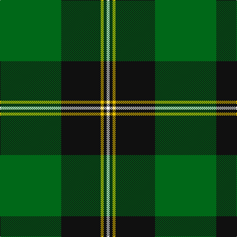

This page is one **sett** — a single exact thread-count. It belongs to the [tartan](/tartans/g62k40y3k3w3/)
(the same proportion at any scale), whose colour order is pattern [GKYKW](/stripes/gkykw/).

Sourced from register-of-tartans.  It is a [5 stripe tartan](/stripes/stripes5/).

Original link https://www.tartanregister.gov.uk/tartanDetails.aspx?ref=3219

2 attestations — the source records this cloth was collapsed from (oldest owns this page)

<ul>
<li>01/01/2003 — O'Donoghue (register-of-tartans, <a href="https://www.tartanregister.gov.uk/tartanDetails.aspx?ref=3219">record</a>)</li>
<li>2003 — O'Donoghue (Fashion?) (tartans-authority, <a href="http://www.tartansauthority.com/tartan-ferret/display/6399/">record</a>)</li>
</ul>

## Register references

External register numbers recorded for this tartan.

- Scottish Register of Tartans: [3219](https://www.tartanregister.gov.uk/tartanDetails.aspx?ref=3219)
- Scottish Tartans Authority (ITI): 6399

## Thread count
G/124 K80 Y6 K6 W/6

## Palette
Each colour and the base-6 reference it is a variant of.

| Colour | Shade | Base |
|---|---|---|
| G | <code style="background-color:#006818;">#006818</code> `oklch(45.0% 0.142 145.0)` <small>#006818</small> | G <code style="background-color:#006100;">#006100</code> |
| K | <code style="background-color:#101010;">#101010</code> `oklch(17.3% 0.000 89.9)` <small>#101010</small> | K <code style="background-color:#000000;">#000000</code> |
| W | <code style="background-color:#F8F8F8;">#F8F8F8</code> `oklch(97.9% 0.000 89.9)` <small>#F8F8F8</small> | W <code style="background-color:#F7F7F7;">#F7F7F7</code> |
| Y | <code style="background-color:#E8C000;">#E8C000</code> `oklch(81.9% 0.168 93.7)` <small>#E8C000</small> | Y <code style="background-color:#F2BF00;">#F2BF00</code> |

# Sample pattern

## Nearest tartans

The nearest existing variants by ΔTartan distance, with this tartan at the top so the swatches line up against it.

ΔTartan

Tartan

Sett

—

<a href="/ttd/edit/#slug=g62k40ly3k3w3~x2">O'Donoghue</a> <a class="nn-out" href="/setts/s5/g62k40ly3k3w3~x2/" title="open its dictionary page">↗</a>

0.84

<a href="/ttd/edit/#slug=g55k17r9k11ly2k4~x2">Moran (Name)</a> <a class="nn-out" href="/setts/s6/g55k17r9k11ly2k4~x2/" title="open its dictionary page">↗</a>

1.13

<a href="/ttd/edit/#slug=g3r1k14g14lo1~x4">Wcwm 1255</a> <a class="nn-out" href="/setts/s5/g3r1k14g14lo1~x4/" title="open its dictionary page">↗</a>

1.15

<a href="/ttd/edit/#slug=r3g30k12g6k16ly2~x2">MacArthur (Variant)</a> <a class="nn-out" href="/setts/s6/r3g30k12g6k16ly2~x2/" title="open its dictionary page">↗</a>

1.16

<a href="/ttd/edit/#slug=g15ly2k30g32r3w2~x2">Merwe</a> <a class="nn-out" href="/setts/s6/g15ly2k30g32r3w2~x2/" title="open its dictionary page">↗</a>

1.23

<a href="/ttd/edit/#slug=g18db9k1db1w1~x4">Irvine</a> <a class="nn-out" href="/setts/s5/g18db9k1db1w1~x4/" title="open its dictionary page">↗</a>

1.28

<a href="/ttd/edit/#slug=r3g30k12g1k16lo2~x2">MacArthur-Fox Htg (Personal)</a> <a class="nn-out" href="/setts/s6/r3g30k12g1k16lo2~x2/" title="open its dictionary page">↗</a>

1.29

<a href="/ttd/edit/#slug=g55k17r9k11ly2db4~x2">Moran Family Tartan Tartan Number: 675. Earliest known date: 1986 The designers requested that the threadcount be Restricted. See products available Copyright © Blair Urquhart, Comrie, 2015</a> <a class="nn-out" href="/setts/s6/g55k17r9k11ly2db4~x2/" title="open its dictionary page">↗</a>

1.32

<a href="/ttd/edit/#slug=r1dg16k8dg3k4ly1">Forbes VS</a> <a class="nn-out" href="/setts/s6/r1dg16k8dg3k4ly1/" title="open its dictionary page">↗</a>

1.32

<a href="/ttd/edit/#slug=g25k8y10r1y3~x4">Herbage</a> <a class="nn-out" href="/setts/s5/g25k8y10r1y3~x4/" title="open its dictionary page">↗</a>

1.33

<a href="/ttd/edit/#slug=k6g4g44k41w4~x2">Raeside</a> <a class="nn-out" href="/setts/s5/k6g4g44k41w4~x2/" title="open its dictionary page">↗</a>

## Neighbour map

Every grey dot is one of 14299 variants placed by the first two principal components of the ΔTartan feature space (44% of its variance). Red is this tartan; blue dots are its nearest — click one to open its page.

<svg viewBox="0 0 640 380" role="img" style="max-width:100%;height:auto;border:1px solid #e0e0e0;border-radius:4px;display:block" xmlns="http://www.w3.org/2000/svg"><image href="/nn/cloud.v1.png" width="640" height="380"/><a href="/setts/s6/g55k17r9k11ly2k4~x2/"><circle cx="369.9" cy="171.1" r="4" fill="#3465a4"><title>Moran (Name)</title></circle></a><a href="/setts/s5/g3r1k14g14lo1~x4/"><circle cx="337.7" cy="223.3" r="4" fill="#3465a4"><title>Wcwm 1255</title></circle></a><a href="/setts/s6/r3g30k12g6k16ly2~x2/"><circle cx="319.5" cy="213.9" r="4" fill="#3465a4"><title>MacArthur (Variant)</title></circle></a><a href="/setts/s6/g15ly2k30g32r3w2~x2/"><circle cx="313.2" cy="184.5" r="4" fill="#3465a4"><title>Merwe</title></circle></a><a href="/setts/s5/g18db9k1db1w1~x4/"><circle cx="379.9" cy="193.3" r="4" fill="#3465a4"><title>Irvine</title></circle></a><a href="/setts/s6/r3g30k12g1k16lo2~x2/"><circle cx="348.3" cy="184.8" r="4" fill="#3465a4"><title>MacArthur-Fox Htg (Personal)</title></circle></a><a href="/setts/s6/g55k17r9k11ly2db4~x2/"><circle cx="345.4" cy="155.8" r="4" fill="#3465a4"><title>Moran Family Tartan Tartan Number: 675. Earliest known date: 1986 The designers requested that the threadcount be Restricted. See products available Copyright © Blair Urquhart, Comrie, 2015</title></circle></a><a href="/setts/s6/r1dg16k8dg3k4ly1/"><circle cx="340.5" cy="198.4" r="4" fill="#3465a4"><title>Forbes VS</title></circle></a><a href="/setts/s5/g25k8y10r1y3~x4/"><circle cx="301.9" cy="181.5" r="4" fill="#3465a4"><title>Herbage</title></circle></a><a href="/setts/s5/k6g4g44k41w4~x2/"><circle cx="289.7" cy="220.9" r="4" fill="#3465a4"><title>Raeside</title></circle></a><circle cx="362.9" cy="187.4" r="5" fill="#c00000"/></svg>

ID: /setts/s5/g62k40ly3k3w3~x2/
