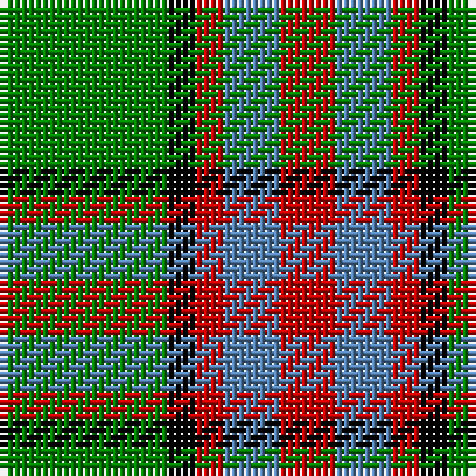

In pattern [GKRBR](/stripes/gkrbr/).

This was sourced from weddslist.  It is a [5 stripe tartan](/stripes/stripes5/).

Original link http://www.weddslist.com/cgi-bin/tartans/pg.pl?source=sts

## Also known as

This cloth is also recorded under:

- Wilson's, No 193

## Thread count
G/24 K4 R4 B8 R/8

## Palette
Each colour and the base-6 reference it is a variant of.

| Colour | Shade | Base |
|---|---|---|
| B | <code style="background-color:#5480B0;">#5480B0</code> `oklch(58.8% 0.089 251.5)` <small>#5480B0</small> | B <code style="background-color:#2A418A;">#2A418A</code> |
| G | <code style="background-color:#008000;">#008000</code> `oklch(52.0% 0.177 142.5)` <small>#008000</small> | G <code style="background-color:#006100;">#006100</code> |
| K | <code style="background-color:#000000;">#000000</code> `oklch(0.0% 0.000 0.0)` <small>#000000</small> | K <code style="background-color:#000000;">#000000</code> |
| R | <code style="background-color:#C00000;">#C00000</code> `oklch(50.7% 0.208 29.2)` <small>#C00000</small> | R <code style="background-color:#CC0000;">#CC0000</code> |

# Sample pattern

## Nearest tartans

The nearest existing variants by ΔTartan distance.

1. [Wilson's, No 179](/setts/s5/g6ly1r1t2r2~x4/) — ΔT 1.02
1. [Phinn (Personal)](/setts/s5/dg11dg3r4ly2w2~x10/) — ΔT 1.14
1. [Harmer (Corporate)](/setts/s7/lo12dg4lo24k9lo8dg36r4/) — ΔT 1.14
1. [ChuMac (Personal)](/setts/s5/g15ly3r3dp8w2~x6/) — ΔT 1.17
1. [Wilson's No.195](/setts/s4/r5g7k2t1~x4/) — ΔT 1.21
1. [Wilson's, No 195](/setts/s4/lo5g7k1t1~x4/) — ΔT 1.24
1. [Delroeux (Personal)](/setts/s4/db3g6ly1r3~x10/) — ΔT 1.30
1. [Moore Caledonian (Personal)](/setts/s6/r1k6g6ly1g6ly1~x6/) — ΔT 1.31
1. [Bronte House Check (Fashion)](/setts/s6/r10dy60dt13lb24dt24dy8/) — ΔT 1.31
1. [Newfoundland](/setts/s7/r6g4do14w4do7g30lo4~x2/) — ΔT 1.35

## Neighbour map

Every grey dot is one of 14299 variants placed by the first two principal components of the ΔTartan feature space (44% of its variance). Red is this tartan; blue dots are its nearest — click one to open its page.

<svg viewBox="0 0 640 380" role="img" style="max-width:100%;height:auto;border:1px solid #e0e0e0;border-radius:4px;display:block" xmlns="http://www.w3.org/2000/svg"><image href="/nn/cloud.v1.png" width="640" height="380"/><a href="/setts/s5/g6ly1r1t2r2~x4/"><circle cx="245.2" cy="243.1" r="4" fill="#3465a4"><title>Wilson's, No 179</title></circle></a><a href="/setts/s5/dg11dg3r4ly2w2~x10/"><circle cx="191.5" cy="223.8" r="4" fill="#3465a4"><title>Phinn (Personal)</title></circle></a><a href="/setts/s7/lo12dg4lo24k9lo8dg36r4/"><circle cx="238.8" cy="207.3" r="4" fill="#3465a4"><title>Harmer (Corporate)</title></circle></a><a href="/setts/s5/g15ly3r3dp8w2~x6/"><circle cx="205.8" cy="210.4" r="4" fill="#3465a4"><title>ChuMac (Personal)</title></circle></a><a href="/setts/s4/r5g7k2t1~x4/"><circle cx="232.8" cy="258.8" r="4" fill="#3465a4"><title>Wilson's No.195</title></circle></a><a href="/setts/s4/lo5g7k1t1~x4/"><circle cx="236.9" cy="234.8" r="4" fill="#3465a4"><title>Wilson's, No 195</title></circle></a><a href="/setts/s4/db3g6ly1r3~x10/"><circle cx="194.8" cy="269.2" r="4" fill="#3465a4"><title>Delroeux (Personal)</title></circle></a><a href="/setts/s6/r1k6g6ly1g6ly1~x6/"><circle cx="262.6" cy="243.2" r="4" fill="#3465a4"><title>Moore Caledonian (Personal)</title></circle></a><a href="/setts/s6/r10dy60dt13lb24dt24dy8/"><circle cx="232.2" cy="220.2" r="4" fill="#3465a4"><title>Bronte House Check (Fashion)</title></circle></a><a href="/setts/s7/r6g4do14w4do7g30lo4~x2/"><circle cx="233.0" cy="196.9" r="4" fill="#3465a4"><title>Newfoundland</title></circle></a><circle cx="225.1" cy="236.6" r="5" fill="#c00000"/></svg>

ID: /setts/s5/g6k1r1t2r2~x4/
