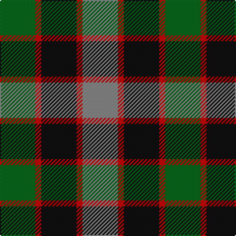

In pattern [GRKRR](/patterns/grkrr/).

This was sourced from register-of-tartans.  It is a [5 stripes tartan](/stripes/stripes5/).

Original link https://www.tartanregister.gov.uk/tartanDetails.aspx?ref=4127

## Attestations

This cloth appears in 3 source records; the oldest owns this page.

- 01/01/2002 — Timespan (register-of-tartans, [record](https://www.tartanregister.gov.uk/tartanDetails.aspx?ref=4127))
- pre 2002 — Timespan (Corporate) (tartans-authority, [record](http://www.tartansauthority.com/tartan-ferret/display/1002/))
- undated — Timespan (MacKay) Corporate Tartan Tartan Number: 1002. Earliest known date: 1989 Based on MacKay of Strathnaver for 'Timespan Heritage Centre' at Helmsdale See products available Copyright © Blair Urquhart, Comrie, 2015 (house-of-tartan, [record](http://www.house-of-tartan.scotland.net/house/TartanViewjs.asp?colr=Def&tnam=1002))

## Thread count
G/36 R6 K36 R6 N/36

## Palette
Each colour and its ΔE from the base-6 reference it is a variant of.

| Colour | Shade | Base | ΔE (OKLab) |
|---|---|---|---|
| G | <code style="background-color:#006818;">#006818</code> `#006818` | G <code style="background-color:#006100;">#006100</code> | 0.02 |
| K | <code style="background-color:#101010;">#101010</code> `#101010` | K <code style="background-color:#000000;">#000000</code> | 0.17 |
| N | <code style="background-color:#888888;">#888888</code> `#888888` | R <code style="background-color:#CC0000;">#CC0000</code> | 0.24 |
| R | <code style="background-color:#C80000;">#C80000</code> `#C80000` | R <code style="background-color:#CC0000;">#CC0000</code> | 0.01 |

# Sample pattern

## Nearest tartans

The nearest existing variants by ΔTartan distance.

1. [Waterloo](/setts/s6/g3ga6k6g4r1g1~g789484-ga003820-k101010-rc80000~x2/) — ΔT 0.91
1. [Wilson's, No 214](/setts/s5/g4r3b1k1b3~b5480b0-g008000-k000000-rc00000~x4/) — ΔT 1.06
1. [Timespan, (MacKay)](/setts/s5/g6r1k6r1ga6~g008000-ga808080-k000000-rc00000~x6/) — ΔT 1.08
1. [Wellington or Waterloo Commemorative Tartan Tartan Number: 154. Earliest known date: pre 2003 Name derived from Wilson letters 1821 and 1824 See products available Copyright © Blair Urquhart, Comrie, 2015](/setts/s6/b3g6k6b4r1b1~b5c8ca8-g006818-k101010-rc80000~x2/) — ΔT 1.10
1. [Creek Indian Nation](/setts/s5/b2g4y1b1r2~b2c2c80-g006818-rc80000-ye8c000~x12/) — ΔT 1.15
1. [Casely (Name)](/setts/s6/r4g11k11g2b11y3~b506878-g30644c-k101010-re87878-ye0b000~x4/) — ΔT 1.15
1. [Morrison Society](/setts/s6/k3g14k14g2b14r3~b1474b4-g006818-k101010-rc80000~x2/) — ΔT 1.19
1. [Fletcher of Dunans](/setts/s7/b10k3b10k14r2g14r5~b1870a4-g006818-k101010-rc80000~x2/) — ΔT 1.19
1. [Hudson Valley Reg. Police P & D (Cor](/setts/s6/y5g16k16b16k2b2~b202060-g006818-k101010-ye8c000~x2/) — ΔT 1.22
1. [Lennie Family Tartan Tartan Number: 725. Earliest known date: 1819 Wilson's No 231. See products available Copyright © Blair Urquhart, Comrie, 2015](/setts/s6/g2b8k9ba2g10k2~b780078-ba5c8ca8-g006818-k101010~x2/) — ΔT 1.22

## Neighbour map

Every grey dot is one of 15726 variants placed by the first two principal components of the ΔTartan feature space (44% of its variance). Red is this tartan; blue dots are its nearest — click one to open its page.

<svg viewBox="0 0 640 380" role="img" style="max-width:100%;height:auto;border:1px solid #e0e0e0;border-radius:4px;display:block" xmlns="http://www.w3.org/2000/svg"><image href="/nn/cloud.v1.png" width="640" height="380"/><a href="/setts/s6/g3ga6k6g4r1g1~g789484-ga003820-k101010-rc80000~x2/"><circle cx="154.5" cy="253.0" r="4" fill="#3465a4"><title>Waterloo</title></circle></a><a href="/setts/s5/g4r3b1k1b3~b5480b0-g008000-k000000-rc00000~x4/"><circle cx="106.3" cy="276.0" r="4" fill="#3465a4"><title>Wilson's, No 214</title></circle></a><a href="/setts/s5/g6r1k6r1ga6~g008000-ga808080-k000000-rc00000~x6/"><circle cx="98.4" cy="246.4" r="4" fill="#3465a4"><title>Timespan, (MacKay)</title></circle></a><a href="/setts/s6/b3g6k6b4r1b1~b5c8ca8-g006818-k101010-rc80000~x2/"><circle cx="153.7" cy="253.9" r="4" fill="#3465a4"><title>Wellington or Waterloo Commemorative Tartan Tartan Number: 154. Earliest known date: pre 2003 Name derived from Wilson letters 1821 and 1824 See products available Copyright © Blair Urquhart, Comrie, 2015</title></circle></a><a href="/setts/s5/b2g4y1b1r2~b2c2c80-g006818-rc80000-ye8c000~x12/"><circle cx="142.1" cy="273.4" r="4" fill="#3465a4"><title>Creek Indian Nation</title></circle></a><a href="/setts/s6/r4g11k11g2b11y3~b506878-g30644c-k101010-re87878-ye0b000~x4/"><circle cx="95.6" cy="239.4" r="4" fill="#3465a4"><title>Casely (Name)</title></circle></a><a href="/setts/s6/k3g14k14g2b14r3~b1474b4-g006818-k101010-rc80000~x2/"><circle cx="159.5" cy="244.1" r="4" fill="#3465a4"><title>Morrison Society</title></circle></a><a href="/setts/s7/b10k3b10k14r2g14r5~b1870a4-g006818-k101010-rc80000~x2/"><circle cx="138.6" cy="247.3" r="4" fill="#3465a4"><title>Fletcher of Dunans</title></circle></a><a href="/setts/s6/y5g16k16b16k2b2~b202060-g006818-k101010-ye8c000~x2/"><circle cx="147.9" cy="236.1" r="4" fill="#3465a4"><title>Hudson Valley Reg. Police P &amp; D (Cor</title></circle></a><a href="/setts/s6/g2b8k9ba2g10k2~b780078-ba5c8ca8-g006818-k101010~x2/"><circle cx="162.7" cy="259.2" r="4" fill="#3465a4"><title>Lennie Family Tartan Tartan Number: 725. Earliest known date: 1819 Wilson's No 231. See products available Copyright © Blair Urquhart, Comrie, 2015</title></circle></a><circle cx="126.7" cy="254.8" r="5" fill="#c00000"/></svg>

ID: /setts/s5/g6r1k6r1ra6~g006818-k101010-rc80000-ra888888~x6/
