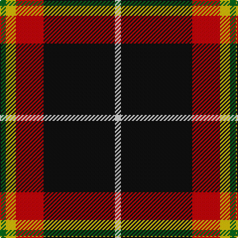

In pattern [GYRKW](/patterns/gyrkw/).

This was sourced from register-of-tartans.  It is a [5 stripes tartan](/stripes/stripes5/).

Original link https://www.tartanregister.gov.uk/tartanDetails.aspx?ref=5406

## Attestations

This cloth appears in 2 source records; the oldest owns this page.

- 01/06/2007 — Papua New Guinea (register-of-tartans, [record](https://www.tartanregister.gov.uk/tartanDetails.aspx?ref=5406))
- June 2007 — Papua New Guinea (Corporate) (tartans-authority, [record](http://www.tartansauthority.com/tartan-ferret/display/7235/))

## Thread count
G/6 Y10 R28 K72 LN/6

## Palette
Each colour and its ΔE from the base-6 reference it is a variant of.

| Colour | Shade | Base | ΔE (OKLab) |
|---|---|---|---|
| G | <code style="background-color:#006818;">#006818</code> `#006818` | G <code style="background-color:#006100;">#006100</code> | 0.02 |
| K | <code style="background-color:#101010;">#101010</code> `#101010` | K <code style="background-color:#000000;">#000000</code> | 0.17 |
| LN | <code style="background-color:#E0E0E0;">#E0E0E0</code> `#E0E0E0` | W <code style="background-color:#F7F7F7;">#F7F7F7</code> | 0.07 |
| R | <code style="background-color:#C80000;">#C80000</code> `#C80000` | R <code style="background-color:#CC0000;">#CC0000</code> | 0.01 |
| Y | <code style="background-color:#E8C000;">#E8C000</code> `#E8C000` | Y <code style="background-color:#F2BF00;">#F2BF00</code> | 0.02 |

# Sample pattern

## Nearest tartans

The nearest existing variants by ΔTartan distance.

1. [Papua New Guinea Pipes and Drums](/setts/s5/g6y10r26k66w4-g309c18-k101010-rdc0000-we0e0e0-ye8c000/) — ΔT 0.52
1. [Drambuie](/setts/s6/w6r36k48y4k5ya6-k101010-r880000-we0e0e0-ya08858-yae8c000/) — ΔT 0.93
1. [MacShimsi](/setts/s5/r22ra10g10k80y6-g006818-k101010-rb43448-ra901c38-ye8c000/) — ΔT 1.06
1. [Drambuie Dress](/setts/s6/w6g36k48r4k5y6-g604000-k101010-rc80000-we0e0e0-ye8c000/) — ΔT 1.10
1. [Drambuie dress](/setts/s6/w6r36k48ra4k5y6-k000000-r806050-rac00000-we0e0e0-yf0c000/) — ΔT 1.16
1. [Drambuie](/setts/s6/w6r36k48ra4k5y6-k000000-r800000-ra906030-we0e0e0-yf0c000/) — ΔT 1.28
1. [Bro-Wened](/setts/s6/k86r20w6k6w30b6-b202060-k101010-r880000-wf8e8d8/) — ΔT 1.30
1. [Billy Apple](/setts/s4/g6r48k78y6-g006818-k101010-rc80000-yfccc00/) — ΔT 1.30
1. [Calgary Firefighters (Corporate)](/setts/s5/r8k96r32ra24b6-b2c2c80-k101010-r888888-rac80000/) — ΔT 1.31
1. [Tott (Personal))](/setts/s7/k102r42y8r24g16b8r10-b2c2c80-g006818-k101010-rc80000-yc4bc68/) — ΔT 1.34

## Neighbour map

Every grey dot is one of 15726 variants placed by the first two principal components of the ΔTartan feature space (44% of its variance). Red is this tartan; blue dots are its nearest — click one to open its page.

<svg viewBox="0 0 640 380" role="img" style="max-width:100%;height:auto;border:1px solid #e0e0e0;border-radius:4px;display:block" xmlns="http://www.w3.org/2000/svg"><image href="/nn/cloud.v1.png" width="640" height="380"/><a href="/setts/s5/g6y10r26k66w4-g309c18-k101010-rdc0000-we0e0e0-ye8c000/"><circle cx="306.2" cy="157.0" r="4" fill="#3465a4"><title>Papua New Guinea Pipes and Drums</title></circle></a><a href="/setts/s6/w6r36k48y4k5ya6-k101010-r880000-we0e0e0-ya08858-yae8c000/"><circle cx="264.5" cy="167.1" r="4" fill="#3465a4"><title>Drambuie</title></circle></a><a href="/setts/s5/r22ra10g10k80y6-g006818-k101010-rb43448-ra901c38-ye8c000/"><circle cx="347.9" cy="178.5" r="4" fill="#3465a4"><title>MacShimsi</title></circle></a><a href="/setts/s6/w6g36k48r4k5y6-g604000-k101010-rc80000-we0e0e0-ye8c000/"><circle cx="264.4" cy="173.2" r="4" fill="#3465a4"><title>Drambuie Dress</title></circle></a><a href="/setts/s6/w6r36k48ra4k5y6-k000000-r806050-rac00000-we0e0e0-yf0c000/"><circle cx="240.1" cy="164.4" r="4" fill="#3465a4"><title>Drambuie dress</title></circle></a><a href="/setts/s6/w6r36k48ra4k5y6-k000000-r800000-ra906030-we0e0e0-yf0c000/"><circle cx="250.7" cy="165.2" r="4" fill="#3465a4"><title>Drambuie</title></circle></a><a href="/setts/s6/k86r20w6k6w30b6-b202060-k101010-r880000-wf8e8d8/"><circle cx="315.5" cy="163.9" r="4" fill="#3465a4"><title>Bro-Wened</title></circle></a><a href="/setts/s4/g6r48k78y6-g006818-k101010-rc80000-yfccc00/"><circle cx="332.5" cy="208.2" r="4" fill="#3465a4"><title>Billy Apple</title></circle></a><a href="/setts/s5/r8k96r32ra24b6-b2c2c80-k101010-r888888-rac80000/"><circle cx="334.5" cy="188.5" r="4" fill="#3465a4"><title>Calgary Firefighters (Corporate)</title></circle></a><a href="/setts/s7/k102r42y8r24g16b8r10-b2c2c80-g006818-k101010-rc80000-yc4bc68/"><circle cx="266.2" cy="156.6" r="4" fill="#3465a4"><title>Tott (Personal))</title></circle></a><circle cx="297.7" cy="170.7" r="5" fill="#c00000"/></svg>

ID: /setts/s5/g6y10r28k72w6-g006818-k101010-rc80000-we0e0e0-ye8c000/
