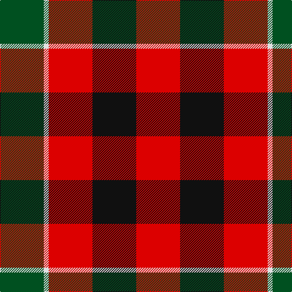

In pattern [GWRKR](/patterns/gwrkr/).

This was sourced from register-of-tartans.  It is a [5 stripes tartan](/stripes/stripes5/).

Original link https://www.tartanregister.gov.uk/tartanDetails.aspx?ref=4300

## Thread count
G/72 LN8 R72 K72 R/72

## Palette
Each colour and its ΔE from the base-6 reference it is a variant of.

| Colour | Shade | Base | ΔE (OKLab) |
|---|---|---|---|
| G | <code style="background-color:#005020;">#005020</code> `#005020` | G <code style="background-color:#006400;">#006400</code> | 0.08 |
| K | <code style="background-color:#101010;">#101010</code> `#101010` | K <code style="background-color:#000000;">#000000</code> | 0.17 |
| LN | <code style="background-color:#E0E0E0;">#E0E0E0</code> `#E0E0E0` | W <code style="background-color:#F4F4F0;">#F4F4F0</code> | 0.06 |
| R | <code style="background-color:#DC0000;">#DC0000</code> `#DC0000` | R <code style="background-color:#C80000;">#C80000</code> | 0.04 |

# Sample pattern

## Nearest tartans

The nearest existing variants by ΔTartan distance.

1. [Unidentified, item](/setts/s5/g72w8r72k72r72-g008000-k000000-rc00000-we0e0e0/) — ΔT 0.83
1. [MacDuff](/setts/s7/r16b6k8g12r8k2r8-b5480b0-g008000-k000000-rc00000/) — ΔT 0.91
1. [MacDuff #5](/setts/s7/r16b6k8g12r8k2r8-b3c82af-g005020-k101010-rdc0000/) — ΔT 0.94
1. [Torana](/setts/s6/r26b26ra10y4b26y26-b1c1c1c-rc80000-rad87000-yd09800/) — ΔT 0.98
1. [MacDuff Clan Tartan Tartan Number: 2141. Earliest known date: 1831 According to D.C.Stewart, "It will be observed that the MacDuff tartan is substantially the Royal Stuart with the white and yellow lines removed. Whether this indicates it as a source of the Stuart, or the association of the Earls of Fife with the Crown, remains to be determined." James Logan published this sett in his book, 'The Scottish Gael' in 1831. See products available Copyright © Blair Urquhart, Comrie, 2015](/setts/s7/r32b12k16g24r16k4r16-b2c2c80-g006818-k101010-rc80000/) — ΔT 1.00
1. [MacDuff](/setts/s7/r16b6k8g12r8k2r8-b00004c-g004c00-k000000-rc80000/) — ΔT 1.04
1. [MacDuff](/setts/s7/r44b16k18g28r20b4r20-b5480b0-g008000-k000000-rc00000/) — ΔT 1.13
1. [MacDuff](/setts/s7/r16b6k8g12r8k2r8-b000052-g11450d-k000000-raa0000/) — ΔT 1.24
1. [MacDuff #2](/setts/s7/r44b16k18g28r20b4r20-b3c82af-g005020-k101010-rdc0000/) — ΔT 1.28
1. [Norwich No.028](/setts/s6/r24g20k20g20r24b4-b5c8ca8-g006818-k000000-rc80000/) — ΔT 1.29

## Neighbour map

Every grey dot is one of 15726 variants placed by the first two principal components of the ΔTartan feature space (44% of its variance). Red is this tartan; blue dots are its nearest — click one to open its page.

<svg viewBox="0 0 640 380" role="img" style="max-width:100%;height:auto;border:1px solid #e0e0e0;border-radius:4px;display:block" xmlns="http://www.w3.org/2000/svg"><image href="/nn/cloud.v1.png" width="640" height="380"/><a href="/setts/s5/g72w8r72k72r72-g008000-k000000-rc00000-we0e0e0/"><circle cx="194.5" cy="246.2" r="4" fill="#3465a4"><title>Unidentified, item</title></circle></a><a href="/setts/s7/r16b6k8g12r8k2r8-b5480b0-g008000-k000000-rc00000/"><circle cx="215.7" cy="231.1" r="4" fill="#3465a4"><title>MacDuff</title></circle></a><a href="/setts/s7/r16b6k8g12r8k2r8-b3c82af-g005020-k101010-rdc0000/"><circle cx="233.2" cy="234.5" r="4" fill="#3465a4"><title>MacDuff #5</title></circle></a><a href="/setts/s6/r26b26ra10y4b26y26-b1c1c1c-rc80000-rad87000-yd09800/"><circle cx="164.3" cy="247.3" r="4" fill="#3465a4"><title>Torana</title></circle></a><a href="/setts/s7/r32b12k16g24r16k4r16-b2c2c80-g006818-k101010-rc80000/"><circle cx="241.0" cy="240.2" r="4" fill="#3465a4"><title>MacDuff Clan Tartan Tartan Number: 2141. Earliest known date: 1831 According to D.C.Stewart, &quot;It will be observed that the MacDuff tartan is substantially the Royal Stuart with the white and yellow lines removed. Whether this indicates it as a source of the Stuart, or the association of the Earls of Fife with the Crown, remains to be determined.&quot; James Logan published this sett in his book, 'The Scottish Gael' in 1831. See products available Copyright © Blair Urquhart, Comrie, 2015</title></circle></a><a href="/setts/s7/r16b6k8g12r8k2r8-b00004c-g004c00-k000000-rc80000/"><circle cx="220.4" cy="233.9" r="4" fill="#3465a4"><title>MacDuff</title></circle></a><a href="/setts/s7/r44b16k18g28r20b4r20-b5480b0-g008000-k000000-rc00000/"><circle cx="255.5" cy="215.0" r="4" fill="#3465a4"><title>MacDuff</title></circle></a><a href="/setts/s7/r16b6k8g12r8k2r8-b000052-g11450d-k000000-raa0000/"><circle cx="232.8" cy="242.4" r="4" fill="#3465a4"><title>MacDuff</title></circle></a><a href="/setts/s7/r44b16k18g28r20b4r20-b3c82af-g005020-k101010-rdc0000/"><circle cx="269.9" cy="217.3" r="4" fill="#3465a4"><title>MacDuff #2</title></circle></a><a href="/setts/s6/r24g20k20g20r24b4-b5c8ca8-g006818-k000000-rc80000/"><circle cx="151.1" cy="268.1" r="4" fill="#3465a4"><title>Norwich No.028</title></circle></a><circle cx="213.9" cy="249.7" r="5" fill="#c00000"/></svg>

ID: /setts/s5/g72w8r72k72r72-g005020-k101010-rdc0000-we0e0e0/
