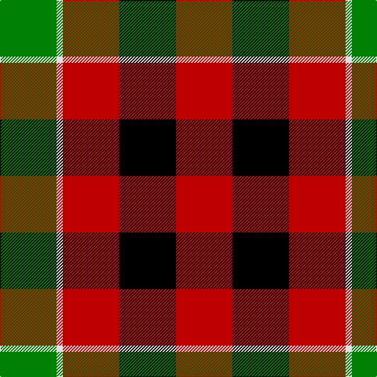

In pattern [GWRKR](/patterns/gwrkr/).

This was sourced from weddslist.  It is a [5 stripes tartan](/stripes/stripes5/).

Original link http://www.weddslist.com/cgi-bin/tartans/pg.pl?source=sts

## Thread count
G/72 LN8 R72 K72 R/72

## Palette
Each colour and its ΔE from the base-6 reference it is a variant of.

| Colour | Shade | Base | ΔE (OKLab) |
|---|---|---|---|
| G | <code style="background-color:#008000;">#008000</code> `#008000` | G <code style="background-color:#006100;">#006100</code> | 0.10 |
| K | <code style="background-color:#000000;">#000000</code> `#000000` | K <code style="background-color:#000000;">#000000</code> | 0.00 |
| LN | <code style="background-color:#E0E0E0;">#E0E0E0</code> `#E0E0E0` | W <code style="background-color:#F7F7F7;">#F7F7F7</code> | 0.07 |
| R | <code style="background-color:#C00000;">#C00000</code> `#C00000` | R <code style="background-color:#CC0000;">#CC0000</code> | 0.03 |

# Sample pattern

## Nearest tartans

The nearest existing variants by ΔTartan distance.

1. [Unidentified item](/setts/s5/g72w8r72k72r72-g005020-k101010-rdc0000-we0e0e0/) — ΔT 0.83
1. [MacDuff](/setts/s7/r16b6k8g12r8k2r8-b5480b0-g008000-k000000-rc00000/) — ΔT 0.99
1. [Torana](/setts/s6/r26b26ra10y4b26y26-b1c1c1c-rc80000-rad87000-yd09800/) — ΔT 1.07
1. [Norwich No.028](/setts/s6/r24g20k20g20r24b4-b5c8ca8-g006818-k000000-rc80000/) — ΔT 1.07
1. [MacDuff](/setts/s7/r16b6k8g12r8k2r8-b00004c-g004c00-k000000-rc80000/) — ΔT 1.13
1. [MacTavish](/setts/s7/r24g4r24b4g12k12g12-b304080-g008000-k000000-rc00000/) — ΔT 1.38
1. [MacDuff](/setts/s7/r44b16k18g28r20b4r20-b5480b0-g008000-k000000-rc00000/) — ΔT 1.39
1. [MacDuff](/setts/s7/r16b6k8g12r8k2r8-b000052-g11450d-k000000-raa0000/) — ΔT 1.41
1. [MacDuff #5](/setts/s7/r16b6k8g12r8k2r8-b3c82af-g005020-k101010-rdc0000/) — ΔT 1.49
1. [Connel](/setts/s6/r32k32y4k32r32w4-k101010-rc80000-wfcfcfc-ye8c000/) — ΔT 1.51

## Neighbour map

Every grey dot is one of 15726 variants placed by the first two principal components of the ΔTartan feature space (44% of its variance). Red is this tartan; blue dots are its nearest — click one to open its page.

<svg viewBox="0 0 640 380" role="img" style="max-width:100%;height:auto;border:1px solid #e0e0e0;border-radius:4px;display:block" xmlns="http://www.w3.org/2000/svg"><image href="/nn/cloud.v1.png" width="640" height="380"/><a href="/setts/s5/g72w8r72k72r72-g005020-k101010-rdc0000-we0e0e0/"><circle cx="213.9" cy="249.7" r="4" fill="#3465a4"><title>Unidentified item</title></circle></a><a href="/setts/s7/r16b6k8g12r8k2r8-b5480b0-g008000-k000000-rc00000/"><circle cx="215.7" cy="231.1" r="4" fill="#3465a4"><title>MacDuff</title></circle></a><a href="/setts/s6/r26b26ra10y4b26y26-b1c1c1c-rc80000-rad87000-yd09800/"><circle cx="164.3" cy="247.3" r="4" fill="#3465a4"><title>Torana</title></circle></a><a href="/setts/s6/r24g20k20g20r24b4-b5c8ca8-g006818-k000000-rc80000/"><circle cx="151.1" cy="268.1" r="4" fill="#3465a4"><title>Norwich No.028</title></circle></a><a href="/setts/s7/r16b6k8g12r8k2r8-b00004c-g004c00-k000000-rc80000/"><circle cx="220.4" cy="233.9" r="4" fill="#3465a4"><title>MacDuff</title></circle></a><a href="/setts/s7/r24g4r24b4g12k12g12-b304080-g008000-k000000-rc00000/"><circle cx="224.5" cy="232.5" r="4" fill="#3465a4"><title>MacTavish</title></circle></a><a href="/setts/s7/r44b16k18g28r20b4r20-b5480b0-g008000-k000000-rc00000/"><circle cx="255.5" cy="215.0" r="4" fill="#3465a4"><title>MacDuff</title></circle></a><a href="/setts/s7/r16b6k8g12r8k2r8-b000052-g11450d-k000000-raa0000/"><circle cx="232.8" cy="242.4" r="4" fill="#3465a4"><title>MacDuff</title></circle></a><a href="/setts/s7/r16b6k8g12r8k2r8-b3c82af-g005020-k101010-rdc0000/"><circle cx="233.2" cy="234.5" r="4" fill="#3465a4"><title>MacDuff #5</title></circle></a><a href="/setts/s6/r32k32y4k32r32w4-k101010-rc80000-wfcfcfc-ye8c000/"><circle cx="247.1" cy="229.2" r="4" fill="#3465a4"><title>Connel</title></circle></a><circle cx="194.5" cy="246.2" r="5" fill="#c00000"/></svg>

ID: /setts/s5/g72w8r72k72r72-g008000-k000000-rc00000-we0e0e0/
