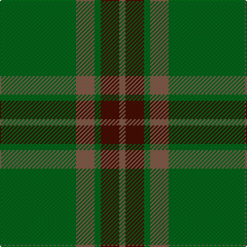

In pattern [GRGBR](/patterns/grgbr/).

This was sourced from weddslist.  It is a [5 stripes tartan](/stripes/stripes5/).

Original link http://www.weddslist.com/cgi-bin/tartans/pg.pl?source=sts

## Thread count
G/74 LT18 G6 DR18 LT/6

## Palette
Each colour and its ΔE from the base-6 reference it is a variant of.

| Colour | Shade | Base | ΔE (OKLab) |
|---|---|---|---|
| DR | <code style="background-color:#401000;">#401000</code> `#401000` | B <code style="background-color:#2C4084;">#2C4084</code> | 0.23 |
| G | <code style="background-color:#006020;">#006020</code> `#006020` | G <code style="background-color:#006400;">#006400</code> | 0.03 |
| LT | <code style="background-color:#806050;">#806050</code> `#806050` | R <code style="background-color:#C80000;">#C80000</code> | 0.17 |

# Sample pattern

## Nearest tartans

The nearest existing variants by ΔTartan distance.

1. [Colonial Marine (Corporate)](/setts/s4/g112ga26y26y10-g006818-ga604000-ybc8c00/) — ΔT 1.23
1. [Glen Trool District Tartan Tartan Number: 914. Earliest known date: pre 1945 Glen Trool is in the Galloway Uplands in the Southwest of Scotland. The tartan began life as a trade sett - a colourful fashion fabric - and was given a name merely to identify it. It proved very popular and is now recognised as a District Tartan. See products available Copyright © Blair Urquhart, Comrie, 2015](/setts/s5/g74ga18g6r18ga6-g003820-ga604000-rc80000/) — ΔT 1.37
1. [Glenlivet Corporate Tartan Tartan Number: 193. Earliest known date: 1989 Designed for Glenlivet Distilleries Ltd, Strathspey. See products available Copyright © Blair Urquhart, Comrie, 2015](/setts/s8/g18r6g75b6g13ga35g12b6-b2c2c80-g006818-ga604000-rc80000/) — ΔT 1.44
1. [Dunbar Hunting](/setts/s6/g8k4g56k16ga42g6-g006818-ga003820-k101010/) — ΔT 1.65
1. [Loton (Personal)](/setts/s5/r24g8b8g68r8-b00008c-g004c00-r880000/) — ΔT 1.67
1. [Glen Trool (Fashion)](/setts/s5/g84r20g6ra20r6-g004428-ra07c58-ra880000/) — ΔT 1.69
1. [Irving of Bonshaw](/setts/s5/g108ga56b8ga8y8-b003c64-g006818-ga048888-ye8c000/) — ΔT 1.73
1. [Carnet (Fashion)](/setts/s6/k24g12k12g44k4g8-g004c00-k28140c/) — ΔT 1.75
1. [Glenlivet](/setts/s8/g18r6g75b6g13ra35g12b6-b304080-g008000-rc00000-ra806050/) — ΔT 1.77
1. [O'Neill, Red (Corporate?)](/setts/s4/g18r40g92y10-g006818-rb84c00-y48a4c0/) — ΔT 1.80

## Neighbour map

Every grey dot is one of 15726 variants placed by the first two principal components of the ΔTartan feature space (44% of its variance). Red is this tartan; blue dots are its nearest — click one to open its page.

<svg viewBox="0 0 640 380" role="img" style="max-width:100%;height:auto;border:1px solid #e0e0e0;border-radius:4px;display:block" xmlns="http://www.w3.org/2000/svg"><image href="/nn/cloud.v1.png" width="640" height="380"/><a href="/setts/s4/g112ga26y26y10-g006818-ga604000-ybc8c00/"><circle cx="459.0" cy="274.0" r="4" fill="#3465a4"><title>Colonial Marine (Corporate)</title></circle></a><a href="/setts/s5/g74ga18g6r18ga6-g003820-ga604000-rc80000/"><circle cx="476.1" cy="251.7" r="4" fill="#3465a4"><title>Glen Trool District Tartan Tartan Number: 914. Earliest known date: pre 1945 Glen Trool is in the Galloway Uplands in the Southwest of Scotland. The tartan began life as a trade sett - a colourful fashion fabric - and was given a name merely to identify it. It proved very popular and is now recognised as a District Tartan. See products available Copyright © Blair Urquhart, Comrie, 2015</title></circle></a><a href="/setts/s8/g18r6g75b6g13ga35g12b6-b2c2c80-g006818-ga604000-rc80000/"><circle cx="496.3" cy="234.0" r="4" fill="#3465a4"><title>Glenlivet Corporate Tartan Tartan Number: 193. Earliest known date: 1989 Designed for Glenlivet Distilleries Ltd, Strathspey. See products available Copyright © Blair Urquhart, Comrie, 2015</title></circle></a><a href="/setts/s6/g8k4g56k16ga42g6-g006818-ga003820-k101010/"><circle cx="399.0" cy="261.0" r="4" fill="#3465a4"><title>Dunbar Hunting</title></circle></a><a href="/setts/s5/r24g8b8g68r8-b00008c-g004c00-r880000/"><circle cx="452.7" cy="262.0" r="4" fill="#3465a4"><title>Loton (Personal)</title></circle></a><a href="/setts/s5/g84r20g6ra20r6-g004428-ra07c58-ra880000/"><circle cx="466.4" cy="235.5" r="4" fill="#3465a4"><title>Glen Trool (Fashion)</title></circle></a><a href="/setts/s5/g108ga56b8ga8y8-b003c64-g006818-ga048888-ye8c000/"><circle cx="421.6" cy="241.0" r="4" fill="#3465a4"><title>Irving of Bonshaw</title></circle></a><a href="/setts/s6/k24g12k12g44k4g8-g004c00-k28140c/"><circle cx="504.3" cy="310.6" r="4" fill="#3465a4"><title>Carnet (Fashion)</title></circle></a><a href="/setts/s8/g18r6g75b6g13ra35g12b6-b304080-g008000-rc00000-ra806050/"><circle cx="470.8" cy="220.7" r="4" fill="#3465a4"><title>Glenlivet</title></circle></a><a href="/setts/s4/g18r40g92y10-g006818-rb84c00-y48a4c0/"><circle cx="464.4" cy="283.7" r="4" fill="#3465a4"><title>O'Neill, Red (Corporate?)</title></circle></a><circle cx="491.4" cy="262.6" r="5" fill="#c00000"/></svg>

ID: /setts/s5/g74r18g6b18r6-b401000-g006020-r806050/
