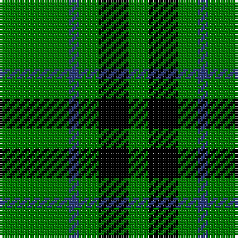

This page is one **sett** — a single exact thread-count. It belongs to the [tartan](/tartans/g7db1g2k3g2/)
(the same proportion at any scale), whose colour order is pattern [GBGKG](/stripes/gbgkg/).

Sourced from weddslist.  It is a [5 stripe tartan](/stripes/stripes5/).

Original link http://www.weddslist.com/cgi-bin/tartans/pg.pl?source=sts

## Thread count
G/28 B4 G8 K12 G/8

## Palette

Palette: <strong>Ingles Buchan</strong> <small style="color:#888">(1 of 3 colours)</small>
<table><thead><tr><th>Colour</th><th>Threads</th><th>Shade</th><th>Base</th><th>OKLCh</th></tr></thead><tbody><tr><td>G/</td><td style="text-align:right;font-variant-numeric:tabular-nums">28</td><td><code style="background-color:#008000;">#008000</code> <small style="color:#888">#008000</small></td><td>G <code style="background-color:#006100;">#006100</code></td><td><small style="color:#888">oklch(52.0% 0.177 142.5)</small></td></tr><tr><td>B</td><td style="text-align:right;font-variant-numeric:tabular-nums">4</td><td><code style="background-color:#304080;">#304080</code> <small style="color:#888">#304080</small></td><td>B <code style="background-color:#2A418A;">#2A418A</code></td><td><small style="color:#888">oklch(39.4% 0.109 270.2)</small></td></tr><tr><td>G</td><td style="text-align:right;font-variant-numeric:tabular-nums">8</td><td><code style="background-color:#008000;">#008000</code> <small style="color:#888">#008000</small></td><td>G <code style="background-color:#006100;">#006100</code></td><td><small style="color:#888">oklch(52.0% 0.177 142.5)</small></td></tr><tr><td>K</td><td style="text-align:right;font-variant-numeric:tabular-nums">12</td><td><code style="background-color:#000000;">#000000</code> <small style="color:#888">#000000</small></td><td>K <code style="background-color:#000000;">#000000</code></td><td><small style="color:#888">oklch(0.0% 0.000 0.0)</small></td></tr><tr><td>G/</td><td style="text-align:right;font-variant-numeric:tabular-nums">8</td><td><code style="background-color:#008000;">#008000</code> <small style="color:#888">#008000</small></td><td>G <code style="background-color:#006100;">#006100</code></td><td><small style="color:#888">oklch(52.0% 0.177 142.5)</small></td></tr></tbody></table>

# Sample pattern

## Nearest tartans

The nearest existing variants by ΔTartan distance, with this tartan at the top so the swatches line up against it.

ΔTartan

Tartan

Sett

—

<a href="/ttd/edit/#slug=g7db1g2k3g2~x4">Peterhead</a> <a class="nn-out" href="/setts/s5/g7db1g2k3g2~x4/" title="open its dictionary page">↗</a>

1.40

<a href="/ttd/edit/#slug=dg40k4dg12k21dg17w4~x2">Granger</a> <a class="nn-out" href="/setts/s6/dg40k4dg12k21dg17w4~x2/" title="open its dictionary page">↗</a>

1.59

<a href="/ttd/edit/#slug=dg21ly43dg86t10">Special Saffron Tartan Tartan Number: 201. Earliest known date: pre 2003 Y = Saffron See products available Copyright © Blair Urquhart, Comrie, 2015</a> <a class="nn-out" href="/setts/s4/dg21ly43dg86t10/" title="open its dictionary page">↗</a>

1.63

<a href="/ttd/edit/#slug=g7k1g7t1k6t1~x2">Innes</a> <a class="nn-out" href="/setts/s6/g7k1g7t1k6t1~x2/" title="open its dictionary page">↗</a>

1.64

<a href="/ttd/edit/#slug=dg20w2dg9w2ly5w7dg10~x2">Heritage #2</a> <a class="nn-out" href="/setts/s7/dg20w2dg9w2ly5w7dg10~x2/" title="open its dictionary page">↗</a>

1.77

<a href="/ttd/edit/#slug=g50k6db11g25ly4~x2">Glen of Daviot (Dalgleish)</a> <a class="nn-out" href="/setts/s5/g50k6db11g25ly4~x2/" title="open its dictionary page">↗</a>

1.77

<a href="/ttd/edit/#slug=g20w2g9w2ly5w7g10~x2">Heritage (Commemorative)</a> <a class="nn-out" href="/setts/s7/g20w2g9w2ly5w7g10~x2/" title="open its dictionary page">↗</a>

1.82

<a href="/ttd/edit/#slug=g18ly2g18k4g2k15~x2">MacArthur (Highland Society)</a> <a class="nn-out" href="/setts/s6/g18ly2g18k4g2k15~x2/" title="open its dictionary page">↗</a>

1.84

<a href="/ttd/edit/#slug=g7k1g7t1k6t1~x4">Innes, Georgina (Portrait)</a> <a class="nn-out" href="/setts/s6/g7k1g7t1k6t1~x4/" title="open its dictionary page">↗</a>

1.85

<a href="/ttd/edit/#slug=dg21lo43dg86b10">Special, Saffron</a> <a class="nn-out" href="/setts/s4/dg21lo43dg86b10/" title="open its dictionary page">↗</a>

1.89

<a href="/setts/s4/g12k4g1~x2/">Graham</a>

## Neighbour map

Every grey dot is one of 14299 variants placed by the first two principal components of the ΔTartan feature space (44% of its variance). Red is this tartan; blue dots are its nearest — click one to open its page.

<svg viewBox="0 0 640 380" role="img" style="max-width:100%;height:auto;border:1px solid #e0e0e0;border-radius:4px;display:block" xmlns="http://www.w3.org/2000/svg"><image href="/nn/cloud.v1.png" width="640" height="380"/><a href="/setts/s6/dg40k4dg12k21dg17w4~x2/"><circle cx="391.4" cy="245.5" r="4" fill="#3465a4"><title>Granger</title></circle></a><a href="/setts/s4/dg21ly43dg86t10/"><circle cx="357.6" cy="254.7" r="4" fill="#3465a4"><title>Special Saffron Tartan Tartan Number: 201. Earliest known date: pre 2003 Y = Saffron See products available Copyright © Blair Urquhart, Comrie, 2015</title></circle></a><a href="/setts/s6/g7k1g7t1k6t1~x2/"><circle cx="298.4" cy="249.9" r="4" fill="#3465a4"><title>Innes</title></circle></a><a href="/setts/s7/dg20w2dg9w2ly5w7dg10~x2/"><circle cx="372.6" cy="225.6" r="4" fill="#3465a4"><title>Heritage #2</title></circle></a><a href="/setts/s5/g50k6db11g25ly4~x2/"><circle cx="462.7" cy="229.3" r="4" fill="#3465a4"><title>Glen of Daviot (Dalgleish)</title></circle></a><a href="/setts/s7/g20w2g9w2ly5w7g10~x2/"><circle cx="380.3" cy="229.4" r="4" fill="#3465a4"><title>Heritage (Commemorative)</title></circle></a><a href="/setts/s6/g18ly2g18k4g2k15~x2/"><circle cx="386.4" cy="265.0" r="4" fill="#3465a4"><title>MacArthur (Highland Society)</title></circle></a><a href="/setts/s6/g7k1g7t1k6t1~x4/"><circle cx="310.9" cy="255.7" r="4" fill="#3465a4"><title>Innes, Georgina (Portrait)</title></circle></a><a href="/setts/s4/dg21lo43dg86b10/"><circle cx="379.1" cy="263.5" r="4" fill="#3465a4"><title>Special, Saffron</title></circle></a><a href="/setts/s4/g12k4g1~x2/"><circle cx="371.9" cy="263.7" r="4" fill="#3465a4"><title>Graham</title></circle></a><circle cx="387.3" cy="269.5" r="5" fill="#c00000"/></svg>

ID: /setts/s5/g7db1g2k3g2~x4/
