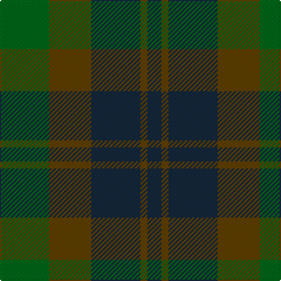

In pattern [BGBGG](/stripes/bgbgg/).

This was sourced from register-of-tartans.  It is a [5 stripe tartan](/stripes/stripes5/).

Original link https://www.tartanregister.gov.uk/tartanDetails.aspx?ref=353

## Register references

External register numbers recorded for this tartan.

- Scottish Register of Tartans: [353](https://www.tartanregister.gov.uk/tartanDetails.aspx?ref=353)
- Scottish Tartans Authority (ITI): 6576

## Thread count
G/42 T36 DN42 T6 DN/12

## Palette
Each colour and the base-6 reference it is a variant of.

| Colour | Shade | Base |
|---|---|---|
| DB | <code style="background-color:#2C2C80;">#2C2C80</code> `oklch(35.0% 0.138 276.6)` <small>#2C2C80</small> | B <code style="background-color:#2A418A;">#2A418A</code> |
| DN | <code style="background-color:#14283C;">#14283C</code> `oklch(27.1% 0.046 249.9)` <small>#14283C</small> | B <code style="background-color:#2A418A;">#2A418A</code> |
| G | <code style="background-color:#006818;">#006818</code> `oklch(45.0% 0.142 145.0)` <small>#006818</small> | G <code style="background-color:#006100;">#006100</code> |
| T | <code style="background-color:#604000;">#604000</code> `oklch(39.8% 0.083 76.8)` <small>#604000</small> | G <code style="background-color:#006100;">#006100</code> |

# Sample pattern

## Nearest tartans

The nearest existing variants by ΔTartan distance, with this tartan at the top so the swatches line up against it.

ΔTartan

Tartan

Sett

—

<a href="/ttd/edit/#slug=g7dy6dt7dy1dt2~x6">Bright of Garth (Personal)</a> <a class="nn-out" href="/setts/s5/g7dy6dt7dy1dt2~x6/" title="open its dictionary page">↗</a>

0.93

<a href="/ttd/edit/#slug=g7y6n7y1n2~x6">Bright of Garth (Personal)</a> <a class="nn-out" href="/setts/s5/g7y6n7y1n2~x6/" title="open its dictionary page">↗</a>

1.14

<a href="/ttd/edit/#slug=k3dg20k20g20k3~x2">MacCormick Hunting (Name)</a> <a class="nn-out" href="/setts/s5/k3dg20k20g20k3~x2/" title="open its dictionary page">↗</a>

1.34

<a href="/ttd/edit/#slug=g4dy25g6t12g12t3~x2">Canadian Fancy</a> <a class="nn-out" href="/setts/s6/g4dy25g6t12g12t3~x2/" title="open its dictionary page">↗</a>

1.48

<a href="/ttd/edit/#slug=dg2dp10dy15dg10dp2~x4">Harmony 6</a> <a class="nn-out" href="/setts/s5/dg2dp10dy15dg10dp2~x4/" title="open its dictionary page">↗</a>

1.58

<a href="/ttd/edit/#slug=dg15r3n11b2~x2">MacNab WI 2</a> <a class="nn-out" href="/setts/s4/dg15r3n11b2~x2/" title="open its dictionary page">↗</a>

1.58

<a href="/ttd/edit/#slug=dg15r3n11b2">MacNab WI2</a> <a class="nn-out" href="/setts/s4/dg15r3n11b2/" title="open its dictionary page">↗</a>

1.61

<a href="/ttd/edit/#slug=dy1db3dy1dg3dy4r1~x2">Fraser Hunting #2</a> <a class="nn-out" href="/setts/s6/dy1db3dy1dg3dy4r1~x2/" title="open its dictionary page">↗</a>

1.65

<a href="/ttd/edit/#slug=k5dg14k16db12dg4~x2">Unidentified #29</a> <a class="nn-out" href="/setts/s5/k5dg14k16db12dg4~x2/" title="open its dictionary page">↗</a>

1.65

<a href="/ttd/edit/#slug=dt1dy1dt7dy5y7lr1~x4">Dewar (WCWM)</a> <a class="nn-out" href="/setts/s6/dt1dy1dt7dy5y7lr1~x4/" title="open its dictionary page">↗</a>

1.69

<a href="/ttd/edit/#slug=g4o25g6t12g12t3~x2">Canadian Fancy</a> <a class="nn-out" href="/setts/s6/g4o25g6t12g12t3~x2/" title="open its dictionary page">↗</a>

## Neighbour map

Every grey dot is one of 14299 variants placed by the first two principal components of the ΔTartan feature space (44% of its variance). Red is this tartan; blue dots are its nearest — click one to open its page.

<svg viewBox="0 0 640 380" role="img" style="max-width:100%;height:auto;border:1px solid #e0e0e0;border-radius:4px;display:block" xmlns="http://www.w3.org/2000/svg"><image href="/nn/cloud.v1.png" width="640" height="380"/><a href="/setts/s5/g7y6n7y1n2~x6/"><circle cx="301.9" cy="334.8" r="4" fill="#3465a4"><title>Bright of Garth (Personal)</title></circle></a><a href="/setts/s5/k3dg20k20g20k3~x2/"><circle cx="276.4" cy="320.3" r="4" fill="#3465a4"><title>MacCormick Hunting (Name)</title></circle></a><a href="/setts/s6/g4dy25g6t12g12t3~x2/"><circle cx="302.3" cy="289.1" r="4" fill="#3465a4"><title>Canadian Fancy</title></circle></a><a href="/setts/s5/dg2dp10dy15dg10dp2~x4/"><circle cx="304.7" cy="309.3" r="4" fill="#3465a4"><title>Harmony 6</title></circle></a><a href="/setts/s4/dg15r3n11b2~x2/"><circle cx="335.6" cy="299.8" r="4" fill="#3465a4"><title>MacNab WI 2</title></circle></a><a href="/setts/s4/dg15r3n11b2/"><circle cx="335.6" cy="299.8" r="4" fill="#3465a4"><title>MacNab WI2</title></circle></a><a href="/setts/s6/dy1db3dy1dg3dy4r1~x2/"><circle cx="270.9" cy="323.6" r="4" fill="#3465a4"><title>Fraser Hunting #2</title></circle></a><a href="/setts/s5/k5dg14k16db12dg4~x2/"><circle cx="264.5" cy="364.3" r="4" fill="#3465a4"><title>Unidentified #29</title></circle></a><a href="/setts/s6/dt1dy1dt7dy5y7lr1~x4/"><circle cx="256.2" cy="272.5" r="4" fill="#3465a4"><title>Dewar (WCWM)</title></circle></a><a href="/setts/s6/g4o25g6t12g12t3~x2/"><circle cx="315.3" cy="294.4" r="4" fill="#3465a4"><title>Canadian Fancy</title></circle></a><circle cx="292.3" cy="332.0" r="5" fill="#c00000"/></svg>

ID: /setts/s5/g7dy6dt7dy1dt2~x6/
