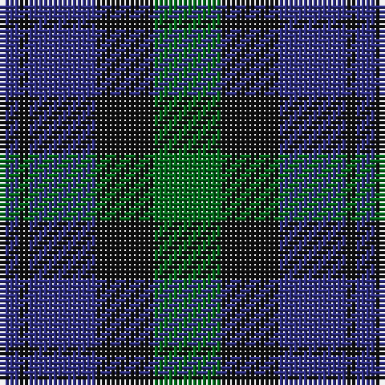

In pattern [BKBKG](/patterns/bkbkg/).

This was sourced from house-of-tartan.  It is a [5 stripes tartan](/stripes/stripes5/).

Original link http://www.house-of-tartan.scotland.net/house/TartanViewjs.asp?colr=Def&tnam=14

## Thread count
DB/4 K2 DB14 K12 G/14

## Palette
Each colour and its ΔE from the base-6 reference it is a variant of.

| Colour | Shade | Base | ΔE (OKLab) |
|---|---|---|---|
| DB | <code style="background-color:#2C2C80;">#2C2C80</code> `#2C2C80` | B <code style="background-color:#2A418A;">#2A418A</code> | 0.06 |
| G | <code style="background-color:#006818;">#006818</code> `#006818` | G <code style="background-color:#006100;">#006100</code> | 0.02 |
| K | <code style="background-color:#101010;">#101010</code> `#101010` | K <code style="background-color:#000000;">#000000</code> | 0.17 |

# Sample pattern

## Nearest tartans

The nearest existing variants by ΔTartan distance.

1. [Austin Clan](/setts/s5/b4k4b4g9k2x2~b2c2c80-g006818-k101010/) — ΔT 0.81
1. [Scotsman](/setts/s7/g21k14g9b21k3b12ba3x2~b2c2c80-ba780078-g006818-k101010/) — ΔT 1.11
1. [MacKay Plaid](/setts/s6/g14b82g9k80g80k14~b5a008c-g005020-k101010/) — ΔT 1.14
1. [Wilson's Folio 131](/setts/s5/b12k17g19w2k5x2~b2c4084-g005020-k101010-we0e0e0/) — ΔT 1.15
1. [Strathspey District Tartan Tartan Number: 1039. Earliest known date: 1795 From the back of a waistcoat of a Strathspey Fencible 1794-5. The design, which is a variation of the Black Watch may be attributed to General James Grant of Ballindalloch who raised the fencible unit and whose clan already used the the Black Watch as a hunting sett. The Strathspey tartan is now produced as a District tartan. See products available Copyright © Blair Urquhart, Comrie, 2015](/setts/s7/k1g5k5b5k1b1k1x4~b2c2c80-g006818-k101010/) — ΔT 1.17
1. [Unnamed, No 54](/setts/s6/b2g6b6ba5b1ba2x2~b000050-ba300030-g008000/) — ΔT 1.18
1. [Ferguson of Balquhidder #3](/setts/s6/k3b12r2k12g12k3x2~b2c4084-g005020-k101010-rdc0000/) — ΔT 1.18
1. [Gallamore](/setts/s6/k3b14r2k14g14k3x2~b2c2c80-g006818-k101010-rc80000/) — ΔT 1.20
1. [Campbell of Glenlyon](/setts/s5/g7k6b7k1b2x2~b1474b4-g006818-k101010/) — ΔT 1.21
1. [Campbell of Glenlyon Check (Clan)](/setts/s5/g7k6b7k1b2x4~b1474b4-g006818-k101010/) — ΔT 1.21

## Neighbour map

Every grey dot is one of 15726 variants placed by the first two principal components of the ΔTartan feature space (44% of its variance). Red is this tartan; blue dots are its nearest — click one to open its page.

<svg viewBox="0 0 640 380" role="img" style="max-width:100%;height:auto;border:1px solid #e0e0e0;border-radius:4px;display:block" xmlns="http://www.w3.org/2000/svg"><image href="/nn/cloud.v1.png" width="640" height="380"/><a href="/setts/s5/b4k4b4g9k2x2~b2c2c80-g006818-k101010/"><circle cx="206.0" cy="318.6" r="4" fill="#3465a4"><title>Austin Clan</title></circle></a><a href="/setts/s7/g21k14g9b21k3b12ba3x2~b2c2c80-ba780078-g006818-k101010/"><circle cx="207.5" cy="262.6" r="4" fill="#3465a4"><title>Scotsman</title></circle></a><a href="/setts/s6/g14b82g9k80g80k14~b5a008c-g005020-k101010/"><circle cx="255.3" cy="261.7" r="4" fill="#3465a4"><title>MacKay Plaid</title></circle></a><a href="/setts/s5/b12k17g19w2k5x2~b2c4084-g005020-k101010-we0e0e0/"><circle cx="219.5" cy="263.2" r="4" fill="#3465a4"><title>Wilson's Folio 131</title></circle></a><a href="/setts/s7/k1g5k5b5k1b1k1x4~b2c2c80-g006818-k101010/"><circle cx="244.3" cy="279.2" r="4" fill="#3465a4"><title>Strathspey District Tartan Tartan Number: 1039. Earliest known date: 1795 From the back of a waistcoat of a Strathspey Fencible 1794-5. The design, which is a variation of the Black Watch may be attributed to General James Grant of Ballindalloch who raised the fencible unit and whose clan already used the the Black Watch as a hunting sett. The Strathspey tartan is now produced as a District tartan. See products available Copyright © Blair Urquhart, Comrie, 2015</title></circle></a><a href="/setts/s6/b2g6b6ba5b1ba2x2~b000050-ba300030-g008000/"><circle cx="204.1" cy="286.1" r="4" fill="#3465a4"><title>Unnamed, No 54</title></circle></a><a href="/setts/s6/k3b12r2k12g12k3x2~b2c4084-g005020-k101010-rdc0000/"><circle cx="222.3" cy="273.1" r="4" fill="#3465a4"><title>Ferguson of Balquhidder #3</title></circle></a><a href="/setts/s6/k3b14r2k14g14k3x2~b2c2c80-g006818-k101010-rc80000/"><circle cx="211.1" cy="255.8" r="4" fill="#3465a4"><title>Gallamore</title></circle></a><a href="/setts/s5/g7k6b7k1b2x2~b1474b4-g006818-k101010/"><circle cx="200.8" cy="286.4" r="4" fill="#3465a4"><title>Campbell of Glenlyon</title></circle></a><a href="/setts/s5/g7k6b7k1b2x4~b1474b4-g006818-k101010/"><circle cx="200.8" cy="286.4" r="4" fill="#3465a4"><title>Campbell of Glenlyon Check (Clan)</title></circle></a><circle cx="231.6" cy="298.0" r="5" fill="#c00000"/></svg>

ID: /setts/s5/g7k6b7k1b2x2~b2c2c80-g006818-k101010/
