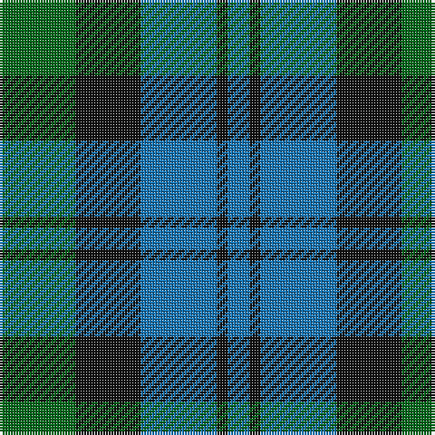

In pattern [BKBKG](/stripes/bkbkg/).

This was sourced from tartans-authority.  It is a [5 stripe tartan](/stripes/stripes5/).

Original link http://www.tartansauthority.com/tartan-ferret/display/14/

## Also known as

This cloth is also recorded under:

- Campbell of Glenlyon Check

## Thread count
G/28 K24 B28 K4 B/8

## Palette
Each colour and its ΔE from the base-6 reference it is a variant of.

| Colour | Shade | Base | ΔE (OKLab) |
|---|---|---|---|
| B | <code style="background-color:#1474B4;">#1474B4</code> `#1474B4` | B <code style="background-color:#2A418A;">#2A418A</code> | 0.15 |
| G | <code style="background-color:#006818;">#006818</code> `#006818` | G <code style="background-color:#006100;">#006100</code> | 0.02 |
| K | <code style="background-color:#101010;">#101010</code> `#101010` | K <code style="background-color:#000000;">#000000</code> | 0.17 |

# Sample pattern

## Nearest tartans

The nearest existing variants by ΔTartan distance.

1. [Campbell of Glenlyon](/setts/s5/g7k6b7k1b2~x2/) — ΔT 0.00
1. [Campbell, The 42nd](/setts/s6/b6k6b18k18g22k5~x2/) — ΔT 0.86
1. [Falconer](/setts/s5/b3k4b4g9k2~x4/) — ΔT 1.11
1. [Austin Clan](/setts/s5/db4k4db4g9k2~x2/) — ΔT 1.20
1. [Blaylock Annandale](/setts/s7/g24b6lb3k6b12k15g4~x2/) — ΔT 1.30
1. [Redland](/setts/s6/g52lb7g9k35db35k7/) — ΔT 1.31
1. [Sinclair of Ulbster](/setts/s6/b12k4g6ly1~x8/) — ΔT 1.32
1. [Morrison Society](/setts/s6/k3g14k14g2b14r3~x2/) — ΔT 1.33
1. [Unidentified #28](/setts/s6/k2dg9t1k6b4dg2~x2/) — ΔT 1.35
1. [Campbell of Glenlyon](/setts/s5/g7k6db7k1db2~x2/) — ΔT 1.38

## Neighbour map

Every grey dot is one of 14299 variants placed by the first two principal components of the ΔTartan feature space (44% of its variance). Red is this tartan; blue dots are its nearest — click one to open its page.

<svg viewBox="0 0 640 380" role="img" style="max-width:100%;height:auto;border:1px solid #e0e0e0;border-radius:4px;display:block" xmlns="http://www.w3.org/2000/svg"><image href="/nn/cloud.v1.png" width="640" height="380"/><a href="/setts/s5/g7k6b7k1b2~x2/"><circle cx="204.4" cy="289.0" r="4" fill="#3465a4"><title>Campbell of Glenlyon</title></circle></a><a href="/setts/s6/b6k6b18k18g22k5~x2/"><circle cx="180.9" cy="297.3" r="4" fill="#3465a4"><title>Campbell, The 42nd</title></circle></a><a href="/setts/s5/b3k4b4g9k2~x4/"><circle cx="180.6" cy="295.5" r="4" fill="#3465a4"><title>Falconer</title></circle></a><a href="/setts/s5/db4k4db4g9k2~x2/"><circle cx="209.1" cy="323.4" r="4" fill="#3465a4"><title>Austin Clan</title></circle></a><a href="/setts/s7/g24b6lb3k6b12k15g4~x2/"><circle cx="189.5" cy="235.8" r="4" fill="#3465a4"><title>Blaylock Annandale</title></circle></a><a href="/setts/s6/g52lb7g9k35db35k7/"><circle cx="207.6" cy="246.5" r="4" fill="#3465a4"><title>Redland</title></circle></a><a href="/setts/s6/b12k4g6ly1~x8/"><circle cx="192.0" cy="239.5" r="4" fill="#3465a4"><title>Sinclair of Ulbster</title></circle></a><a href="/setts/s6/k3g14k14g2b14r3~x2/"><circle cx="163.1" cy="247.3" r="4" fill="#3465a4"><title>Morrison Society</title></circle></a><a href="/setts/s6/k2dg9t1k6b4dg2~x2/"><circle cx="229.3" cy="242.6" r="4" fill="#3465a4"><title>Unidentified #28</title></circle></a><a href="/setts/s5/g7k6db7k1db2~x2/"><circle cx="179.1" cy="276.5" r="4" fill="#3465a4"><title>Campbell of Glenlyon</title></circle></a><circle cx="204.4" cy="289.0" r="5" fill="#c00000"/></svg>

ID: /setts/s5/g7k6b7k1b2~x4/
