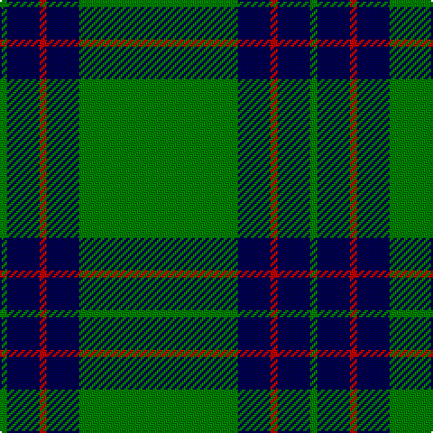

In pattern [GBRBG](/patterns/gbrbg/).

This was sourced from weddslist.  It is a [5 stripes tartan](/stripes/stripes5/).

Original link http://www.weddslist.com/cgi-bin/tartans/pg.pl?source=sts

## Thread count
G/4 DB18 R4 DB18 G/88

## Palette
Each colour and its ΔE from the base-6 reference it is a variant of.

| Colour | Shade | Base | ΔE (OKLab) |
|---|---|---|---|
| DB | <code style="background-color:#000050;">#000050</code> `#000050` | B <code style="background-color:#2A418A;">#2A418A</code> | 0.21 |
| G | <code style="background-color:#008000;">#008000</code> `#008000` | G <code style="background-color:#006100;">#006100</code> | 0.10 |
| R | <code style="background-color:#C00000;">#C00000</code> `#C00000` | R <code style="background-color:#CC0000;">#CC0000</code> | 0.03 |

# Sample pattern

## Nearest tartans

The nearest existing variants by ΔTartan distance.

1. [Fife, Duke of..](/setts/s6/g64k12g8k16r2k4-g008000-k000000-rc00000/) — ΔT 1.40
1. [Loch Rannoch Fancy Tartan Tartan Number: 943. Earliest known date: 1975 Nothing See products available Copyright © Blair Urquhart, Comrie, 2015](/setts/s5/g37w9g3k9w3-g006818-k101010-we0e0e0/) — ΔT 1.53
1. [Skene, or Tribe of Mar](/setts/s5/r2k4g32k4y2-g008000-k000000-rc00000-yf0c000/) — ΔT 1.58
1. [Fife Duke of.. District Tartan Tartan Number: 790. Earliest known date: 1889 Designed for the celebration of the wedding of Louise, the Princess Royal, daughter of Edward VII, and grand daughter of Queen Victoria, to Alexander Duff, the first Duke of Fife. The sett differs slightly from the modern district tartan. See products available Copyright © Blair Urquhart, Comrie, 2015](/setts/s6/g64k12g8k16r2k4-g006818-k101010-rc80000/) — ΔT 1.58
1. [Irvine](/setts/s5/g72b36k4b4w4-b304080-g008000-k000000-we0e0e0/) — ΔT 1.61
1. [Marshall University](/setts/s8/g50w2ga4w2g12k4w4ga6-g146400-ga003c14-k101010-wffffff/) — ΔT 1.63
1. [Mar District](/setts/s5/r2k4g32k4y2-g004c00-k000000-rc80000-yffc800/) — ΔT 1.64
1. [St Andrews Hotel, Golf Resort, and SPA](/setts/s6/g100b40k6b4r4b10-b304080-g008000-k000000-r806050/) — ΔT 1.72
1. [Inman (2016)](/setts/s7/r4g48k4g24y12k2r4-g005020-k101010-rdc0000-ye0a126/) — ΔT 1.75
1. [Welsh National (District)](/setts/s5/r16g6r8g88w8-g00643c-rc8002c-we0e0e0/) — ΔT 1.78

## Neighbour map

Every grey dot is one of 15726 variants placed by the first two principal components of the ΔTartan feature space (44% of its variance). Red is this tartan; blue dots are its nearest — click one to open its page.

<svg viewBox="0 0 640 380" role="img" style="max-width:100%;height:auto;border:1px solid #e0e0e0;border-radius:4px;display:block" xmlns="http://www.w3.org/2000/svg"><image href="/nn/cloud.v1.png" width="640" height="380"/><a href="/setts/s6/g64k12g8k16r2k4-g008000-k000000-rc00000/"><circle cx="439.8" cy="166.6" r="4" fill="#3465a4"><title>Fife, Duke of..</title></circle></a><a href="/setts/s5/g37w9g3k9w3-g006818-k101010-we0e0e0/"><circle cx="371.9" cy="209.8" r="4" fill="#3465a4"><title>Loch Rannoch Fancy Tartan Tartan Number: 943. Earliest known date: 1975 Nothing See products available Copyright © Blair Urquhart, Comrie, 2015</title></circle></a><a href="/setts/s5/r2k4g32k4y2-g008000-k000000-rc00000-yf0c000/"><circle cx="431.3" cy="174.9" r="4" fill="#3465a4"><title>Skene, or Tribe of Mar</title></circle></a><a href="/setts/s6/g64k12g8k16r2k4-g006818-k101010-rc80000/"><circle cx="500.4" cy="189.7" r="4" fill="#3465a4"><title>Fife Duke of.. District Tartan Tartan Number: 790. Earliest known date: 1889 Designed for the celebration of the wedding of Louise, the Princess Royal, daughter of Edward VII, and grand daughter of Queen Victoria, to Alexander Duff, the first Duke of Fife. The sett differs slightly from the modern district tartan. See products available Copyright © Blair Urquhart, Comrie, 2015</title></circle></a><a href="/setts/s5/g72b36k4b4w4-b304080-g008000-k000000-we0e0e0/"><circle cx="377.1" cy="190.4" r="4" fill="#3465a4"><title>Irvine</title></circle></a><a href="/setts/s8/g50w2ga4w2g12k4w4ga6-g146400-ga003c14-k101010-wffffff/"><circle cx="469.7" cy="142.0" r="4" fill="#3465a4"><title>Marshall University</title></circle></a><a href="/setts/s5/r2k4g32k4y2-g004c00-k000000-rc80000-yffc800/"><circle cx="454.1" cy="184.7" r="4" fill="#3465a4"><title>Mar District</title></circle></a><a href="/setts/s6/g100b40k6b4r4b10-b304080-g008000-k000000-r806050/"><circle cx="413.3" cy="169.2" r="4" fill="#3465a4"><title>St Andrews Hotel, Golf Resort, and SPA</title></circle></a><a href="/setts/s7/r4g48k4g24y12k2r4-g005020-k101010-rdc0000-ye0a126/"><circle cx="471.3" cy="169.5" r="4" fill="#3465a4"><title>Inman (2016)</title></circle></a><a href="/setts/s5/r16g6r8g88w8-g00643c-rc8002c-we0e0e0/"><circle cx="504.4" cy="206.5" r="4" fill="#3465a4"><title>Welsh National (District)</title></circle></a><circle cx="457.5" cy="195.4" r="5" fill="#c00000"/></svg>

ID: /setts/s5/g88b18r4b18g4-b000050-g008000-rc00000/
