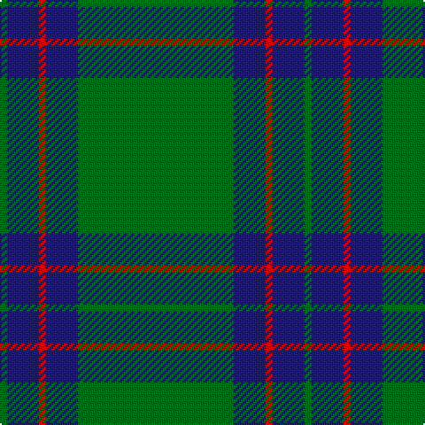

In pattern [GBRBG](/patterns/gbrbg/).

This was sourced from register-of-tartans.  It is a [5 stripes tartan](/stripes/stripes5/).

Original link https://www.tartanregister.gov.uk/tartanDetails.aspx?ref=4177

## Attestations

This cloth appears in 2 source records; the oldest owns this page.

- 01/01/1998 — Tyrconnell (Personal) (register-of-tartans, [record](https://www.tartanregister.gov.uk/tartanDetails.aspx?ref=4177))
- 1998 — Tyrconnell (Personal) (tartans-authority, [record](http://www.tartansauthority.com/tartan-ferret/display/2580/))

## Thread count
G/4 DB18 R4 DB18 G/88

## Palette
Each colour and its ΔE from the base-6 reference it is a variant of.

| Colour | Shade | Base | ΔE (OKLab) |
|---|---|---|---|
| DB | <code style="background-color:#202060;">#202060</code> `#202060` | B <code style="background-color:#2C4084;">#2C4084</code> | 0.11 |
| G | <code style="background-color:#006818;">#006818</code> `#006818` | G <code style="background-color:#006400;">#006400</code> | 0.02 |
| R | <code style="background-color:#C80000;">#C80000</code> `#C80000` | R <code style="background-color:#C80000;">#C80000</code> | 0.00 |

# Sample pattern

ID: /setts/s5/g88b18r4b18g4-b202060-g006818-rc80000/
