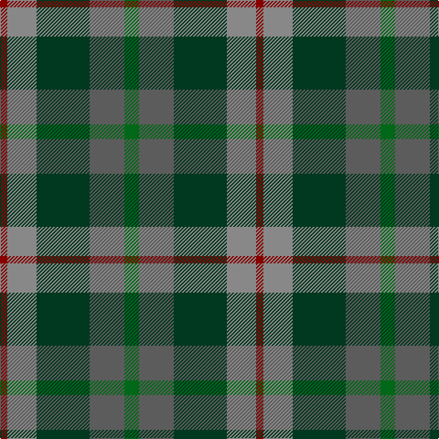

In pattern [GBGRR](/patterns/gbgrr/).

This was sourced from tartans-authority.  It is a [5 stripes tartan](/stripes/stripes5/).

Original link http://www.tartansauthority.com/tartan-ferret/display/5839/

## Thread count
DR/8 Na32 DG58 N38 G/16

## Palette
Each colour and its ΔE from the base-6 reference it is a variant of.

| Colour | Shade | Base | ΔE (OKLab) |
|---|---|---|---|
| DG | <code style="background-color:#003820;">#003820</code> `#003820` | G <code style="background-color:#006100;">#006100</code> | 0.15 |
| DR | <code style="background-color:#880000;">#880000</code> `#880000` | R <code style="background-color:#CC0000;">#CC0000</code> | 0.15 |
| G | <code style="background-color:#006818;">#006818</code> `#006818` | G <code style="background-color:#006100;">#006100</code> | 0.02 |
| N | <code style="background-color:#5C5C5C;">#5C5C5C</code> `#5C5C5C` | B <code style="background-color:#2A418A;">#2A418A</code> | 0.15 |
| Na | <code style="background-color:#888888;">#888888</code> `#888888` | R <code style="background-color:#CC0000;">#CC0000</code> | 0.24 |

# Sample pattern

## Nearest tartans

The nearest existing variants by ΔTartan distance.

1. [Saorsa (Corporate)](/setts/s6/b11g15k2ba5bb3ba11x2~b202060-ba5c5c5c-bb1c0070-g408060-k101010/) — ΔT 1.17
1. [Styrian](/setts/s8/r16g29b19ga8b19g29r16ra4x2~b5c5c5c-g003820-ga006818-r888888-ra880000/) — ΔT 1.17
1. [Casely](/setts/s6/r4g11k11g2b11ga3x4~b506878-g30644c-ga446428-k101010-rc80000/) — ΔT 1.21
1. [Tennant Family Tartan Tartan Number: 1653. Earliest known date: 1930 MacGregor-Hastie made few notes about his sample collection. In December 1967, Captain Tennant wrote to the Scottish Tartans Society, saying, ".. and I have no objection to other Tennants wearing it (Tennant tartan) but their problem will be to get hold of it ... I don't know of any other Tennant tartan and that is why I think my father designed this one." The head of the Tennant family is Lord Glenconner, descended from John Tennant of Blairston, Ayr. (1635). See products available Copyright © Blair Urquhart, Comrie, 2015](/setts/s7/r1g7b7k7ga7g7r1x4~b2c2c80-g604000-ga006818-k101010-rc80000/) — ΔT 1.24
1. [Tennant (Clan)](/setts/s7/r1g7b7k7ga7g7r1x4~b1474b4-g604000-ga006818-k101010-rc80000/) — ΔT 1.31
1. [Scottish Airports (Corporate)](/setts/s6/b4g18b3k17b18ba4x2~b3c505c-ba780078-g006818-k101010/) — ΔT 1.34
1. [Forres](/setts/s6/g2y1g5k4b5r1x4~b4c3428-g006818-k101010-r880000-yd09800/) — ΔT 1.39
1. [Corey (Name)](/setts/s5/b32g16ga3y4gb28x2~b1474b4-g604000-ga006818-gb003820-yd87c00/) — ΔT 1.40
1. [McMoosie Htg (Fashion)](/setts/s5/g46ga23b23r4y4x2~b1870a4-g604000-ga00643c-rcc4438-ye8c000/) — ΔT 1.41
1. [Breon (Jersey Shore, Pennsylvania) (Personal)](/setts/s5/b25g25k6ba10r6x2~b5f749c-ba433a5a-g23321b-k1c1714-rb62531/) — ΔT 1.44

## Neighbour map

Every grey dot is one of 15726 variants placed by the first two principal components of the ΔTartan feature space (44% of its variance). Red is this tartan; blue dots are its nearest — click one to open its page.

<svg viewBox="0 0 640 380" role="img" style="max-width:100%;height:auto;border:1px solid #e0e0e0;border-radius:4px;display:block" xmlns="http://www.w3.org/2000/svg"><image href="/nn/cloud.v1.png" width="640" height="380"/><a href="/setts/s6/b11g15k2ba5bb3ba11x2~b202060-ba5c5c5c-bb1c0070-g408060-k101010/"><circle cx="183.4" cy="251.4" r="4" fill="#3465a4"><title>Saorsa (Corporate)</title></circle></a><a href="/setts/s8/r16g29b19ga8b19g29r16ra4x2~b5c5c5c-g003820-ga006818-r888888-ra880000/"><circle cx="193.0" cy="257.0" r="4" fill="#3465a4"><title>Styrian</title></circle></a><a href="/setts/s6/r4g11k11g2b11ga3x4~b506878-g30644c-ga446428-k101010-rc80000/"><circle cx="130.4" cy="255.6" r="4" fill="#3465a4"><title>Casely</title></circle></a><a href="/setts/s7/r1g7b7k7ga7g7r1x4~b2c2c80-g604000-ga006818-k101010-rc80000/"><circle cx="165.5" cy="252.8" r="4" fill="#3465a4"><title>Tennant Family Tartan Tartan Number: 1653. Earliest known date: 1930 MacGregor-Hastie made few notes about his sample collection. In December 1967, Captain Tennant wrote to the Scottish Tartans Society, saying, &quot;.. and I have no objection to other Tennants wearing it (Tennant tartan) but their problem will be to get hold of it ... I don't know of any other Tennant tartan and that is why I think my father designed this one.&quot; The head of the Tennant family is Lord Glenconner, descended from John Tennant of Blairston, Ayr. (1635). See products available Copyright © Blair Urquhart, Comrie, 2015</title></circle></a><a href="/setts/s7/r1g7b7k7ga7g7r1x4~b1474b4-g604000-ga006818-k101010-rc80000/"><circle cx="149.3" cy="246.5" r="4" fill="#3465a4"><title>Tennant (Clan)</title></circle></a><a href="/setts/s6/b4g18b3k17b18ba4x2~b3c505c-ba780078-g006818-k101010/"><circle cx="220.3" cy="272.4" r="4" fill="#3465a4"><title>Scottish Airports (Corporate)</title></circle></a><a href="/setts/s6/g2y1g5k4b5r1x4~b4c3428-g006818-k101010-r880000-yd09800/"><circle cx="164.1" cy="261.9" r="4" fill="#3465a4"><title>Forres</title></circle></a><a href="/setts/s5/b32g16ga3y4gb28x2~b1474b4-g604000-ga006818-gb003820-yd87c00/"><circle cx="215.1" cy="230.5" r="4" fill="#3465a4"><title>Corey (Name)</title></circle></a><a href="/setts/s5/g46ga23b23r4y4x2~b1870a4-g604000-ga00643c-rcc4438-ye8c000/"><circle cx="282.0" cy="229.9" r="4" fill="#3465a4"><title>McMoosie Htg (Fashion)</title></circle></a><a href="/setts/s5/b25g25k6ba10r6x2~b5f749c-ba433a5a-g23321b-k1c1714-rb62531/"><circle cx="161.5" cy="273.6" r="4" fill="#3465a4"><title>Breon (Jersey Shore, Pennsylvania) (Personal)</title></circle></a><circle cx="192.6" cy="263.5" r="5" fill="#c00000"/></svg>

ID: /setts/s5/g8b19ga29r16ra4x2~b5c5c5c-g006818-ga003820-r888888-ra880000/
