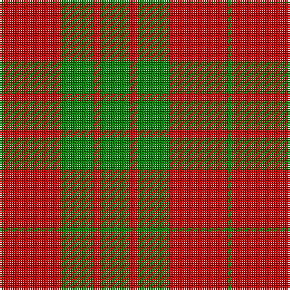

In pattern [GRGRG](/patterns/grgrg/).

This was sourced from weddslist.  It is a [5 stripes tartan](/stripes/stripes5/).

Original link http://www.weddslist.com/cgi-bin/tartans/pg.pl?source=sts

## Thread count
G/2 R32 G18 R4 G/16

## Palette
Each colour and its ΔE from the base-6 reference it is a variant of.

| Colour | Shade | Base | ΔE (OKLab) |
|---|---|---|---|
| G | <code style="background-color:#008000;">#008000</code> `#008000` | G <code style="background-color:#006100;">#006100</code> | 0.10 |
| R | <code style="background-color:#C00000;">#C00000</code> `#C00000` | R <code style="background-color:#CC0000;">#CC0000</code> | 0.03 |

# Sample pattern

## Nearest tartans

The nearest existing variants by ΔTartan distance.

1. [MacGregor of Glen Straye Htg Clan Tartan Tartan Number: 866. Earliest known date: 1842 This sett appears in the text of the Vestiarium but is not illustrated. Glen Straye (Glenstrae) lies in the heart of Campbell country and was the scene of a noteable period in the history of Clan Gregor which led to the prosciption of the name. See products available Copyright © Blair Urquhart, Comrie, 2015](/setts/s5/g8r2g9r16g1x2~g006818-rc80000/) — ΔT 0.49
1. [MacGregor of Glenstrae](/setts/s5/g8r2g9r16g1x2~g005020-rdc0000/) — ΔT 1.03
1. [Middleton](/setts/s4/g16r1g2r11x8~g006818-rc80000/) — ΔT 1.12
1. [Middleton](/setts/s4/g16r1g2r11x8~g008000-rc00000/) — ΔT 1.19
1. [Applecross, (MacDonald)](/setts/s4/g18r2g7r18x2~g008000-rc00000/) — ΔT 1.26
1. [Applecross](/setts/s4/g18r2g7r18x2~g006818-rc80000/) — ΔT 1.26
1. [Applecross (District)](/setts/s4/g18r2g7r18x4~g006818-rc80000/) — ΔT 1.26
1. [MacGregor of Glenstrae](/setts/s4/r17g9r2g9x2~g008000-rc00000/) — ΔT 1.29
1. [Erskine](/setts/s6/g6r1g24r28g1r4x2~g008000-rc00000/) — ΔT 1.30
1. [Unidentified, NW Highlands](/setts/s6/g2r2g15r16g2r2x2~g008000-rc00000/) — ΔT 1.34

## Neighbour map

Every grey dot is one of 15726 variants placed by the first two principal components of the ΔTartan feature space (44% of its variance). Red is this tartan; blue dots are its nearest — click one to open its page.

<svg viewBox="0 0 640 380" role="img" style="max-width:100%;height:auto;border:1px solid #e0e0e0;border-radius:4px;display:block" xmlns="http://www.w3.org/2000/svg"><image href="/nn/cloud.v1.png" width="640" height="380"/><a href="/setts/s5/g8r2g9r16g1x2~g006818-rc80000/"><circle cx="393.8" cy="249.6" r="4" fill="#3465a4"><title>MacGregor of Glen Straye Htg Clan Tartan Tartan Number: 866. Earliest known date: 1842 This sett appears in the text of the Vestiarium but is not illustrated. Glen Straye (Glenstrae) lies in the heart of Campbell country and was the scene of a noteable period in the history of Clan Gregor which led to the prosciption of the name. See products available Copyright © Blair Urquhart, Comrie, 2015</title></circle></a><a href="/setts/s5/g8r2g9r16g1x2~g005020-rdc0000/"><circle cx="381.3" cy="242.6" r="4" fill="#3465a4"><title>MacGregor of Glenstrae</title></circle></a><a href="/setts/s4/g16r1g2r11x8~g006818-rc80000/"><circle cx="442.7" cy="257.6" r="4" fill="#3465a4"><title>Middleton</title></circle></a><a href="/setts/s4/g16r1g2r11x8~g008000-rc00000/"><circle cx="434.8" cy="255.0" r="4" fill="#3465a4"><title>Middleton</title></circle></a><a href="/setts/s4/g18r2g7r18x2~g008000-rc00000/"><circle cx="375.0" cy="292.7" r="4" fill="#3465a4"><title>Applecross, (MacDonald)</title></circle></a><a href="/setts/s4/g18r2g7r18x2~g006818-rc80000/"><circle cx="382.5" cy="295.1" r="4" fill="#3465a4"><title>Applecross</title></circle></a><a href="/setts/s4/g18r2g7r18x4~g006818-rc80000/"><circle cx="382.5" cy="295.1" r="4" fill="#3465a4"><title>Applecross (District)</title></circle></a><a href="/setts/s4/r17g9r2g9x2~g008000-rc00000/"><circle cx="355.0" cy="297.0" r="4" fill="#3465a4"><title>MacGregor of Glenstrae</title></circle></a><a href="/setts/s6/g6r1g24r28g1r4x2~g008000-rc00000/"><circle cx="431.1" cy="197.3" r="4" fill="#3465a4"><title>Erskine</title></circle></a><a href="/setts/s6/g2r2g15r16g2r2x2~g008000-rc00000/"><circle cx="380.0" cy="245.0" r="4" fill="#3465a4"><title>Unidentified, NW Highlands</title></circle></a><circle cx="386.5" cy="247.4" r="5" fill="#c00000"/></svg>

ID: /setts/s5/g8r2g9r16g1x2~g008000-rc00000/
