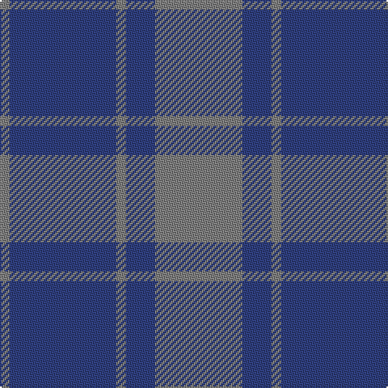

In pattern [GBGBG](/patterns/gbgbg/).

This was sourced from weddslist.  It is a [5 stripes tartan](/stripes/stripes5/).

Original link http://www.weddslist.com/cgi-bin/tartans/pg.pl?source=sts

## Thread count
N/6 B66 N6 B18 N/54

## Palette
Each colour and its ΔE from the base-6 reference it is a variant of.

| Colour | Shade | Base | ΔE (OKLab) |
|---|---|---|---|
| B | <code style="background-color:#304080;">#304080</code> `#304080` | B <code style="background-color:#2A418A;">#2A418A</code> | 0.02 |
| N | <code style="background-color:#808080;">#808080</code> `#808080` | G <code style="background-color:#006100;">#006100</code> | 0.23 |

# Sample pattern

## Nearest tartans

The nearest existing variants by ΔTartan distance.

1. [MacCallum High School](/setts/s5/r9b3r1b11r1x6~b3850c8-r888888/) — ΔT 1.06
1. [North Sea Commission](/setts/s5/b9ba3b1ba12y1x4~b5c8ca8-ba344054-ye8c000/) — ΔT 1.63
1. [Unidentified 17](/setts/s5/b16r2b16r19ra4x3~b304080-r806050-rac00000/) — ΔT 1.69
1. [Unidentified #24](/setts/s5/b16g2b16g19r4x3~b2c4084-g503c14-rdc0000/) — ΔT 1.71
1. [MacCallum High School Corporate Tartan Tartan Number: 1279. Earliest known date: 0 From the J. Rutledge Collection, Belfast. MacCallum High School, Philadelphia See products available Copyright © Blair Urquhart, Comrie, 2015](/setts/s5/r9b3r1b11r1x6~b2c2c80-r888888/) — ΔT 1.73
1. [Pringle, James (Fashion)](/setts/s7/b20ba2b3ba2b14g18b4x2~b2c2c80-ba64008c-g146400/) — ΔT 1.75
1. [Unidentified Tweed](/setts/s6/b4w1b12g12b1g4x2~b2c4084-g005020-we0e0e0/) — ΔT 1.78
1. [Unidentified Tartan Tartan Number: 598. Earliest known date: 0 Seen by Alex Lumsden in a Toronto subway 1984. See products available Copyright © Blair Urquhart, Comrie, 2015](/setts/s5/b16g2b16g19r4x3~b2c2c80-g604000-rc80000/) — ΔT 1.81
1. [Hamilton Hunting](/setts/s5/b11g2b15g18w2x2~b2c4084-g005020-we0e0e0/) — ΔT 1.82
1. [Harmony 11](/setts/s6/b6g2b29g29b2g6x2~b5a008c-g503c14/) — ΔT 1.86

## Neighbour map

Every grey dot is one of 15726 variants placed by the first two principal components of the ΔTartan feature space (44% of its variance). Red is this tartan; blue dots are its nearest — click one to open its page.

<svg viewBox="0 0 640 380" role="img" style="max-width:100%;height:auto;border:1px solid #e0e0e0;border-radius:4px;display:block" xmlns="http://www.w3.org/2000/svg"><image href="/nn/cloud.v1.png" width="640" height="380"/><a href="/setts/s5/r9b3r1b11r1x6~b3850c8-r888888/"><circle cx="443.7" cy="281.3" r="4" fill="#3465a4"><title>MacCallum High School</title></circle></a><a href="/setts/s5/b9ba3b1ba12y1x4~b5c8ca8-ba344054-ye8c000/"><circle cx="396.1" cy="249.5" r="4" fill="#3465a4"><title>North Sea Commission</title></circle></a><a href="/setts/s5/b16r2b16r19ra4x3~b304080-r806050-rac00000/"><circle cx="407.5" cy="299.0" r="4" fill="#3465a4"><title>Unidentified 17</title></circle></a><a href="/setts/s5/b16g2b16g19r4x3~b2c4084-g503c14-rdc0000/"><circle cx="398.3" cy="298.7" r="4" fill="#3465a4"><title>Unidentified #24</title></circle></a><a href="/setts/s5/r9b3r1b11r1x6~b2c2c80-r888888/"><circle cx="402.2" cy="264.7" r="4" fill="#3465a4"><title>MacCallum High School Corporate Tartan Tartan Number: 1279. Earliest known date: 0 From the J. Rutledge Collection, Belfast. MacCallum High School, Philadelphia See products available Copyright © Blair Urquhart, Comrie, 2015</title></circle></a><a href="/setts/s7/b20ba2b3ba2b14g18b4x2~b2c2c80-ba64008c-g146400/"><circle cx="432.8" cy="259.2" r="4" fill="#3465a4"><title>Pringle, James (Fashion)</title></circle></a><a href="/setts/s6/b4w1b12g12b1g4x2~b2c4084-g005020-we0e0e0/"><circle cx="383.3" cy="262.2" r="4" fill="#3465a4"><title>Unidentified Tweed</title></circle></a><a href="/setts/s5/b16g2b16g19r4x3~b2c2c80-g604000-rc80000/"><circle cx="382.7" cy="290.5" r="4" fill="#3465a4"><title>Unidentified Tartan Tartan Number: 598. Earliest known date: 0 Seen by Alex Lumsden in a Toronto subway 1984. See products available Copyright © Blair Urquhart, Comrie, 2015</title></circle></a><a href="/setts/s5/b11g2b15g18w2x2~b2c4084-g005020-we0e0e0/"><circle cx="363.5" cy="286.3" r="4" fill="#3465a4"><title>Hamilton Hunting</title></circle></a><a href="/setts/s6/b6g2b29g29b2g6x2~b5a008c-g503c14/"><circle cx="451.4" cy="254.2" r="4" fill="#3465a4"><title>Harmony 11</title></circle></a><circle cx="448.4" cy="284.0" r="5" fill="#c00000"/></svg>

ID: /setts/s5/g9b3g1b11g1x6~b304080-g808080/
