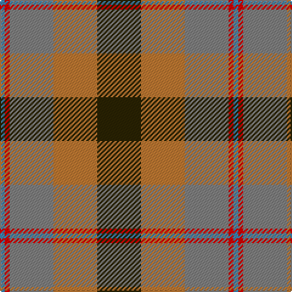

In pattern [BRGRG](/patterns/brgrg/).

This was sourced from register-of-tartans.  It is a [5 stripes tartan](/stripes/stripes5/).

Original link https://www.tartanregister.gov.uk/tartanDetails.aspx?ref=1882

## Thread count
B/4 R4 N36 DO36 K/36

## Palette
Each colour and its ΔE from the base-6 reference it is a variant of.

| Colour | Shade | Base | ΔE (OKLab) |
|---|---|---|---|
| B | <code style="background-color:#3C82AF;">#3C82AF</code> `#3C82AF` | B <code style="background-color:#2A418A;">#2A418A</code> | 0.19 |
| DO | <code style="background-color:#BE7832;">#BE7832</code> `#BE7832` | R <code style="background-color:#CC0000;">#CC0000</code> | 0.17 |
| K | <code style="background-color:#2A2303;">#2A2303</code> `#2A2303` | G <code style="background-color:#006100;">#006100</code> | 0.21 |
| N | <code style="background-color:#808080;">#808080</code> `#808080` | G <code style="background-color:#006100;">#006100</code> | 0.23 |
| R | <code style="background-color:#DC0000;">#DC0000</code> `#DC0000` | R <code style="background-color:#CC0000;">#CC0000</code> | 0.03 |

# Sample pattern

## Nearest tartans

The nearest existing variants by ΔTartan distance.

1. [Thompson (J.C.'s Fancy) (Personal)](/setts/s6/r2y8b2g4k4g1x6~b2c2c80-g789484-k101010-rc80000-ya08858/) — ΔT 1.05
1. [Patterson, John](/setts/s6/g3b12w1ga12r12ga2x2~b304080-g008000-ga003000-rc00000-we0e0e0/) — ΔT 1.23
1. [McEachem (Name)](/setts/s6/b7w1r6ba10g10w1x4~b5c5c5c-ba003c64-g006818-rc80000-we0e0e0/) — ΔT 1.25
1. [Thompson's Fancy Personal Tartan Tartan Number: 286. Earliest known date: pre 2003 Designed for his own use. See products available Copyright © Blair Urquhart, Comrie, 2015](/setts/s6/r2g8b2ba4k4ba1x6~b2c2c80-ba5c8ca8-g604000-k101010-rc80000/) — ΔT 1.28
1. [Logan](/setts/s7/b9r3y1r3g9r3y1x2~b304080-g008000-rc00000-yf0c000/) — ΔT 1.30
1. [Canine All Dogs (Fashion)](/setts/s6/r10b6g24ba24r6y3~b2c2c80-ba1c1c50-g006818-rc80000-ye8c000/) — ΔT 1.32
1. [Rothesay](/setts/s7/g4b12y2k10ga10y3ga2x2~b5c5c5c-g006818-ga8c7038-k101010-yd09800/) — ΔT 1.32
1. [Caledonian Brewery (Corporate)](/setts/s7/w4g13ga6r16wa2r2ga2x2~g003820-ga006818-r880000-wc0c0c0-waa8ace8/) — ΔT 1.34
1. [Pople (Name)](/setts/s5/k1r9b8g8w1x2~b5c5c5c-g808080-k101010-r880000-we0e0e0/) — ΔT 1.34
1. [Strathblane (Fashion)](/setts/s5/g12k4w2r6ra3x2~g604000-k101010-r888888-rac80000-we0e0e0/) — ΔT 1.38

## Neighbour map

Every grey dot is one of 15726 variants placed by the first two principal components of the ΔTartan feature space (44% of its variance). Red is this tartan; blue dots are its nearest — click one to open its page.

<svg viewBox="0 0 640 380" role="img" style="max-width:100%;height:auto;border:1px solid #e0e0e0;border-radius:4px;display:block" xmlns="http://www.w3.org/2000/svg"><image href="/nn/cloud.v1.png" width="640" height="380"/><a href="/setts/s6/r2y8b2g4k4g1x6~b2c2c80-g789484-k101010-rc80000-ya08858/"><circle cx="142.0" cy="210.2" r="4" fill="#3465a4"><title>Thompson (J.C.'s Fancy) (Personal)</title></circle></a><a href="/setts/s6/g3b12w1ga12r12ga2x2~b304080-g008000-ga003000-rc00000-we0e0e0/"><circle cx="167.4" cy="198.1" r="4" fill="#3465a4"><title>Patterson, John</title></circle></a><a href="/setts/s6/b7w1r6ba10g10w1x4~b5c5c5c-ba003c64-g006818-rc80000-we0e0e0/"><circle cx="128.2" cy="216.6" r="4" fill="#3465a4"><title>McEachem (Name)</title></circle></a><a href="/setts/s6/r2g8b2ba4k4ba1x6~b2c2c80-ba5c8ca8-g604000-k101010-rc80000/"><circle cx="161.1" cy="221.5" r="4" fill="#3465a4"><title>Thompson's Fancy Personal Tartan Tartan Number: 286. Earliest known date: pre 2003 Designed for his own use. See products available Copyright © Blair Urquhart, Comrie, 2015</title></circle></a><a href="/setts/s7/b9r3y1r3g9r3y1x2~b304080-g008000-rc00000-yf0c000/"><circle cx="164.8" cy="205.9" r="4" fill="#3465a4"><title>Logan</title></circle></a><a href="/setts/s6/r10b6g24ba24r6y3~b2c2c80-ba1c1c50-g006818-rc80000-ye8c000/"><circle cx="139.5" cy="211.7" r="4" fill="#3465a4"><title>Canine All Dogs (Fashion)</title></circle></a><a href="/setts/s7/g4b12y2k10ga10y3ga2x2~b5c5c5c-g006818-ga8c7038-k101010-yd09800/"><circle cx="102.4" cy="223.5" r="4" fill="#3465a4"><title>Rothesay</title></circle></a><a href="/setts/s7/w4g13ga6r16wa2r2ga2x2~g003820-ga006818-r880000-wc0c0c0-waa8ace8/"><circle cx="183.5" cy="194.8" r="4" fill="#3465a4"><title>Caledonian Brewery (Corporate)</title></circle></a><a href="/setts/s5/k1r9b8g8w1x2~b5c5c5c-g808080-k101010-r880000-we0e0e0/"><circle cx="200.0" cy="230.4" r="4" fill="#3465a4"><title>Pople (Name)</title></circle></a><a href="/setts/s5/g12k4w2r6ra3x2~g604000-k101010-r888888-rac80000-we0e0e0/"><circle cx="172.0" cy="229.4" r="4" fill="#3465a4"><title>Strathblane (Fashion)</title></circle></a><circle cx="161.1" cy="218.4" r="5" fill="#c00000"/></svg>

ID: /setts/s5/g9r9ga9ra1b1x4~b3c82af-g2a2303-ga808080-rbe7832-radc0000/
