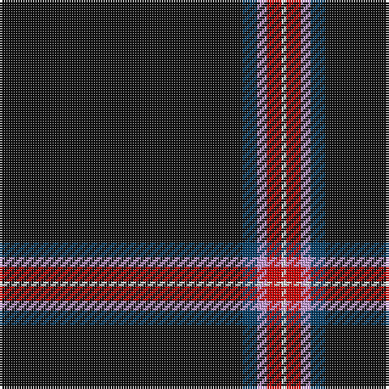

In pattern [KBWRW](/patterns/kbwrw/).

This was sourced from house-of-tartan.  It is a [5 stripes tartan](/stripes/stripes5/).

Original link http://www.house-of-tartan.scotland.net/house/TartanViewjs.asp?colr=Def&tnam=7565

## Thread count
K/100 DB6 LP4 R6 LN/2

## Palette
Each colour and its ΔE from the base-6 reference it is a variant of.

| Colour | Shade | Base | ΔE (OKLab) |
|---|---|---|---|
| DB | <code style="background-color:#003C64;">#003C64</code> `#003C64` | B <code style="background-color:#2A418A;">#2A418A</code> | 0.08 |
| K | <code style="background-color:#101010;">#101010</code> `#101010` | K <code style="background-color:#000000;">#000000</code> | 0.17 |
| LN | <code style="background-color:#E0E0E0;">#E0E0E0</code> `#E0E0E0` | W <code style="background-color:#F7F7F7;">#F7F7F7</code> | 0.07 |
| LP | <code style="background-color:#C49CD8;">#C49CD8</code> `#C49CD8` | W <code style="background-color:#F7F7F7;">#F7F7F7</code> | 0.25 |
| P | <code style="background-color:#9050D8;">#9050D8</code> `#9050D8` | B <code style="background-color:#2A418A;">#2A418A</code> | 0.21 |
| R | <code style="background-color:#C80000;">#C80000</code> `#C80000` | R <code style="background-color:#CC0000;">#CC0000</code> | 0.01 |

# Sample pattern

## Nearest tartans

The nearest existing variants by ΔTartan distance.

1. [McHattie (Personal)](/setts/s5/k90b4r8y2w2-b202060-k101010-rc80000-we0e0e0-ye8c000/) — ΔT 0.27
1. [Fettes (Personal)](/setts/s5/k200b12ba8r12w4-b004878-baa060bc-k101010-rc80000-we0e0e0/) — ΔT 0.27
1. [McHattie (Personal)](/setts/s5/k90b4r8y2w2-b1474b4-k101010-rc80000-we0e0e0-ye8c000/) — ΔT 0.42
1. [Forand (Personal)](/setts/s5/k200r2ra20b20y4-b1c0070-k101010-rc80000-ra888888-ye8c000/) — ΔT 0.69
1. [Perratt (Personal)](/setts/s6/k166g8r8g20k2w6-g006818-k101010-rc80000-wfcfcfc/) — ΔT 1.32
1. [Modern Craft (Masonic)](/setts/s8/k216ka8y8w4y8ka2b4w4-b2c2c80-k101010-ka1c1714-wfcfcfc-ya0a0a0/) — ΔT 1.34
1. [Spirit of Lanarkshire (Corporate)](/setts/s8/k166y4b8r4k16g10r8w6-b2c2c80-g006818-k101010-rc80000-we0e0e0-ye8c000/) — ΔT 1.50
1. [Modern Craft (Masonic)](/setts/s8/k216b8w8wa4w8b2ba4wa4-b5c5c5c-ba202060-k101010-wc0c0c0-wafcfcfc/) — ΔT 1.53
1. [Dellen](/setts/s6/k160r12g6r24k4w4-g06392b-k1c1714-rb62531-wf9f5ef/) — ΔT 1.57
1. [Dellen](/setts/s6/k160r12g6r24k4w4-g006818-k101010-rcc4438-wfcfcfc/) — ΔT 1.60

## Neighbour map

Every grey dot is one of 15726 variants placed by the first two principal components of the ΔTartan feature space (44% of its variance). Red is this tartan; blue dots are its nearest — click one to open its page.

<svg viewBox="0 0 640 380" role="img" style="max-width:100%;height:auto;border:1px solid #e0e0e0;border-radius:4px;display:block" xmlns="http://www.w3.org/2000/svg"><image href="/nn/cloud.v1.png" width="640" height="380"/><a href="/setts/s5/k90b4r8y2w2-b202060-k101010-rc80000-we0e0e0-ye8c000/"><circle cx="619.3" cy="131.0" r="4" fill="#3465a4"><title>McHattie (Personal)</title></circle></a><a href="/setts/s5/k200b12ba8r12w4-b004878-baa060bc-k101010-rc80000-we0e0e0/"><circle cx="626.0" cy="132.0" r="4" fill="#3465a4"><title>Fettes (Personal)</title></circle></a><a href="/setts/s5/k90b4r8y2w2-b1474b4-k101010-rc80000-we0e0e0-ye8c000/"><circle cx="610.9" cy="127.4" r="4" fill="#3465a4"><title>McHattie (Personal)</title></circle></a><a href="/setts/s5/k200r2ra20b20y4-b1c0070-k101010-rc80000-ra888888-ye8c000/"><circle cx="596.2" cy="135.4" r="4" fill="#3465a4"><title>Forand (Personal)</title></circle></a><a href="/setts/s6/k166g8r8g20k2w6-g006818-k101010-rc80000-wfcfcfc/"><circle cx="586.9" cy="129.1" r="4" fill="#3465a4"><title>Perratt (Personal)</title></circle></a><a href="/setts/s8/k216ka8y8w4y8ka2b4w4-b2c2c80-k101010-ka1c1714-wfcfcfc-ya0a0a0/"><circle cx="618.5" cy="85.5" r="4" fill="#3465a4"><title>Modern Craft (Masonic)</title></circle></a><a href="/setts/s8/k166y4b8r4k16g10r8w6-b2c2c80-g006818-k101010-rc80000-we0e0e0-ye8c000/"><circle cx="561.2" cy="84.6" r="4" fill="#3465a4"><title>Spirit of Lanarkshire (Corporate)</title></circle></a><a href="/setts/s8/k216b8w8wa4w8b2ba4wa4-b5c5c5c-ba202060-k101010-wc0c0c0-wafcfcfc/"><circle cx="606.3" cy="79.7" r="4" fill="#3465a4"><title>Modern Craft (Masonic)</title></circle></a><a href="/setts/s6/k160r12g6r24k4w4-g06392b-k1c1714-rb62531-wf9f5ef/"><circle cx="581.4" cy="139.0" r="4" fill="#3465a4"><title>Dellen</title></circle></a><a href="/setts/s6/k160r12g6r24k4w4-g006818-k101010-rcc4438-wfcfcfc/"><circle cx="556.0" cy="130.2" r="4" fill="#3465a4"><title>Dellen</title></circle></a><circle cx="622.2" cy="128.9" r="5" fill="#c00000"/></svg>

ID: /setts/s5/k100b6w4r6wa2-b003c64-k101010-rc80000-wc49cd8-wae0e0e0/
