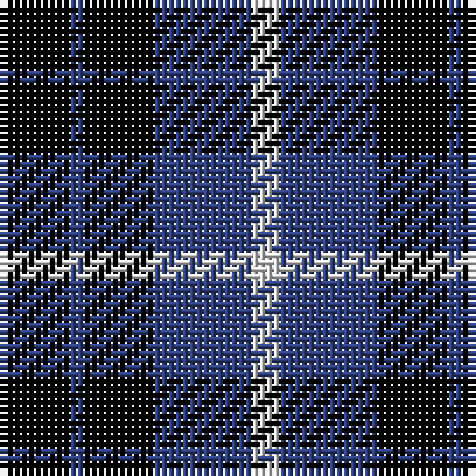

In pattern [KBKBW](/patterns/kbkbw/).

This was sourced from weddslist.  It is a [5 stripes tartan](/stripes/stripes5/).

Original link http://www.weddslist.com/cgi-bin/tartans/pg.pl?source=sts

## Thread count
K/10 B2 K10 B14 LN/4

## Palette
Each colour and its ΔE from the base-6 reference it is a variant of.

| Colour | Shade | Base | ΔE (OKLab) |
|---|---|---|---|
| B | <code style="background-color:#304080;">#304080</code> `#304080` | B <code style="background-color:#2A418A;">#2A418A</code> | 0.02 |
| K | <code style="background-color:#000000;">#000000</code> `#000000` | K <code style="background-color:#000000;">#000000</code> | 0.00 |
| LN | <code style="background-color:#E0E0E0;">#E0E0E0</code> `#E0E0E0` | W <code style="background-color:#F7F7F7;">#F7F7F7</code> | 0.07 |

# Sample pattern

## Nearest tartans

The nearest existing variants by ΔTartan distance.

1. [Grampian T.V. Corporate Tartan Tartan Number: 1058. Earliest known date: pre 1992 Created by Johnstons of Elgin See products available Copyright © Blair Urquhart, Comrie, 2015](/setts/s5/k10b2k10b14w4-b2c2c80-k101010-we0e0e0/) — ΔT 1.02
1. [College of Radiographers](/setts/s5/k30g4k20b36w6-b304080-g908000-k000000-we0e0e0/) — ΔT 1.09
1. [Grampian Television (Corporate)](/setts/s5/k24b6k24b36w10-b305470-k101010-wfcfcfc/) — ΔT 1.22
1. [Allen, Nicholas (Personal)](/setts/s6/r16k48b20k10b20k10-b0000cd-k000000-rc8002c/) — ΔT 1.24
1. [College of Radiographers Corporate Tartan Tartan Number: 1274. Earliest known date: 1988 Marketed in Edinburgh around 1930s but no longer seen. See products available Copyright © Blair Urquhart, Comrie, 2015](/setts/s5/k30y4k20b36w6-b2c2c80-k101010-we0e0e0-ye8c000/) — ΔT 1.44
1. [Wilson's, No 118](/setts/s3/k10b8y2-b5480b0-k000000-yf0c000/) — ΔT 1.46
1. [Black Watch](/setts/s6/k10g46k36b42k66b6-b304080-g008000-k000000/) — ΔT 1.51
1. [Scott, Sir Walter](/setts/s6/k6b18k22ba4g18k6-b800080-ba5480b0-g008000-k000000/) — ΔT 1.58
1. [College of Radiographers](/setts/s5/k30y4k20b36w6-b00008c-k101010-wc8c8c8-yc88c00/) — ΔT 1.61
1. [Laval (Tartan de..)](/setts/s5/b4w4ba16b16w2-b000050-ba600030-we0e0e0/) — ΔT 1.62

## Neighbour map

Every grey dot is one of 15726 variants placed by the first two principal components of the ΔTartan feature space (44% of its variance). Red is this tartan; blue dots are its nearest — click one to open its page.

<svg viewBox="0 0 640 380" role="img" style="max-width:100%;height:auto;border:1px solid #e0e0e0;border-radius:4px;display:block" xmlns="http://www.w3.org/2000/svg"><image href="/nn/cloud.v1.png" width="640" height="380"/><a href="/setts/s5/k10b2k10b14w4-b2c2c80-k101010-we0e0e0/"><circle cx="255.5" cy="279.9" r="4" fill="#3465a4"><title>Grampian T.V. Corporate Tartan Tartan Number: 1058. Earliest known date: pre 1992 Created by Johnstons of Elgin See products available Copyright © Blair Urquhart, Comrie, 2015</title></circle></a><a href="/setts/s5/k30g4k20b36w6-b304080-g908000-k000000-we0e0e0/"><circle cx="248.6" cy="239.8" r="4" fill="#3465a4"><title>College of Radiographers</title></circle></a><a href="/setts/s5/k24b6k24b36w10-b305470-k101010-wfcfcfc/"><circle cx="229.2" cy="280.5" r="4" fill="#3465a4"><title>Grampian Television (Corporate)</title></circle></a><a href="/setts/s6/r16k48b20k10b20k10-b0000cd-k000000-rc8002c/"><circle cx="251.0" cy="275.9" r="4" fill="#3465a4"><title>Allen, Nicholas (Personal)</title></circle></a><a href="/setts/s5/k30y4k20b36w6-b2c2c80-k101010-we0e0e0-ye8c000/"><circle cx="265.6" cy="243.3" r="4" fill="#3465a4"><title>College of Radiographers Corporate Tartan Tartan Number: 1274. Earliest known date: 1988 Marketed in Edinburgh around 1930s but no longer seen. See products available Copyright © Blair Urquhart, Comrie, 2015</title></circle></a><a href="/setts/s3/k10b8y2-b5480b0-k000000-yf0c000/"><circle cx="218.7" cy="305.7" r="4" fill="#3465a4"><title>Wilson's, No 118</title></circle></a><a href="/setts/s6/k10g46k36b42k66b6-b304080-g008000-k000000/"><circle cx="268.8" cy="251.9" r="4" fill="#3465a4"><title>Black Watch</title></circle></a><a href="/setts/s6/k6b18k22ba4g18k6-b800080-ba5480b0-g008000-k000000/"><circle cx="166.6" cy="251.3" r="4" fill="#3465a4"><title>Scott, Sir Walter</title></circle></a><a href="/setts/s5/k30y4k20b36w6-b00008c-k101010-wc8c8c8-yc88c00/"><circle cx="271.3" cy="250.2" r="4" fill="#3465a4"><title>College of Radiographers</title></circle></a><a href="/setts/s5/b4w4ba16b16w2-b000050-ba600030-we0e0e0/"><circle cx="253.2" cy="243.0" r="4" fill="#3465a4"><title>Laval (Tartan de..)</title></circle></a><circle cx="234.6" cy="274.1" r="5" fill="#c00000"/></svg>

ID: /setts/s5/k10b2k10b14w4-b304080-k000000-we0e0e0/
