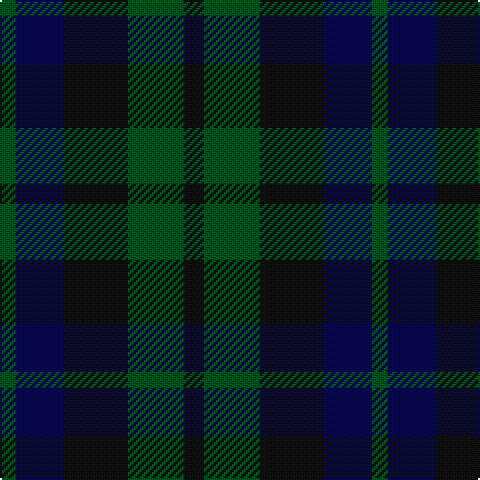

In pattern [GBKGK](/patterns/gbkgk/).

This was sourced from register-of-tartans.  It is a [5 stripes tartan](/stripes/stripes5/).

Original link https://www.tartanregister.gov.uk/tartanDetails.aspx?ref=4230

## Thread count
G/8 DB24 K32 G28 K/10

## Palette
Each colour and its ΔE from the base-6 reference it is a variant of.

| Colour | Shade | Base | ΔE (OKLab) |
|---|---|---|---|
| DB | <code style="background-color:#080848;">#080848</code> `#080848` | B <code style="background-color:#2A418A;">#2A418A</code> | 0.20 |
| G | <code style="background-color:#005020;">#005020</code> `#005020` | G <code style="background-color:#006100;">#006100</code> | 0.07 |
| K | <code style="background-color:#101010;">#101010</code> `#101010` | K <code style="background-color:#000000;">#000000</code> | 0.17 |

# Sample pattern

## Nearest tartans

The nearest existing variants by ΔTartan distance.

1. [Unidentified No 63](/setts/s7/k6g8k2g8k6b8k2-b2c4084-g005020-k101010/) — ΔT 1.06
1. [Sutherland 42nd](/setts/s6/b4k4b12k12g12k4-b2c4084-g005020-k101010/) — ΔT 1.11
1. [Unidentified no. 54](/setts/s6/b4g12b12ba10b2ba4-b080848-ba280032-g005020/) — ΔT 1.44
1. [Barwell](/setts/s4/g4b12g12r4-b202060-g003820-r880000/) — ΔT 1.50
1. [MacCormick Hunting (Name)](/setts/s5/k6g40k40ga40k6-g003820-ga006818-k101010/) — ΔT 1.55
1. [I Y](/setts/s6/k8g32k26b32ba6b6-b141e46-ba5f749c-g005448-k101010/) — ΔT 1.61
1. [Bright of Garth (Personal)](/setts/s5/g42ga36b42ga6b12-b14283c-g006818-ga604000/) — ΔT 1.64
1. [MacIntyre](/setts/s7/k24g24k4g24k24b24ba6-b2c4084-ba3c82af-g005020-k101010/) — ΔT 1.72
1. [Tennant](/setts/s4/k36g36ga42r8-g005020-ga2a2303-k101010-rdc0000/) — ΔT 1.73
1. [MacCallum #2](/setts/s7/k12g12r2g12k12b12k2-b2c4084-g005020-k101010-rdc0000/) — ΔT 1.77

## Neighbour map

Every grey dot is one of 15726 variants placed by the first two principal components of the ΔTartan feature space (44% of its variance). Red is this tartan; blue dots are its nearest — click one to open its page.

<svg viewBox="0 0 640 380" role="img" style="max-width:100%;height:auto;border:1px solid #e0e0e0;border-radius:4px;display:block" xmlns="http://www.w3.org/2000/svg"><image href="/nn/cloud.v1.png" width="640" height="380"/><a href="/setts/s7/k6g8k2g8k6b8k2-b2c4084-g005020-k101010/"><circle cx="233.6" cy="336.4" r="4" fill="#3465a4"><title>Unidentified No 63</title></circle></a><a href="/setts/s6/b4k4b12k12g12k4-b2c4084-g005020-k101010/"><circle cx="231.9" cy="341.5" r="4" fill="#3465a4"><title>Sutherland 42nd</title></circle></a><a href="/setts/s6/b4g12b12ba10b2ba4-b080848-ba280032-g005020/"><circle cx="286.9" cy="322.7" r="4" fill="#3465a4"><title>Unidentified no. 54</title></circle></a><a href="/setts/s4/g4b12g12r4-b202060-g003820-r880000/"><circle cx="333.6" cy="366.0" r="4" fill="#3465a4"><title>Barwell</title></circle></a><a href="/setts/s5/k6g40k40ga40k6-g003820-ga006818-k101010/"><circle cx="273.8" cy="311.9" r="4" fill="#3465a4"><title>MacCormick Hunting (Name)</title></circle></a><a href="/setts/s6/k8g32k26b32ba6b6-b141e46-ba5f749c-g005448-k101010/"><circle cx="234.8" cy="300.0" r="4" fill="#3465a4"><title>I Y</title></circle></a><a href="/setts/s5/g42ga36b42ga6b12-b14283c-g006818-ga604000/"><circle cx="290.4" cy="322.5" r="4" fill="#3465a4"><title>Bright of Garth (Personal)</title></circle></a><a href="/setts/s7/k24g24k4g24k24b24ba6-b2c4084-ba3c82af-g005020-k101010/"><circle cx="209.8" cy="295.5" r="4" fill="#3465a4"><title>MacIntyre</title></circle></a><a href="/setts/s4/k36g36ga42r8-g005020-ga2a2303-k101010-rdc0000/"><circle cx="208.5" cy="335.9" r="4" fill="#3465a4"><title>Tennant</title></circle></a><a href="/setts/s7/k12g12r2g12k12b12k2-b2c4084-g005020-k101010-rdc0000/"><circle cx="218.2" cy="289.8" r="4" fill="#3465a4"><title>MacCallum #2</title></circle></a><circle cx="262.6" cy="355.0" r="5" fill="#c00000"/></svg>

ID: /setts/s5/k10g28k32b24g8-b080848-g005020-k101010/
