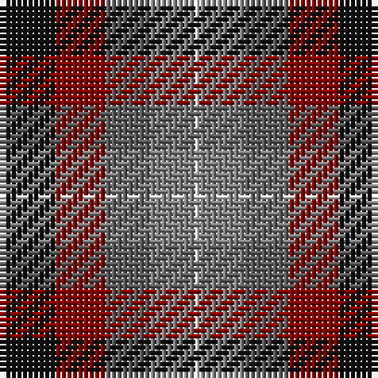

This page is one **sett** — a single exact thread-count. It belongs to the [tartan](/tartans/k10r9n8y8w1/)
(the same proportion at any scale), whose colour order is pattern [KRBGW](/stripes/krbgw/).

Sourced from register-of-tartans.  It is a [5 stripe tartan](/stripes/stripes5/).

Original link https://www.tartanregister.gov.uk/tartanDetails.aspx?ref=5159

## Register references

External register numbers recorded for this tartan.

- Scottish Register of Tartans: [5159](https://www.tartanregister.gov.uk/tartanDetails.aspx?ref=5159)
- Scottish Tartans Authority (ITI): 3247

## Thread count
K/10 DR9 N8 Na8 LN/1

## Palette

Palette: <strong>Tartan Register</strong> <small style="color:#888">(4 of 5 colours)</small>
<table><thead><tr><th>Colour</th><th>Threads</th><th>Shade</th><th>Base</th><th>OKLCh</th></tr></thead><tbody><tr><td>K/</td><td style="text-align:right;font-variant-numeric:tabular-nums">10</td><td><code style="background-color:#101010;">#101010</code> <small style="color:#888">#101010</small></td><td>K <code style="background-color:#000000;">#000000</code></td><td><small style="color:#888">oklch(17.3% 0.000 89.9)</small></td></tr><tr><td>DR</td><td style="text-align:right;font-variant-numeric:tabular-nums">9</td><td><code style="background-color:#880000;">#880000</code> <small style="color:#888">#880000</small></td><td>R <code style="background-color:#CC0000;">#CC0000</code></td><td><small style="color:#888">oklch(39.4% 0.162 29.2)</small></td></tr><tr><td>N</td><td style="text-align:right;font-variant-numeric:tabular-nums">8</td><td><code style="background-color:#5C5C5C;">#5C5C5C</code> <small style="color:#888">#5C5C5C</small></td><td>B <code style="background-color:#2A418A;">#2A418A</code></td><td><small style="color:#888">oklch(47.5% 0.000 89.9)</small></td></tr><tr><td>Na</td><td style="text-align:right;font-variant-numeric:tabular-nums">8</td><td><code style="background-color:#808080;">#808080</code> <small style="color:#888">#808080</small></td><td>G <code style="background-color:#006100;">#006100</code></td><td><small style="color:#888">oklch(60.0% 0.000 89.9)</small></td></tr><tr><td>LN/</td><td style="text-align:right;font-variant-numeric:tabular-nums">1</td><td><code style="background-color:#E0E0E0;">#E0E0E0</code> <small style="color:#888">#E0E0E0</small></td><td>W <code style="background-color:#F7F7F7;">#F7F7F7</code></td><td><small style="color:#888">oklch(90.7% 0.000 89.9)</small></td></tr></tbody></table>

# Sample pattern

## Nearest tartans

The nearest existing variants by ΔTartan distance, with this tartan at the top so the swatches line up against it.

ΔTartan

Tartan

Sett

—

<a href="/ttd/edit/#slug=k10r9n8y8w1">Pople</a> <a class="nn-out" href="/setts/s5/k10r9n8y8w1/" title="open its dictionary page">↗</a>

1.29

<a href="/ttd/edit/#slug=db9r24dg24k24db24ly2db9">Dundas</a> <a class="nn-out" href="/setts/s7/db9r24dg24k24db24ly2db9/" title="open its dictionary page">↗</a>

1.31

<a href="/ttd/edit/#slug=do19dg23lo3db15r11w5~x2">Mekos, The</a> <a class="nn-out" href="/setts/s6/do19dg23lo3db15r11w5~x2/" title="open its dictionary page">↗</a>

1.36

<a href="/ttd/edit/#slug=dp20k5k19g19ly2~x2">Martin Hunting</a> <a class="nn-out" href="/setts/s5/dp20k5k19g19ly2~x2/" title="open its dictionary page">↗</a>

1.44

<a href="/ttd/edit/#slug=dp9k7dg5r4dg7k1ly1~x2">MacLaren #2</a> <a class="nn-out" href="/setts/s7/dp9k7dg5r4dg7k1ly1~x2/" title="open its dictionary page">↗</a>

1.46

<a href="/ttd/edit/#slug=dp11y2k10g10lo2~x2">Selkirk (Name)</a> <a class="nn-out" href="/setts/s5/dp11y2k10g10lo2~x2/" title="open its dictionary page">↗</a>

1.47

<a href="/ttd/edit/#slug=r2dy8db2t4k4t1~x6">Thompson's Fancy Personal Tartan Tartan Number: 286. Earliest known date: pre 2003 Designed for his own use. See products available Copyright © Blair Urquhart, Comrie, 2015</a> <a class="nn-out" href="/setts/s6/r2dy8db2t4k4t1~x6/" title="open its dictionary page">↗</a>

1.48

<a href="/ttd/edit/#slug=dp11t2k10g10ly3~x2">Nobiliary Fraternity</a> <a class="nn-out" href="/setts/s5/dp11t2k10g10ly3~x2/" title="open its dictionary page">↗</a>

1.49

<a href="/ttd/edit/#slug=dp27db4k27g27lo4~x2">Selkirk (Personal)</a> <a class="nn-out" href="/setts/s5/dp27db4k27g27lo4~x2/" title="open its dictionary page">↗</a>

1.53

<a href="/ttd/edit/#slug=g3db12w1dg12r12dg2~x2">Patterson, John (Personal)</a> <a class="nn-out" href="/setts/s6/g3db12w1dg12r12dg2~x2/" title="open its dictionary page">↗</a>

1.55

<a href="/ttd/edit/#slug=g15dg18db23w4r8~x2">Friebe (2014)</a> <a class="nn-out" href="/setts/s5/g15dg18db23w4r8~x2/" title="open its dictionary page">↗</a>

## Neighbour map

Every grey dot is one of 14299 variants placed by the first two principal components of the ΔTartan feature space (44% of its variance). Red is this tartan; blue dots are its nearest — click one to open its page.

<svg viewBox="0 0 640 380" role="img" style="max-width:100%;height:auto;border:1px solid #e0e0e0;border-radius:4px;display:block" xmlns="http://www.w3.org/2000/svg"><image href="/nn/cloud.v1.png" width="640" height="380"/><a href="/setts/s7/db9r24dg24k24db24ly2db9/"><circle cx="148.2" cy="215.0" r="4" fill="#3465a4"><title>Dundas</title></circle></a><a href="/setts/s6/do19dg23lo3db15r11w5~x2/"><circle cx="86.6" cy="217.0" r="4" fill="#3465a4"><title>Mekos, The</title></circle></a><a href="/setts/s5/dp20k5k19g19ly2~x2/"><circle cx="138.1" cy="228.6" r="4" fill="#3465a4"><title>Martin Hunting</title></circle></a><a href="/setts/s7/dp9k7dg5r4dg7k1ly1~x2/"><circle cx="143.7" cy="220.9" r="4" fill="#3465a4"><title>MacLaren #2</title></circle></a><a href="/setts/s5/dp11y2k10g10lo2~x2/"><circle cx="111.8" cy="246.7" r="4" fill="#3465a4"><title>Selkirk (Name)</title></circle></a><a href="/setts/s6/r2dy8db2t4k4t1~x6/"><circle cx="163.3" cy="225.3" r="4" fill="#3465a4"><title>Thompson's Fancy Personal Tartan Tartan Number: 286. Earliest known date: pre 2003 Designed for his own use. See products available Copyright © Blair Urquhart, Comrie, 2015</title></circle></a><a href="/setts/s5/dp11t2k10g10ly3~x2/"><circle cx="88.0" cy="245.8" r="4" fill="#3465a4"><title>Nobiliary Fraternity</title></circle></a><a href="/setts/s5/dp27db4k27g27lo4~x2/"><circle cx="136.1" cy="243.2" r="4" fill="#3465a4"><title>Selkirk (Personal)</title></circle></a><a href="/setts/s6/g3db12w1dg12r12dg2~x2/"><circle cx="169.2" cy="199.7" r="4" fill="#3465a4"><title>Patterson, John (Personal)</title></circle></a><a href="/setts/s5/g15dg18db23w4r8~x2/"><circle cx="91.2" cy="249.9" r="4" fill="#3465a4"><title>Friebe (2014)</title></circle></a><circle cx="107.7" cy="244.5" r="5" fill="#c00000"/></svg>

ID: /setts/s5/k10r9n8y8w1/
