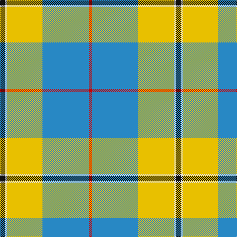

In pattern [KWYBR](/patterns/kwybr/).

This was sourced from house-of-tartan.  It is a [5 stripes tartan](/stripes/stripes5/).

Original link http://www.house-of-tartan.scotland.net/house/TartanViewjs.asp?colr=Def&tnam=1262

## Thread count
K/10 LN4 Y72 B94 R/6

## Palette
Each colour and its ΔE from the base-6 reference it is a variant of.

| Colour | Shade | Base | ΔE (OKLab) |
|---|---|---|---|
| B | <code style="background-color:#2888C4;">#2888C4</code> `#2888C4` | B <code style="background-color:#2C4084;">#2C4084</code> | 0.21 |
| K | <code style="background-color:#101010;">#101010</code> `#101010` | K <code style="background-color:#000000;">#000000</code> | 0.17 |
| LN | <code style="background-color:#E0E0E0;">#E0E0E0</code> `#E0E0E0` | W <code style="background-color:#F4F4F0;">#F4F4F0</code> | 0.06 |
| R | <code style="background-color:#C80000;">#C80000</code> `#C80000` | R <code style="background-color:#C80000;">#C80000</code> | 0.00 |
| Y | <code style="background-color:#E8C000;">#E8C000</code> `#E8C000` | Y <code style="background-color:#E8C000;">#E8C000</code> | 0.00 |

# Sample pattern

## Nearest tartans

The nearest existing variants by ΔTartan distance.

1. [Oliver Dress Pink](/setts/s5/k10w4y72b94r6-b2888c4-k101010-rc80000-wfcfcfc-ye8c000/) — ΔT 0.04
1. [Cornish, National Day](/setts/s5/k10w4y72b94r6-b8080d0-k000000-rc00000-we0e0e0-yf0c000/) — ΔT 1.05
1. [Kinloch of Loch Awe (Personal)](/setts/s5/w36r58b4ba6k2-b2888c4-ba780078-k101010-r888888-wf8f8f8/) — ΔT 1.12
1. [Cornish National Day](/setts/s8/k10w4y72b94r6b94y72w4-b2888c4-k101010-rc80000-wfcfcfc-ye8c000/) — ΔT 1.14
1. [Scotstown](/setts/s5/y8g68w24b20r4-b1474b4-g005020-rfa4b00-wffffff-ya0a0a0/) — ΔT 1.42
1. [Exabyte](/setts/s5/r6w70b8g94wa6-b304080-g008000-r802040-wc0c0c0-wae0e0e0/) — ΔT 1.43
1. [Manx Laxey Dress Green](/setts/s5/w28b8y2g16ba4-b780078-ba2c2c80-g006818-we0e0e0-ye8c000/) — ΔT 1.46
1. [Tilburg Hunting (District)](/setts/s7/b12k6b74y82w6y12w6-b1068a4-k101010-we0e0e0-yd8a810/) — ΔT 1.46
1. [Herriot (New Zealand) (Name)](/setts/s6/w15y2b5ya3ba40b10-b003c64-ba64809c-we0e0e0-ye8c000-yaa0a0a0/) — ΔT 1.47
1. [Galicia](/setts/s6/b106k4w106k4r8y14-b788cb4-k000000-r9c0000-wfcfcfc-yc89800/) — ΔT 1.51

## Neighbour map

Every grey dot is one of 15726 variants placed by the first two principal components of the ΔTartan feature space (44% of its variance). Red is this tartan; blue dots are its nearest — click one to open its page.

<svg viewBox="0 0 640 380" role="img" style="max-width:100%;height:auto;border:1px solid #e0e0e0;border-radius:4px;display:block" xmlns="http://www.w3.org/2000/svg"><image href="/nn/cloud.v1.png" width="640" height="380"/><a href="/setts/s5/k10w4y72b94r6-b2888c4-k101010-rc80000-wfcfcfc-ye8c000/"><circle cx="287.6" cy="144.3" r="4" fill="#3465a4"><title>Oliver Dress Pink</title></circle></a><a href="/setts/s5/k10w4y72b94r6-b8080d0-k000000-rc00000-we0e0e0-yf0c000/"><circle cx="286.6" cy="135.9" r="4" fill="#3465a4"><title>Cornish, National Day</title></circle></a><a href="/setts/s5/w36r58b4ba6k2-b2888c4-ba780078-k101010-r888888-wf8f8f8/"><circle cx="322.4" cy="132.0" r="4" fill="#3465a4"><title>Kinloch of Loch Awe (Personal)</title></circle></a><a href="/setts/s8/k10w4y72b94r6b94y72w4-b2888c4-k101010-rc80000-wfcfcfc-ye8c000/"><circle cx="294.0" cy="138.8" r="4" fill="#3465a4"><title>Cornish National Day</title></circle></a><a href="/setts/s5/y8g68w24b20r4-b1474b4-g005020-rfa4b00-wffffff-ya0a0a0/"><circle cx="253.9" cy="165.0" r="4" fill="#3465a4"><title>Scotstown</title></circle></a><a href="/setts/s5/r6w70b8g94wa6-b304080-g008000-r802040-wc0c0c0-wae0e0e0/"><circle cx="288.3" cy="170.9" r="4" fill="#3465a4"><title>Exabyte</title></circle></a><a href="/setts/s5/w28b8y2g16ba4-b780078-ba2c2c80-g006818-we0e0e0-ye8c000/"><circle cx="202.5" cy="166.0" r="4" fill="#3465a4"><title>Manx Laxey Dress Green</title></circle></a><a href="/setts/s7/b12k6b74y82w6y12w6-b1068a4-k101010-we0e0e0-yd8a810/"><circle cx="285.9" cy="161.4" r="4" fill="#3465a4"><title>Tilburg Hunting (District)</title></circle></a><a href="/setts/s6/w15y2b5ya3ba40b10-b003c64-ba64809c-we0e0e0-ye8c000-yaa0a0a0/"><circle cx="291.5" cy="150.8" r="4" fill="#3465a4"><title>Herriot (New Zealand) (Name)</title></circle></a><a href="/setts/s6/b106k4w106k4r8y14-b788cb4-k000000-r9c0000-wfcfcfc-yc89800/"><circle cx="258.4" cy="111.7" r="4" fill="#3465a4"><title>Galicia</title></circle></a><circle cx="288.8" cy="144.9" r="5" fill="#c00000"/></svg>

ID: /setts/s5/k10w4y72b94r6-b2888c4-k101010-rc80000-we0e0e0-ye8c000/
