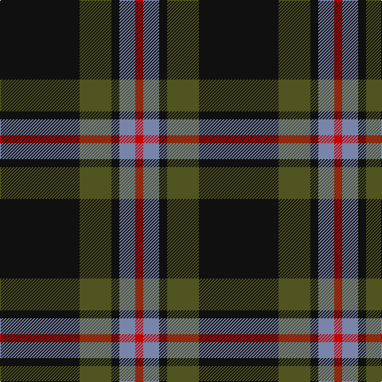

This page is one **sett** — a single exact thread-count. It belongs to the [tartan](/tartans/k10g4k1b2r1/)
(the same proportion at any scale), whose colour order is pattern [KGKBR](/stripes/kgkbr/).

Sourced from register-of-tartans.  It is a [5 stripe tartan](/stripes/stripes5/).

Original link https://www.tartanregister.gov.uk/tartanDetails.aspx?ref=5659

## Register references

External register numbers recorded for this tartan.

- Scottish Register of Tartans: [5659](https://www.tartanregister.gov.uk/tartanDetails.aspx?ref=5659)
- Scottish Tartans Authority (ITI): 7646

## Thread count
K/100 G40 K10 B20 R/10

## Palette
Each colour and the base-6 reference it is a variant of.

| Colour | Shade | Base |
|---|---|---|
| B | <code style="background-color:#7884A8;">#7884A8</code> `oklch(61.7% 0.056 270.3)` <small>#7884A8</small> | B <code style="background-color:#2A418A;">#2A418A</code> |
| G | <code style="background-color:#505420;">#505420</code> `oklch(43.0% 0.074 113.1)` <small>#505420</small> | G <code style="background-color:#006100;">#006100</code> |
| K | <code style="background-color:#101010;">#101010</code> `oklch(17.3% 0.000 89.9)` <small>#101010</small> | K <code style="background-color:#000000;">#000000</code> |
| R | <code style="background-color:#C80000;">#C80000</code> `oklch(52.3% 0.215 29.2)` <small>#C80000</small> | R <code style="background-color:#CC0000;">#CC0000</code> |

# Sample pattern

## Nearest tartans

The nearest existing variants by ΔTartan distance, with this tartan at the top so the swatches line up against it.

ΔTartan

Tartan

Sett

—

<a href="/ttd/edit/#slug=k10y4k1t2r1~x10">Brotherhood of the Kilt</a> <a class="nn-out" href="/setts/s5/k10y4k1t2r1~x10/" title="open its dictionary page">↗</a>

1.04

<a href="/ttd/edit/#slug=k31r12ly2n5k2~x4">Perry (2014)</a> <a class="nn-out" href="/setts/s5/k31r12ly2n5k2~x4/" title="open its dictionary page">↗</a>

1.10

<a href="/ttd/edit/#slug=k3w2n27k31p3~x2">Kelley Oliphint</a> <a class="nn-out" href="/setts/s5/k3w2n27k31p3~x2/" title="open its dictionary page">↗</a>

1.13

<a href="/ttd/edit/#slug=m11dr5dg5k40ly3~x2">MacShimsi Personal Tartan Tartan Number: 7318. Earliest known date: 2007 Designed for the MacShimsi Clan in Dundee See products available Copyright © Blair Urquhart, Comrie, 2015</a> <a class="nn-out" href="/setts/s5/m11dr5dg5k40ly3~x2/" title="open its dictionary page">↗</a>

1.16

<a href="/ttd/edit/#slug=y4k48y16r12b3~x2">Calgary Firefighters</a> <a class="nn-out" href="/setts/s5/y4k48y16r12b3~x2/" title="open its dictionary page">↗</a>

1.21

<a href="/ttd/edit/#slug=r17db7lo8dg58k6~x2">St Johns County's Sheriff's Office</a> <a class="nn-out" href="/setts/s5/r17db7lo8dg58k6~x2/" title="open its dictionary page">↗</a>

1.22

<a href="/ttd/edit/#slug=k3w2n27k31lr3~x2">Kelley Oliphint (Commemorative)</a> <a class="nn-out" href="/setts/s5/k3w2n27k31lr3~x2/" title="open its dictionary page">↗</a>

1.27

<a href="/ttd/edit/#slug=k36w3k10w3g28r6k18~x2">Wild Highlanders (Corporate)</a> <a class="nn-out" href="/setts/s7/k36w3k10w3g28r6k18~x2/" title="open its dictionary page">↗</a>

1.30

<a href="/ttd/edit/#slug=o4k48o16r12db3~x2">Calgary Firefighters (Corporate)</a> <a class="nn-out" href="/setts/s5/o4k48o16r12db3~x2/" title="open its dictionary page">↗</a>

1.33

<a href="/ttd/edit/#slug=r11r5g5k40ly3~x2">MacShimsi</a> <a class="nn-out" href="/setts/s5/r11r5g5k40ly3~x2/" title="open its dictionary page">↗</a>

1.33

<a href="/ttd/edit/#slug=k32b2k6b2k13n30w2~x2">Mountain Rescue Association Honor Guard</a> <a class="nn-out" href="/setts/s7/k32b2k6b2k13n30w2~x2/" title="open its dictionary page">↗</a>

## Neighbour map

Every grey dot is one of 14299 variants placed by the first two principal components of the ΔTartan feature space (44% of its variance). Red is this tartan; blue dots are its nearest — click one to open its page.

<svg viewBox="0 0 640 380" role="img" style="max-width:100%;height:auto;border:1px solid #e0e0e0;border-radius:4px;display:block" xmlns="http://www.w3.org/2000/svg"><image href="/nn/cloud.v1.png" width="640" height="380"/><a href="/setts/s5/k31r12ly2n5k2~x4/"><circle cx="401.2" cy="201.9" r="4" fill="#3465a4"><title>Perry (2014)</title></circle></a><a href="/setts/s5/k3w2n27k31p3~x2/"><circle cx="341.1" cy="206.8" r="4" fill="#3465a4"><title>Kelley Oliphint</title></circle></a><a href="/setts/s5/m11dr5dg5k40ly3~x2/"><circle cx="366.4" cy="191.4" r="4" fill="#3465a4"><title>MacShimsi Personal Tartan Tartan Number: 7318. Earliest known date: 2007 Designed for the MacShimsi Clan in Dundee See products available Copyright © Blair Urquhart, Comrie, 2015</title></circle></a><a href="/setts/s5/y4k48y16r12b3~x2/"><circle cx="342.5" cy="192.8" r="4" fill="#3465a4"><title>Calgary Firefighters</title></circle></a><a href="/setts/s5/r17db7lo8dg58k6~x2/"><circle cx="317.4" cy="197.5" r="4" fill="#3465a4"><title>St Johns County's Sheriff's Office</title></circle></a><a href="/setts/s5/k3w2n27k31lr3~x2/"><circle cx="328.9" cy="199.6" r="4" fill="#3465a4"><title>Kelley Oliphint (Commemorative)</title></circle></a><a href="/setts/s7/k36w3k10w3g28r6k18~x2/"><circle cx="329.2" cy="209.0" r="4" fill="#3465a4"><title>Wild Highlanders (Corporate)</title></circle></a><a href="/setts/s5/o4k48o16r12db3~x2/"><circle cx="336.1" cy="188.8" r="4" fill="#3465a4"><title>Calgary Firefighters (Corporate)</title></circle></a><a href="/setts/s5/r11r5g5k40ly3~x2/"><circle cx="349.7" cy="179.4" r="4" fill="#3465a4"><title>MacShimsi</title></circle></a><a href="/setts/s7/k32b2k6b2k13n30w2~x2/"><circle cx="377.2" cy="202.6" r="4" fill="#3465a4"><title>Mountain Rescue Association Honor Guard</title></circle></a><circle cx="357.1" cy="227.3" r="5" fill="#c00000"/></svg>

ID: /setts/s5/k10y4k1t2r1~x10/
