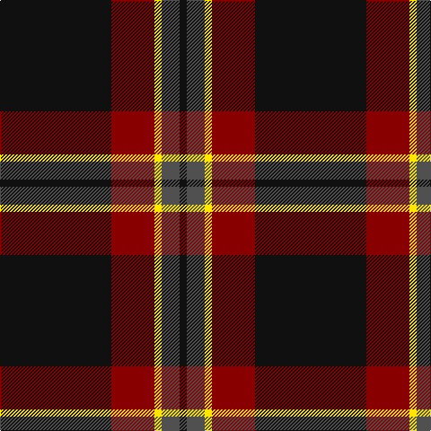

In pattern [KBYRK](/patterns/kbyrk/).

This was sourced from register-of-tartans.  It is a [5 stripes tartan](/stripes/stripes5/).

Original link https://www.tartanregister.gov.uk/tartanDetails.aspx?ref=11023

## Thread count
K/124 DR48 Y8 N20 K/8

## Palette
Each colour and its ΔE from the base-6 reference it is a variant of.

| Colour | Shade | Base | ΔE (OKLab) |
|---|---|---|---|
| DR | <code style="background-color:#880000;">#880000</code> `#880000` | R <code style="background-color:#CC0000;">#CC0000</code> | 0.15 |
| K | <code style="background-color:#101010;">#101010</code> `#101010` | K <code style="background-color:#000000;">#000000</code> | 0.17 |
| N | <code style="background-color:#505050;">#505050</code> `#505050` | B <code style="background-color:#2A418A;">#2A418A</code> | 0.13 |
| Y | <code style="background-color:#FFE600;">#FFE600</code> `#FFE600` | Y <code style="background-color:#F2BF00;">#F2BF00</code> | 0.10 |

# Sample pattern

## Nearest tartans

The nearest existing variants by ΔTartan distance.

1. [Perry (2014)](/setts/s5/k124r48y8b20k8-b5c5c5c-k101010-rc80000-ye8c000/) — ΔT 0.74
1. [MacShimsi Personal Tartan Tartan Number: 7318. Earliest known date: 2007 Designed for the MacShimsi Clan in Dundee See products available Copyright © Blair Urquhart, Comrie, 2015](/setts/s5/r22b10g10k80y6-b601830-g285828-k101010-r882c4c-ydcd00c/) — ΔT 0.98
1. [Perry (Calgary), Alex (Personal)](/setts/s4/k124b48y10w6-b3f4441-k120a01-wf7f1e8-yef8f06/) — ΔT 1.01
1. [Brotherhood of the Kilt](/setts/s5/k100g40k10b20r10-b7884a8-g505420-k101010-rc80000/) — ΔT 1.04
1. [Calgary Firefighters](/setts/s5/g8k96g32r24b6-b4876ff-g696969-k101010-rdb2929/) — ΔT 1.05
1. [MacShimsi](/setts/s5/r22ra10g10k80y6-g006818-k101010-rb43448-ra901c38-ye8c000/) — ΔT 1.08
1. [Calgary Firefighters (Corporate)](/setts/s5/r8k96r32ra24b6-b2c2c80-k101010-r888888-rac80000/) — ΔT 1.17
1. [Meaux, Luc G (Personal)](/setts/s4/k124r48y10g6-g084106-k05132f-r780713-yef8f06/) — ΔT 1.23
1. [Mountain Rescue Assoc. (Corporate)](/setts/s7/k64b4k12b4k26ba60w4-b1474b4-ba5c5c5c-k101010-wfcfcfc/) — ΔT 1.29
1. [Kelley Oliphint](/setts/s5/b6k62ba54w4k6-b871f78-ba555555-k101010-wffffff/) — ΔT 1.33

## Neighbour map

Every grey dot is one of 15726 variants placed by the first two principal components of the ΔTartan feature space (44% of its variance). Red is this tartan; blue dots are its nearest — click one to open its page.

<svg viewBox="0 0 640 380" role="img" style="max-width:100%;height:auto;border:1px solid #e0e0e0;border-radius:4px;display:block" xmlns="http://www.w3.org/2000/svg"><image href="/nn/cloud.v1.png" width="640" height="380"/><a href="/setts/s5/k124r48y8b20k8-b5c5c5c-k101010-rc80000-ye8c000/"><circle cx="383.1" cy="188.5" r="4" fill="#3465a4"><title>Perry (2014)</title></circle></a><a href="/setts/s5/r22b10g10k80y6-b601830-g285828-k101010-r882c4c-ydcd00c/"><circle cx="364.2" cy="188.7" r="4" fill="#3465a4"><title>MacShimsi Personal Tartan Tartan Number: 7318. Earliest known date: 2007 Designed for the MacShimsi Clan in Dundee See products available Copyright © Blair Urquhart, Comrie, 2015</title></circle></a><a href="/setts/s4/k124b48y10w6-b3f4441-k120a01-wf7f1e8-yef8f06/"><circle cx="420.4" cy="201.9" r="4" fill="#3465a4"><title>Perry (Calgary), Alex (Personal)</title></circle></a><a href="/setts/s5/k100g40k10b20r10-b7884a8-g505420-k101010-rc80000/"><circle cx="355.6" cy="224.8" r="4" fill="#3465a4"><title>Brotherhood of the Kilt</title></circle></a><a href="/setts/s5/g8k96g32r24b6-b4876ff-g696969-k101010-rdb2929/"><circle cx="340.8" cy="191.8" r="4" fill="#3465a4"><title>Calgary Firefighters</title></circle></a><a href="/setts/s5/r22ra10g10k80y6-g006818-k101010-rb43448-ra901c38-ye8c000/"><circle cx="347.9" cy="178.5" r="4" fill="#3465a4"><title>MacShimsi</title></circle></a><a href="/setts/s5/r8k96r32ra24b6-b2c2c80-k101010-r888888-rac80000/"><circle cx="334.5" cy="188.5" r="4" fill="#3465a4"><title>Calgary Firefighters (Corporate)</title></circle></a><a href="/setts/s4/k124r48y10g6-g084106-k05132f-r780713-yef8f06/"><circle cx="448.6" cy="211.7" r="4" fill="#3465a4"><title>Meaux, Luc G (Personal)</title></circle></a><a href="/setts/s7/k64b4k12b4k26ba60w4-b1474b4-ba5c5c5c-k101010-wfcfcfc/"><circle cx="364.0" cy="189.8" r="4" fill="#3465a4"><title>Mountain Rescue Assoc. (Corporate)</title></circle></a><a href="/setts/s5/b6k62ba54w4k6-b871f78-ba555555-k101010-wffffff/"><circle cx="338.7" cy="204.1" r="4" fill="#3465a4"><title>Kelley Oliphint</title></circle></a><circle cx="399.9" cy="199.9" r="5" fill="#c00000"/></svg>

ID: /setts/s5/k124r48y8b20k8-b505050-k101010-r880000-yffe600/
