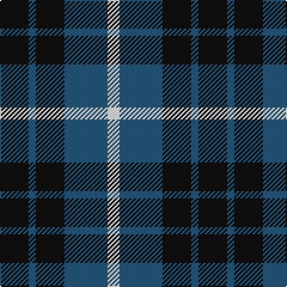

In pattern [KBKBW](/patterns/kbkbw/).

This was sourced from tartans-authority.  It is a [5 stripes tartan](/stripes/stripes5/).

Original link http://www.tartansauthority.com/tartan-ferret/display/1058/

## Thread count
K/24 B6 K24 B36 W/10

## Palette
Each colour and its ΔE from the base-6 reference it is a variant of.

| Colour | Shade | Base | ΔE (OKLab) |
|---|---|---|---|
| B | <code style="background-color:#305470;">#305470</code> `#305470` | B <code style="background-color:#2A418A;">#2A418A</code> | 0.08 |
| K | <code style="background-color:#101010;">#101010</code> `#101010` | K <code style="background-color:#000000;">#000000</code> | 0.17 |
| W | <code style="background-color:#FCFCFC;">#FCFCFC</code> `#FCFCFC` | W <code style="background-color:#F7F7F7;">#F7F7F7</code> | 0.01 |

# Sample pattern

## Nearest tartans

The nearest existing variants by ΔTartan distance.

1. [Grampian T.V. Corporate Tartan Tartan Number: 1058. Earliest known date: pre 1992 Created by Johnstons of Elgin See products available Copyright © Blair Urquhart, Comrie, 2015](/setts/s5/k5b1k5b7w2x2~b2c2c80-k101010-we0e0e0/) — ΔT 0.95
1. [Johore Regiment (Military)](/setts/s5/b20k5b18y26k6x2~b2c2c80-k101010-yd09800/) — ΔT 1.00
1. [Grampian Television](/setts/s8/k12b3k12b18w5b18k12b3x2~b305470-k101010-wfcfcfc/) — ΔT 1.17
1. [Grampian, T.V.](/setts/s5/k5b1k5b7w2x2~b304080-k000000-we0e0e0/) — ΔT 1.23
1. [Campbell of Glenlyon](/setts/s5/g7k6b7k1b2x2~b304080-g008000-k000000/) — ΔT 1.34
1. [Hamilton Green Hunting](/setts/s5/b8g2b8g15w2x4~b1c0070-g006818-wc0c0c0/) — ΔT 1.35
1. [Wilson's, No 118](/setts/s3/k5b4y1x2~b5480b0-k000000-yf0c000/) — ΔT 1.38
1. [Jahore](/setts/s5/b20k5b18y26k6x2~b304080-k000000-yf0c000/) — ΔT 1.38
1. [Salt Spring Island](/setts/s4/r1g6b6w1x4~b000048-g285800-rdc0000-wffffff/) — ΔT 1.41
1. [College of Radiographers Corporate Tartan Tartan Number: 1274. Earliest known date: 1988 Marketed in Edinburgh around 1930s but no longer seen. See products available Copyright © Blair Urquhart, Comrie, 2015](/setts/s5/k15y2k10b18w3x2~b2c2c80-k101010-we0e0e0-ye8c000/) — ΔT 1.44

## Neighbour map

Every grey dot is one of 15726 variants placed by the first two principal components of the ΔTartan feature space (44% of its variance). Red is this tartan; blue dots are its nearest — click one to open its page.

<svg viewBox="0 0 640 380" role="img" style="max-width:100%;height:auto;border:1px solid #e0e0e0;border-radius:4px;display:block" xmlns="http://www.w3.org/2000/svg"><image href="/nn/cloud.v1.png" width="640" height="380"/><a href="/setts/s5/k5b1k5b7w2x2~b2c2c80-k101010-we0e0e0/"><circle cx="253.6" cy="282.8" r="4" fill="#3465a4"><title>Grampian T.V. Corporate Tartan Tartan Number: 1058. Earliest known date: pre 1992 Created by Johnstons of Elgin See products available Copyright © Blair Urquhart, Comrie, 2015</title></circle></a><a href="/setts/s5/b20k5b18y26k6x2~b2c2c80-k101010-yd09800/"><circle cx="224.9" cy="278.8" r="4" fill="#3465a4"><title>Johore Regiment (Military)</title></circle></a><a href="/setts/s8/k12b3k12b18w5b18k12b3x2~b305470-k101010-wfcfcfc/"><circle cx="255.2" cy="270.9" r="4" fill="#3465a4"><title>Grampian Television</title></circle></a><a href="/setts/s5/k5b1k5b7w2x2~b304080-k000000-we0e0e0/"><circle cx="232.3" cy="277.8" r="4" fill="#3465a4"><title>Grampian, T.V.</title></circle></a><a href="/setts/s5/g7k6b7k1b2x2~b304080-g008000-k000000/"><circle cx="175.2" cy="277.3" r="4" fill="#3465a4"><title>Campbell of Glenlyon</title></circle></a><a href="/setts/s5/b8g2b8g15w2x4~b1c0070-g006818-wc0c0c0/"><circle cx="279.2" cy="271.4" r="4" fill="#3465a4"><title>Hamilton Green Hunting</title></circle></a><a href="/setts/s3/k5b4y1x2~b5480b0-k000000-yf0c000/"><circle cx="215.3" cy="309.8" r="4" fill="#3465a4"><title>Wilson's, No 118</title></circle></a><a href="/setts/s5/b20k5b18y26k6x2~b304080-k000000-yf0c000/"><circle cx="203.9" cy="270.8" r="4" fill="#3465a4"><title>Jahore</title></circle></a><a href="/setts/s4/r1g6b6w1x4~b000048-g285800-rdc0000-wffffff/"><circle cx="196.3" cy="256.5" r="4" fill="#3465a4"><title>Salt Spring Island</title></circle></a><a href="/setts/s5/k15y2k10b18w3x2~b2c2c80-k101010-we0e0e0-ye8c000/"><circle cx="264.5" cy="246.0" r="4" fill="#3465a4"><title>College of Radiographers Corporate Tartan Tartan Number: 1274. Earliest known date: 1988 Marketed in Edinburgh around 1930s but no longer seen. See products available Copyright © Blair Urquhart, Comrie, 2015</title></circle></a><circle cx="226.9" cy="283.4" r="5" fill="#c00000"/></svg>

ID: /setts/s5/k12b3k12b18w5x2~b305470-k101010-wfcfcfc/
