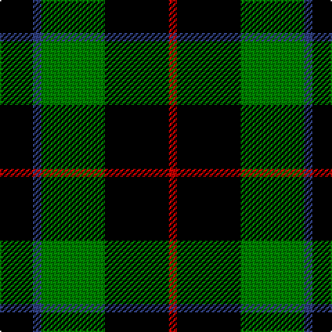

In pattern [KBGKR](/stripes/kbgkr/).

This was sourced from weddslist.  It is a [5 stripe tartan](/stripes/stripes5/).

Original link http://www.weddslist.com/cgi-bin/tartans/pg.pl?source=sts

## Thread count
K/24 B6 G46 K46 R/6

## Palette
Each colour and the base-6 reference it is a variant of.

| Colour | Shade | Base |
|---|---|---|
| B | <code style="background-color:#304080;">#304080</code> `oklch(39.4% 0.109 270.2)` <small>#304080</small> | B <code style="background-color:#2A418A;">#2A418A</code> |
| G | <code style="background-color:#008000;">#008000</code> `oklch(52.0% 0.177 142.5)` <small>#008000</small> | G <code style="background-color:#006100;">#006100</code> |
| K | <code style="background-color:#000000;">#000000</code> `oklch(0.0% 0.000 0.0)` <small>#000000</small> | K <code style="background-color:#000000;">#000000</code> |
| R | <code style="background-color:#C00000;">#C00000</code> `oklch(50.7% 0.208 29.2)` <small>#C00000</small> | R <code style="background-color:#CC0000;">#CC0000</code> |

# Sample pattern

## Nearest tartans

The nearest existing variants by ΔTartan distance.

1. [Murray](/setts/s6/t3k16g16k16db3t3~x2/) — ΔT 0.85
1. [Wilson's, No 167](/setts/s6/k20t2k6g16p4k9~x2/) — ΔT 0.97
1. [Douglas, Black](/setts/s5/k8b5g44k40r6/) — ΔT 0.98
1. [Wallace Htg (Clan)](/setts/s4/k1g8k8ly1~x4/) — ΔT 1.12
1. [MacArthur](/setts/s5/k32dg6k12dg30ly3/) — ΔT 1.15
1. [MacArthur](/setts/s5/k32g6k12g30ly3/) — ΔT 1.20
1. [Wallace Hunting](/setts/s6/g8k8ly1k8g8k1~x4/) — ΔT 1.22
1. [Sinclair, hunting](/setts/s7/g6r2g13k6w2k16r3~x2/) — ΔT 1.24
1. [Gunn](/setts/s6/r2g12k12g1k12g2~x2/) — ΔT 1.29
1. [Wallace Hunting](/setts/s4/k1dg8k8ly1/) — ΔT 1.31

## Neighbour map

Every grey dot is one of 14299 variants placed by the first two principal components of the ΔTartan feature space (44% of its variance). Red is this tartan; blue dots are its nearest — click one to open its page.

<svg viewBox="0 0 640 380" role="img" style="max-width:100%;height:auto;border:1px solid #e0e0e0;border-radius:4px;display:block" xmlns="http://www.w3.org/2000/svg"><image href="/nn/cloud.v1.png" width="640" height="380"/><a href="/setts/s6/t3k16g16k16db3t3~x2/"><circle cx="234.4" cy="250.9" r="4" fill="#3465a4"><title>Murray</title></circle></a><a href="/setts/s6/k20t2k6g16p4k9~x2/"><circle cx="299.2" cy="232.1" r="4" fill="#3465a4"><title>Wilson's, No 167</title></circle></a><a href="/setts/s5/k8b5g44k40r6/"><circle cx="237.8" cy="222.7" r="4" fill="#3465a4"><title>Douglas, Black</title></circle></a><a href="/setts/s4/k1g8k8ly1~x4/"><circle cx="280.8" cy="261.8" r="4" fill="#3465a4"><title>Wallace Htg (Clan)</title></circle></a><a href="/setts/s5/k32dg6k12dg30ly3/"><circle cx="311.0" cy="254.3" r="4" fill="#3465a4"><title>MacArthur</title></circle></a><a href="/setts/s5/k32g6k12g30ly3/"><circle cx="292.6" cy="244.9" r="4" fill="#3465a4"><title>MacArthur</title></circle></a><a href="/setts/s6/g8k8ly1k8g8k1~x4/"><circle cx="265.3" cy="268.1" r="4" fill="#3465a4"><title>Wallace Hunting</title></circle></a><a href="/setts/s7/g6r2g13k6w2k16r3~x2/"><circle cx="203.3" cy="215.8" r="4" fill="#3465a4"><title>Sinclair, hunting</title></circle></a><a href="/setts/s6/r2g12k12g1k12g2~x2/"><circle cx="324.0" cy="233.3" r="4" fill="#3465a4"><title>Gunn</title></circle></a><a href="/setts/s4/k1dg8k8ly1/"><circle cx="302.7" cy="272.6" r="4" fill="#3465a4"><title>Wallace Hunting</title></circle></a><circle cx="258.9" cy="244.6" r="5" fill="#c00000"/></svg>

ID: /setts/s5/k12db3g23k23r3~x2/
