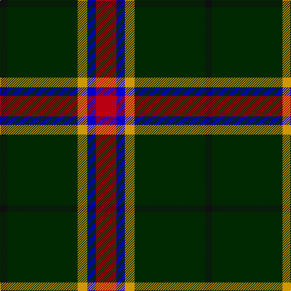

In pattern [KGYBR](/patterns/kgybr/).

This was sourced from register-of-tartans.  It is a [5 stripes tartan](/stripes/stripes5/).

Original link https://www.tartanregister.gov.uk/tartanDetails.aspx?ref=10400

## Thread count
K/12 DG116 DY16 B14 R/34

## Palette
Each colour and its ΔE from the base-6 reference it is a variant of.

| Colour | Shade | Base | ΔE (OKLab) |
|---|---|---|---|
| B | <code style="background-color:#0000CD;">#0000CD</code> `#0000CD` | B <code style="background-color:#2C4084;">#2C4084</code> | 0.15 |
| DG | <code style="background-color:#002901;">#002901</code> `#002901` | G <code style="background-color:#006400;">#006400</code> | 0.20 |
| DY | <code style="background-color:#CF9702;">#CF9702</code> `#CF9702` | Y <code style="background-color:#E8C000;">#E8C000</code> | 0.11 |
| K | <code style="background-color:#101010;">#101010</code> `#101010` | K <code style="background-color:#000000;">#000000</code> | 0.17 |
| R | <code style="background-color:#B90012;">#B90012</code> `#B90012` | R <code style="background-color:#C80000;">#C80000</code> | 0.03 |

# Sample pattern

ID: /setts/s5/k12g116y16b14r34-b0000cd-g002901-k101010-rb90012-ycf9702/
