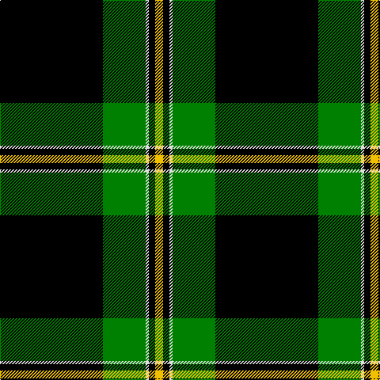

In pattern [KGWKY](/patterns/kgwky/).

This was sourced from weddslist.  It is a [5 stripes tartan](/stripes/stripes5/).

Original link http://www.weddslist.com/cgi-bin/tartans/pg.pl?source=sts

## Thread count
K/130 G54 LN4 K8 Y/10

## Palette
Each colour and its ΔE from the base-6 reference it is a variant of.

| Colour | Shade | Base | ΔE (OKLab) |
|---|---|---|---|
| G | <code style="background-color:#008000;">#008000</code> `#008000` | G <code style="background-color:#006400;">#006400</code> | 0.09 |
| K | <code style="background-color:#000000;">#000000</code> `#000000` | K <code style="background-color:#000000;">#000000</code> | 0.00 |
| LN | <code style="background-color:#E0E0E0;">#E0E0E0</code> `#E0E0E0` | W <code style="background-color:#F4F4F0;">#F4F4F0</code> | 0.06 |
| Y | <code style="background-color:#F0C000;">#F0C000</code> `#F0C000` | Y <code style="background-color:#E8C000;">#E8C000</code> | 0.01 |

# Sample pattern

## Nearest tartans

The nearest existing variants by ΔTartan distance.

1. [Childers](/setts/s6/k176g34k16ga56k16r12-g30a010-ga008000-k000000-rc00000/) — ΔT 1.29
1. [Perry, dress](/setts/s5/k130r54w4k8y10-k000000-r800000-we0e0e0-yf0c000/) — ΔT 1.62
1. [O'Boyle (Name)](/setts/s7/g24k2r2k24ra18k90g18-g289c18-k101010-rc80000-ra9c68a4/) — ΔT 1.62
1. [Childers (Gurkha Rifles) (Military)](/setts/s6/k88g17k8ga28k8r6-g004c00-ga5c6428-k000000-rc80000/) — ΔT 1.65
1. [Wcwm 9275 5471-2](/setts/s6/r8k4g56k76k2y8-g004c00-k000000-r780028-yc89800/) — ΔT 1.67
1. [Perry Hunting (Green) (Personal)](/setts/s5/k150g52y4g8ya10-g006818-k101010-yb8b8b8-yad09800/) — ΔT 1.69
1. [Perry, Pirrie](/setts/s5/k150r52w4k8y10-k000000-rc00000-we0e0e0-yf0c000/) — ΔT 1.78
1. [Perry, Ancient](/setts/s5/k130r54w4k8y10-k000000-rc00000-we0e0e0-yf0c000/) — ΔT 1.81
1. [Forbes VS](/setts/s6/r1g16k8g3k4y1-g004c00-k000000-rc80000-yffc800/) — ΔT 1.84
1. [MacDiarmid](/setts/s9/k24r4k56g24k2w6k2g24r8-g008000-k000000-rc00000-we0e0e0/) — ΔT 1.85

## Neighbour map

Every grey dot is one of 15726 variants placed by the first two principal components of the ΔTartan feature space (44% of its variance). Red is this tartan; blue dots are its nearest — click one to open its page.

<svg viewBox="0 0 640 380" role="img" style="max-width:100%;height:auto;border:1px solid #e0e0e0;border-radius:4px;display:block" xmlns="http://www.w3.org/2000/svg"><image href="/nn/cloud.v1.png" width="640" height="380"/><a href="/setts/s6/k176g34k16ga56k16r12-g30a010-ga008000-k000000-rc00000/"><circle cx="373.9" cy="185.3" r="4" fill="#3465a4"><title>Childers</title></circle></a><a href="/setts/s5/k130r54w4k8y10-k000000-r800000-we0e0e0-yf0c000/"><circle cx="434.1" cy="159.0" r="4" fill="#3465a4"><title>Perry, dress</title></circle></a><a href="/setts/s7/g24k2r2k24ra18k90g18-g289c18-k101010-rc80000-ra9c68a4/"><circle cx="412.6" cy="138.1" r="4" fill="#3465a4"><title>O'Boyle (Name)</title></circle></a><a href="/setts/s6/k88g17k8ga28k8r6-g004c00-ga5c6428-k000000-rc80000/"><circle cx="396.0" cy="192.0" r="4" fill="#3465a4"><title>Childers (Gurkha Rifles) (Military)</title></circle></a><a href="/setts/s6/r8k4g56k76k2y8-g004c00-k000000-r780028-yc89800/"><circle cx="354.2" cy="153.4" r="4" fill="#3465a4"><title>Wcwm 9275 5471-2</title></circle></a><a href="/setts/s5/k150g52y4g8ya10-g006818-k101010-yb8b8b8-yad09800/"><circle cx="463.8" cy="163.7" r="4" fill="#3465a4"><title>Perry Hunting (Green) (Personal)</title></circle></a><a href="/setts/s5/k150r52w4k8y10-k000000-rc00000-we0e0e0-yf0c000/"><circle cx="460.8" cy="146.5" r="4" fill="#3465a4"><title>Perry, Pirrie</title></circle></a><a href="/setts/s5/k130r54w4k8y10-k000000-rc00000-we0e0e0-yf0c000/"><circle cx="425.9" cy="151.9" r="4" fill="#3465a4"><title>Perry, Ancient</title></circle></a><a href="/setts/s6/r1g16k8g3k4y1-g004c00-k000000-rc80000-yffc800/"><circle cx="337.9" cy="196.7" r="4" fill="#3465a4"><title>Forbes VS</title></circle></a><a href="/setts/s9/k24r4k56g24k2w6k2g24r8-g008000-k000000-rc00000-we0e0e0/"><circle cx="311.3" cy="144.2" r="4" fill="#3465a4"><title>MacDiarmid</title></circle></a><circle cx="413.1" cy="160.6" r="5" fill="#c00000"/></svg>

ID: /setts/s5/k130g54w4k8y10-g008000-k000000-we0e0e0-yf0c000/
