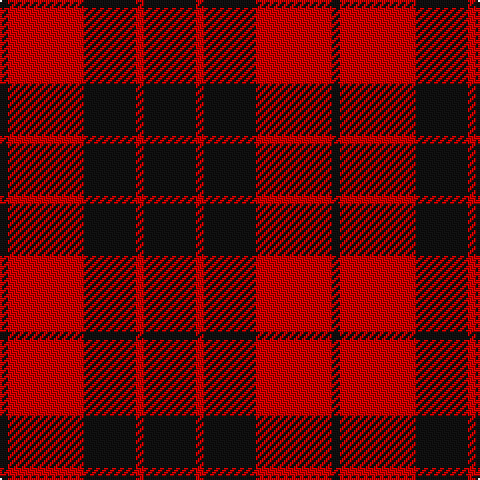

In pattern [KRKRK](/stripes/krkrk/).

This was sourced from register-of-tartans.  It is a [5 stripe tartan](/stripes/stripes5/).

Original link https://www.tartanregister.gov.uk/tartanDetails.aspx?ref=2641

## Attestations

This cloth appears in 2 source records; the oldest owns this page.

- 01/01/1845 — MacLeod of Raasay (Highland Society of London) (register-of-tartans, [record](https://www.tartanregister.gov.uk/tartanDetails.aspx?ref=2641))
- 1845 — MacLeod of Raasay (HSL) (Clan) (tartans-authority, [record](http://www.tartansauthority.com/tartan-ferret/display/1172/))

## Register references

External register numbers recorded for this tartan.

- Scottish Register of Tartans: [2641](https://www.tartanregister.gov.uk/tartanDetails.aspx?ref=2641)
- Scottish Tartans Authority (ITI): 1172
- Scottish Tartans World Register: 1172

## Thread count
K/26 R4 K26 R38 K/4

## Palette
Each colour and the base-6 reference it is a variant of.

| Colour | Shade | Base |
|---|---|---|
| K | <code style="background-color:#101010;">#101010</code> `oklch(17.3% 0.000 89.9)` <small>#101010</small> | K <code style="background-color:#000000;">#000000</code> |
| R | <code style="background-color:#C80000;">#C80000</code> `oklch(52.3% 0.215 29.2)` <small>#C80000</small> | R <code style="background-color:#CC0000;">#CC0000</code> |

# Sample pattern

## Nearest tartans

The nearest existing variants by ΔTartan distance.

1. [MacFarlane Red & Black (Artefact)](/setts/s4/k30r17k3~x4/) — ΔT 0.95
1. [Erskine (Paton)](/setts/s6/k31r4k47r47k4r31~x2/) — ΔT 1.05
1. [Erskine, Black & Red (Clan)](/setts/s6/k6r3k28r28k3r6~x2/) — ΔT 1.10
1. [Bodog.com](/setts/s5/r3k25r25k10lb3~x2/) — ΔT 1.12
1. [MacLeod Black & Red](/setts/s5/r8k1r8k12r1~x2/) — ΔT 1.14
1. [MacQueen](/setts/s6/k2r6k2r6k12ly1~x4/) — ΔT 1.15
1. [MacLeod of Raasay](/setts/s5/k6r1k6r9k1~x4/) — ΔT 1.22
1. [Swanstrom (Personal)](/setts/s6/k8r1k8r11ly1r1~x4/) — ΔT 1.22
1. [Ettrick (District)](/setts/s4/k5r26k26r5~x4/) — ΔT 1.22
1. [Campbell of Armaddie](/setts/s5/r4k1r12k12r2~x2/) — ΔT 1.26

## Neighbour map

Every grey dot is one of 14299 variants placed by the first two principal components of the ΔTartan feature space (44% of its variance). Red is this tartan; blue dots are its nearest — click one to open its page.

<svg viewBox="0 0 640 380" role="img" style="max-width:100%;height:auto;border:1px solid #e0e0e0;border-radius:4px;display:block" xmlns="http://www.w3.org/2000/svg"><image href="/nn/cloud.v1.png" width="640" height="380"/><a href="/setts/s4/k30r17k3~x4/"><circle cx="344.1" cy="277.1" r="4" fill="#3465a4"><title>MacFarlane Red &amp; Black (Artefact)</title></circle></a><a href="/setts/s6/k31r4k47r47k4r31~x2/"><circle cx="338.6" cy="239.7" r="4" fill="#3465a4"><title>Erskine (Paton)</title></circle></a><a href="/setts/s6/k6r3k28r28k3r6~x2/"><circle cx="361.6" cy="231.6" r="4" fill="#3465a4"><title>Erskine, Black &amp; Red (Clan)</title></circle></a><a href="/setts/s5/r3k25r25k10lb3~x2/"><circle cx="317.5" cy="237.3" r="4" fill="#3465a4"><title>Bodog.com</title></circle></a><a href="/setts/s5/r8k1r8k12r1~x2/"><circle cx="376.2" cy="236.1" r="4" fill="#3465a4"><title>MacLeod Black &amp; Red</title></circle></a><a href="/setts/s6/k2r6k2r6k12ly1~x4/"><circle cx="342.4" cy="216.7" r="4" fill="#3465a4"><title>MacQueen</title></circle></a><a href="/setts/s5/k6r1k6r9k1~x4/"><circle cx="348.3" cy="259.3" r="4" fill="#3465a4"><title>MacLeod of Raasay</title></circle></a><a href="/setts/s6/k8r1k8r11ly1r1~x4/"><circle cx="336.5" cy="214.7" r="4" fill="#3465a4"><title>Swanstrom (Personal)</title></circle></a><a href="/setts/s4/k5r26k26r5~x4/"><circle cx="328.7" cy="288.8" r="4" fill="#3465a4"><title>Ettrick (District)</title></circle></a><a href="/setts/s5/r4k1r12k12r2~x2/"><circle cx="373.8" cy="229.8" r="4" fill="#3465a4"><title>Campbell of Armaddie</title></circle></a><circle cx="373.7" cy="261.7" r="5" fill="#c00000"/></svg>

ID: /setts/s5/k13r2k13r19k2~x2/
