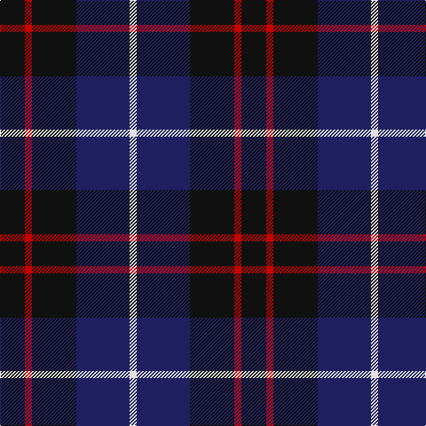

In pattern [KRKBW](/patterns/krkbw/).

This was sourced from register-of-tartans.  It is a [5 stripes tartan](/stripes/stripes5/).

Original link https://www.tartanregister.gov.uk/tartanDetails.aspx?ref=357

## Thread count
K/28 R8 K50 DB60 LN/8

## Palette
Each colour and its ΔE from the base-6 reference it is a variant of.

| Colour | Shade | Base | ΔE (OKLab) |
|---|---|---|---|
| DB | <code style="background-color:#202060;">#202060</code> `#202060` | B <code style="background-color:#2A418A;">#2A418A</code> | 0.11 |
| K | <code style="background-color:#101010;">#101010</code> `#101010` | K <code style="background-color:#000000;">#000000</code> | 0.17 |
| LN | <code style="background-color:#E0E0E0;">#E0E0E0</code> `#E0E0E0` | W <code style="background-color:#F7F7F7;">#F7F7F7</code> | 0.07 |
| R | <code style="background-color:#C80000;">#C80000</code> `#C80000` | R <code style="background-color:#CC0000;">#CC0000</code> | 0.01 |

# Sample pattern

## Nearest tartans

The nearest existing variants by ΔTartan distance.

1. [Scottish Express International](/setts/s6/b1k4w1k4ba7k1~b9058d8-ba1c0070-k101010-wa8ace8~x4/) — ΔT 0.96
1. [Nairn](/setts/s5/r1k8g2b4r1~b2c2c80-g006818-k101010-rc80000~x8/) — ΔT 1.05
1. [Nairn Family Tartan Tartan Number: 1331. Earliest known date: c.1930 The exact date of this design is uncertain. We know that it appeared around 1930 in the collection of Messrs. Anderson of Edinburgh. (Later Kinloch Anderson). A note on the weavers scale in the STS collection states '..worn by the Spencer-Nairn family. (done)'. The design is similar to the Hunting Brodie sett without the yellow. Nairns were first recorded in Fife and later in Moray. There is also a family called Nairne of Dunsinnan in Perthshire of MacBeth fame. See products available Copyright © Blair Urquhart, Comrie, 2015](/setts/s5/r1k8g2b4r1~b2c2c80-g006818-k101010-rc80000~x4/) — ΔT 1.05
1. [College of Radiographers Corporate Tartan Tartan Number: 1274. Earliest known date: 1988 Marketed in Edinburgh around 1930s but no longer seen. See products available Copyright © Blair Urquhart, Comrie, 2015](/setts/s5/k15y2k10b18w3~b2c2c80-k101010-we0e0e0-ye8c000~x2/) — ΔT 1.07
1. [Givens (Arizona)](/setts/s6/k42w5g16k5k5b21~b202060-g003820-k101010-wfcfcfc~x2/) — ΔT 1.12
1. [College of Radiographers](/setts/s5/k15y2k10b18w3~b00008c-k101010-wc8c8c8-yc88c00~x2/) — ΔT 1.13
1. [Gifford (Personal)](/setts/s7/k15r8y2b25k5b13k5~b2c2c80-k101010-rc80000-ye8c000~x2/) — ΔT 1.25
1. [The Harbour Town, Hilton Head](/setts/s6/k3g11k3b11k18r3~b600030-g004010-k000030-r906030~x2/) — ΔT 1.26
1. [Swan (Name)](/setts/s6/k6b17k6b17k27w3~b2c2c80-k101010-we0e0e0~x2/) — ΔT 1.26
1. [Old Brigade](/setts/s6/b9k9r3b9k9y1~b202060-k101010-rc80000-yfccc00~x4/) — ΔT 1.30

## Neighbour map

Every grey dot is one of 15726 variants placed by the first two principal components of the ΔTartan feature space (44% of its variance). Red is this tartan; blue dots are its nearest — click one to open its page.

<svg viewBox="0 0 640 380" role="img" style="max-width:100%;height:auto;border:1px solid #e0e0e0;border-radius:4px;display:block" xmlns="http://www.w3.org/2000/svg"><image href="/nn/cloud.v1.png" width="640" height="380"/><a href="/setts/s6/b1k4w1k4ba7k1~b9058d8-ba1c0070-k101010-wa8ace8~x4/"><circle cx="282.7" cy="253.8" r="4" fill="#3465a4"><title>Scottish Express International</title></circle></a><a href="/setts/s5/r1k8g2b4r1~b2c2c80-g006818-k101010-rc80000~x8/"><circle cx="271.9" cy="241.9" r="4" fill="#3465a4"><title>Nairn</title></circle></a><a href="/setts/s5/r1k8g2b4r1~b2c2c80-g006818-k101010-rc80000~x4/"><circle cx="271.9" cy="241.9" r="4" fill="#3465a4"><title>Nairn Family Tartan Tartan Number: 1331. Earliest known date: c.1930 The exact date of this design is uncertain. We know that it appeared around 1930 in the collection of Messrs. Anderson of Edinburgh. (Later Kinloch Anderson). A note on the weavers scale in the STS collection states '..worn by the Spencer-Nairn family. (done)'. The design is similar to the Hunting Brodie sett without the yellow. Nairns were first recorded in Fife and later in Moray. There is also a family called Nairne of Dunsinnan in Perthshire of MacBeth fame. See products available Copyright © Blair Urquhart, Comrie, 2015</title></circle></a><a href="/setts/s5/k15y2k10b18w3~b2c2c80-k101010-we0e0e0-ye8c000~x2/"><circle cx="264.5" cy="246.0" r="4" fill="#3465a4"><title>College of Radiographers Corporate Tartan Tartan Number: 1274. Earliest known date: 1988 Marketed in Edinburgh around 1930s but no longer seen. See products available Copyright © Blair Urquhart, Comrie, 2015</title></circle></a><a href="/setts/s6/k42w5g16k5k5b21~b202060-g003820-k101010-wfcfcfc~x2/"><circle cx="303.6" cy="238.7" r="4" fill="#3465a4"><title>Givens (Arizona)</title></circle></a><a href="/setts/s5/k15y2k10b18w3~b00008c-k101010-wc8c8c8-yc88c00~x2/"><circle cx="270.4" cy="252.6" r="4" fill="#3465a4"><title>College of Radiographers</title></circle></a><a href="/setts/s7/k15r8y2b25k5b13k5~b2c2c80-k101010-rc80000-ye8c000~x2/"><circle cx="297.4" cy="223.2" r="4" fill="#3465a4"><title>Gifford (Personal)</title></circle></a><a href="/setts/s6/k3g11k3b11k18r3~b600030-g004010-k000030-r906030~x2/"><circle cx="265.5" cy="269.0" r="4" fill="#3465a4"><title>The Harbour Town, Hilton Head</title></circle></a><a href="/setts/s6/k6b17k6b17k27w3~b2c2c80-k101010-we0e0e0~x2/"><circle cx="329.3" cy="271.7" r="4" fill="#3465a4"><title>Swan (Name)</title></circle></a><a href="/setts/s6/b9k9r3b9k9y1~b202060-k101010-rc80000-yfccc00~x4/"><circle cx="268.5" cy="275.5" r="4" fill="#3465a4"><title>Old Brigade</title></circle></a><circle cx="283.0" cy="260.8" r="5" fill="#c00000"/></svg>

ID: /setts/s5/k14r4k25b30w4~b202060-k101010-rc80000-we0e0e0~x2/
