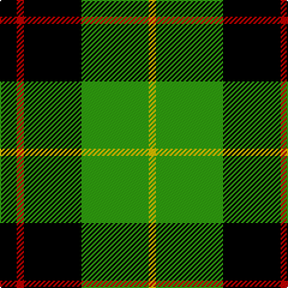

In pattern [KRKGY](/patterns/krkgy/).

This was sourced from weddslist.  It is a [5 stripes tartan](/stripes/stripes5/).

Original link http://www.weddslist.com/cgi-bin/tartans/pg.pl?source=sts

## Thread count
K/14 R6 K48 G56 Y/6

## Palette
Each colour and its ΔE from the base-6 reference it is a variant of.

| Colour | Shade | Base | ΔE (OKLab) |
|---|---|---|---|
| G | <code style="background-color:#30A010;">#30A010</code> `#30A010` | G <code style="background-color:#006400;">#006400</code> | 0.19 |
| K | <code style="background-color:#000000;">#000000</code> `#000000` | K <code style="background-color:#000000;">#000000</code> | 0.00 |
| R | <code style="background-color:#C00000;">#C00000</code> `#C00000` | R <code style="background-color:#C80000;">#C80000</code> | 0.02 |
| Y | <code style="background-color:#F0C000;">#F0C000</code> `#F0C000` | Y <code style="background-color:#E8C000;">#E8C000</code> | 0.01 |

# Sample pattern

## Nearest tartans

The nearest existing variants by ΔTartan distance.

1. [Douglas, Black](/setts/s5/k8b5g44k40r6-b3070fc-g007800-k000000-rc40000/) — ΔT 0.85
1. [Wilson's, No 140](/setts/s4/k14y2g14b2-b5480b0-g008000-k000000-yf0c000/) — ΔT 0.88
1. [Wilson's, No 79](/setts/s4/k14w2g14b2-b5480b0-g008000-k000000-we0e0e0/) — ΔT 0.96
1. [MacArthur, ?](/setts/s6/r6g60k24g12k32y4-g008000-k000000-rc00000-yf0c000/) — ΔT 0.97
1. [Cleghorn (Personal)](/setts/s7/g16r6g60k16w6k72w16-g007800-k000000-r8c0000-wf0f0f0/) — ΔT 1.04
1. [Paton](/setts/s7/r6g48k56g38y6g6y6-g008000-k000000-rc00000-yf0c000/) — ΔT 1.09
1. [Sinclair, hunting](/setts/s7/g12r4g26k12w4k32r6-g008000-k000000-r900030-we0e0e0/) — ΔT 1.11
1. [Wallace, hunting](/setts/s4/k8g66k66y8-g008000-k000000-yf0c000/) — ΔT 1.18
1. [Unnamed 3](/setts/s6/g4b8k12ba2g18k4-b8080d0-ba5480b0-g008000-k000000/) — ΔT 1.30
1. [Fitzpatrick](/setts/s9/g20y4g12y8g32k32b4k32g4-b304080-g008000-k000000-yf0c000/) — ΔT 1.31

## Neighbour map

Every grey dot is one of 15726 variants placed by the first two principal components of the ΔTartan feature space (44% of its variance). Red is this tartan; blue dots are its nearest — click one to open its page.

<svg viewBox="0 0 640 380" role="img" style="max-width:100%;height:auto;border:1px solid #e0e0e0;border-radius:4px;display:block" xmlns="http://www.w3.org/2000/svg"><image href="/nn/cloud.v1.png" width="640" height="380"/><a href="/setts/s5/k8b5g44k40r6-b3070fc-g007800-k000000-rc40000/"><circle cx="235.2" cy="222.5" r="4" fill="#3465a4"><title>Douglas, Black</title></circle></a><a href="/setts/s4/k14y2g14b2-b5480b0-g008000-k000000-yf0c000/"><circle cx="199.9" cy="245.0" r="4" fill="#3465a4"><title>Wilson's, No 140</title></circle></a><a href="/setts/s4/k14w2g14b2-b5480b0-g008000-k000000-we0e0e0/"><circle cx="198.0" cy="244.5" r="4" fill="#3465a4"><title>Wilson's, No 79</title></circle></a><a href="/setts/s6/r6g60k24g12k32y4-g008000-k000000-rc00000-yf0c000/"><circle cx="275.2" cy="196.4" r="4" fill="#3465a4"><title>MacArthur, ?</title></circle></a><a href="/setts/s7/g16r6g60k16w6k72w16-g007800-k000000-r8c0000-wf0f0f0/"><circle cx="219.9" cy="185.0" r="4" fill="#3465a4"><title>Cleghorn (Personal)</title></circle></a><a href="/setts/s7/r6g48k56g38y6g6y6-g008000-k000000-rc00000-yf0c000/"><circle cx="260.9" cy="199.2" r="4" fill="#3465a4"><title>Paton</title></circle></a><a href="/setts/s7/g12r4g26k12w4k32r6-g008000-k000000-r900030-we0e0e0/"><circle cx="200.8" cy="216.0" r="4" fill="#3465a4"><title>Sinclair, hunting</title></circle></a><a href="/setts/s4/k8g66k66y8-g008000-k000000-yf0c000/"><circle cx="272.1" cy="256.3" r="4" fill="#3465a4"><title>Wallace, hunting</title></circle></a><a href="/setts/s6/g4b8k12ba2g18k4-b8080d0-ba5480b0-g008000-k000000/"><circle cx="187.2" cy="221.9" r="4" fill="#3465a4"><title>Unnamed 3</title></circle></a><a href="/setts/s9/g20y4g12y8g32k32b4k32g4-b304080-g008000-k000000-yf0c000/"><circle cx="198.1" cy="208.5" r="4" fill="#3465a4"><title>Fitzpatrick</title></circle></a><circle cx="231.2" cy="215.8" r="5" fill="#c00000"/></svg>

ID: /setts/s5/k14r6k48g56y6-g30a010-k000000-rc00000-yf0c000/
