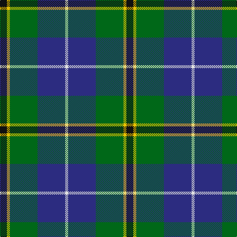

In pattern [KYGBW](/patterns/kygbw/).

This was sourced from house-of-tartan.  It is a [5 stripes tartan](/stripes/stripes5/).

Original link http://www.house-of-tartan.scotland.net/house/TartanViewjs.asp?colr=Def&tnam=1265

## Thread count
K/14 Y6 G56 DB56 LN/6

## Palette
Each colour and its ΔE from the base-6 reference it is a variant of.

| Colour | Shade | Base | ΔE (OKLab) |
|---|---|---|---|
| DB | <code style="background-color:#2C2C80;">#2C2C80</code> `#2C2C80` | B <code style="background-color:#2A418A;">#2A418A</code> | 0.06 |
| G | <code style="background-color:#006818;">#006818</code> `#006818` | G <code style="background-color:#006100;">#006100</code> | 0.02 |
| K | <code style="background-color:#101010;">#101010</code> `#101010` | K <code style="background-color:#000000;">#000000</code> | 0.17 |
| LN | <code style="background-color:#E0E0E0;">#E0E0E0</code> `#E0E0E0` | W <code style="background-color:#F7F7F7;">#F7F7F7</code> | 0.07 |
| Y | <code style="background-color:#E8C000;">#E8C000</code> `#E8C000` | Y <code style="background-color:#F2BF00;">#F2BF00</code> | 0.02 |

# Sample pattern

## Nearest tartans

The nearest existing variants by ΔTartan distance.

1. [Turnbull Hunting (1983) #2](/setts/s5/k12y6g60b60w6-b2c2c80-g006818-k101010-wfcfcfc-ye8c000/) — ΔT 0.26
1. [Douglas, Green (Wilsons)](/setts/s5/k4b4g32ba32w4-b2c2c80-ba202060-g006818-k101010-wfcfcfc/) — ΔT 0.46
1. [Turnbull Hunting (Name)](/setts/s5/r12y6g60b60w6-b2c2c80-g006818-rc80000-we0e0e0-ye8c000/) — ΔT 0.50
1. [Gamba (Commemorative)](/setts/s5/g10r6ga60b60w6-b2c2c80-g003820-ga006818-rc80000-wfcfcfc/) — ΔT 0.51
1. [Highlander, Highland Laddie Kilts](/setts/s5/k14r6g58b58w6-b304080-g008000-k000000-r802040-we0e0e0/) — ΔT 0.51
1. [Highlander Highland Laddie](/setts/s5/k14r6g60b56w6-b1c0070-g006818-k101010-r880000-wc0c0c0/) — ΔT 0.58
1. [DeLoughery (Personal)](/setts/s6/b40k12y8b6g40w4-b38409c-g006818-k101010-wfcfcfc-ya08858/) — ΔT 0.60
1. [Bhatti (Name)](/setts/s5/k14w6g36b36wa4-b2c2c80-g006818-k101010-w98c8e8-wae0e0e0/) — ΔT 0.61
1. [Inglis (Name)](/setts/s6/y8g48b20r6b24ya8-b1c0070-g006818-rc80000-yb8b8b8-yad09800/) — ΔT 0.68
1. [Douglas](/setts/s5/k4b4g32ba32w4-b5480b0-ba304080-g008000-k000000-we0e0e0/) — ΔT 0.71

## Neighbour map

Every grey dot is one of 15726 variants placed by the first two principal components of the ΔTartan feature space (44% of its variance). Red is this tartan; blue dots are its nearest — click one to open its page.

<svg viewBox="0 0 640 380" role="img" style="max-width:100%;height:auto;border:1px solid #e0e0e0;border-radius:4px;display:block" xmlns="http://www.w3.org/2000/svg"><image href="/nn/cloud.v1.png" width="640" height="380"/><a href="/setts/s5/k12y6g60b60w6-b2c2c80-g006818-k101010-wfcfcfc-ye8c000/"><circle cx="211.8" cy="202.2" r="4" fill="#3465a4"><title>Turnbull Hunting (1983) #2</title></circle></a><a href="/setts/s5/k4b4g32ba32w4-b2c2c80-ba202060-g006818-k101010-wfcfcfc/"><circle cx="215.4" cy="214.1" r="4" fill="#3465a4"><title>Douglas, Green (Wilsons)</title></circle></a><a href="/setts/s5/r12y6g60b60w6-b2c2c80-g006818-rc80000-we0e0e0-ye8c000/"><circle cx="217.6" cy="200.4" r="4" fill="#3465a4"><title>Turnbull Hunting (Name)</title></circle></a><a href="/setts/s5/g10r6ga60b60w6-b2c2c80-g003820-ga006818-rc80000-wfcfcfc/"><circle cx="232.6" cy="206.7" r="4" fill="#3465a4"><title>Gamba (Commemorative)</title></circle></a><a href="/setts/s5/k14r6g58b58w6-b304080-g008000-k000000-r802040-we0e0e0/"><circle cx="194.6" cy="203.1" r="4" fill="#3465a4"><title>Highlander, Highland Laddie Kilts</title></circle></a><a href="/setts/s5/k14r6g60b56w6-b1c0070-g006818-k101010-r880000-wc0c0c0/"><circle cx="218.4" cy="210.5" r="4" fill="#3465a4"><title>Highlander Highland Laddie</title></circle></a><a href="/setts/s6/b40k12y8b6g40w4-b38409c-g006818-k101010-wfcfcfc-ya08858/"><circle cx="202.7" cy="199.9" r="4" fill="#3465a4"><title>DeLoughery (Personal)</title></circle></a><a href="/setts/s5/k14w6g36b36wa4-b2c2c80-g006818-k101010-w98c8e8-wae0e0e0/"><circle cx="164.0" cy="218.0" r="4" fill="#3465a4"><title>Bhatti (Name)</title></circle></a><a href="/setts/s6/y8g48b20r6b24ya8-b1c0070-g006818-rc80000-yb8b8b8-yad09800/"><circle cx="180.1" cy="207.4" r="4" fill="#3465a4"><title>Inglis (Name)</title></circle></a><a href="/setts/s5/k4b4g32ba32w4-b5480b0-ba304080-g008000-k000000-we0e0e0/"><circle cx="206.8" cy="209.4" r="4" fill="#3465a4"><title>Douglas</title></circle></a><circle cx="200.6" cy="208.9" r="5" fill="#c00000"/></svg>

ID: /setts/s5/k14y6g56b56w6-b2c2c80-g006818-k101010-we0e0e0-ye8c000/
