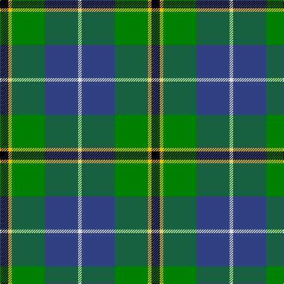

In pattern [KYGBW](/patterns/kygbw/).

This was sourced from weddslist.  It is a [5 stripes tartan](/stripes/stripes5/).

Original link http://www.weddslist.com/cgi-bin/tartans/pg.pl?source=sts

## Thread count
K/14 Y6 G56 B56 LN/6

## Palette
Each colour and its ΔE from the base-6 reference it is a variant of.

| Colour | Shade | Base | ΔE (OKLab) |
|---|---|---|---|
| B | <code style="background-color:#304080;">#304080</code> `#304080` | B <code style="background-color:#2C4084;">#2C4084</code> | 0.01 |
| G | <code style="background-color:#008000;">#008000</code> `#008000` | G <code style="background-color:#006400;">#006400</code> | 0.09 |
| K | <code style="background-color:#000000;">#000000</code> `#000000` | K <code style="background-color:#000000;">#000000</code> | 0.00 |
| LN | <code style="background-color:#E0E0E0;">#E0E0E0</code> `#E0E0E0` | W <code style="background-color:#F4F4F0;">#F4F4F0</code> | 0.06 |
| Y | <code style="background-color:#F0C000;">#F0C000</code> `#F0C000` | Y <code style="background-color:#E8C000;">#E8C000</code> | 0.01 |

# Sample pattern

## Nearest tartans

The nearest existing variants by ΔTartan distance.

1. [Highlander, Highland Laddie Kilts](/setts/s5/k14r6g58b58w6-b304080-g008000-k000000-r802040-we0e0e0/) — ΔT 0.34
1. [Douglas](/setts/s5/k4b4g32ba32w4-b5480b0-ba304080-g008000-k000000-we0e0e0/) — ΔT 0.70
1. [Turnbull Hunting (1983) #2](/setts/s5/k12y6g60b60w6-b2c2c80-g006818-k101010-wfcfcfc-ye8c000/) — ΔT 0.78
1. [Turnbull Hunting Clan Tartan Tartan Number: 1265. Earliest known date: pre 2003 An unusual dress tartan having no white. See products available Copyright © Blair Urquhart, Comrie, 2015](/setts/s5/k14y6g56b56w6-b2c2c80-g006818-k101010-we0e0e0-ye8c000/) — ΔT 0.82
1. [Turnbull, hunting](/setts/s5/r14y6g56b56w6-b304080-g008000-r800000-we0e0e0-yf0c000/) — ΔT 0.86
1. [Dick (Personal)](/setts/s7/k10g60y6b30k30b14w6-b1474b4-g28802c-k101010-we0e0e0-ye8c000/) — ΔT 0.91
1. [Inglis (Name)](/setts/s6/y8g48b20r6b24ya8-b1c0070-g006818-rc80000-yb8b8b8-yad09800/) — ΔT 0.93
1. [Turnbull Hunting (Name)](/setts/s5/r12y6g60b60w6-b2c2c80-g006818-rc80000-we0e0e0-ye8c000/) — ΔT 0.95
1. [Sanix Modern](/setts/s5/r4b32k22g38y4-b304080-g30a010-k000000-rc00000-yf0c000/) — ΔT 0.98
1. [MacThomas](/setts/s7/b6r4b44k22g48w4g6-b304080-g008000-k000000-r900030-wc0a0e0/) — ΔT 0.98

## Neighbour map

Every grey dot is one of 15726 variants placed by the first two principal components of the ΔTartan feature space (44% of its variance). Red is this tartan; blue dots are its nearest — click one to open its page.

<svg viewBox="0 0 640 380" role="img" style="max-width:100%;height:auto;border:1px solid #e0e0e0;border-radius:4px;display:block" xmlns="http://www.w3.org/2000/svg"><image href="/nn/cloud.v1.png" width="640" height="380"/><a href="/setts/s5/k14r6g58b58w6-b304080-g008000-k000000-r802040-we0e0e0/"><circle cx="194.6" cy="203.1" r="4" fill="#3465a4"><title>Highlander, Highland Laddie Kilts</title></circle></a><a href="/setts/s5/k4b4g32ba32w4-b5480b0-ba304080-g008000-k000000-we0e0e0/"><circle cx="206.8" cy="209.4" r="4" fill="#3465a4"><title>Douglas</title></circle></a><a href="/setts/s5/k12y6g60b60w6-b2c2c80-g006818-k101010-wfcfcfc-ye8c000/"><circle cx="211.8" cy="202.2" r="4" fill="#3465a4"><title>Turnbull Hunting (1983) #2</title></circle></a><a href="/setts/s5/k14y6g56b56w6-b2c2c80-g006818-k101010-we0e0e0-ye8c000/"><circle cx="200.6" cy="208.9" r="4" fill="#3465a4"><title>Turnbull Hunting Clan Tartan Tartan Number: 1265. Earliest known date: pre 2003 An unusual dress tartan having no white. See products available Copyright © Blair Urquhart, Comrie, 2015</title></circle></a><a href="/setts/s5/r14y6g56b56w6-b304080-g008000-r800000-we0e0e0-yf0c000/"><circle cx="204.0" cy="206.6" r="4" fill="#3465a4"><title>Turnbull, hunting</title></circle></a><a href="/setts/s7/k10g60y6b30k30b14w6-b1474b4-g28802c-k101010-we0e0e0-ye8c000/"><circle cx="155.9" cy="188.5" r="4" fill="#3465a4"><title>Dick (Personal)</title></circle></a><a href="/setts/s6/y8g48b20r6b24ya8-b1c0070-g006818-rc80000-yb8b8b8-yad09800/"><circle cx="180.1" cy="207.4" r="4" fill="#3465a4"><title>Inglis (Name)</title></circle></a><a href="/setts/s5/r12y6g60b60w6-b2c2c80-g006818-rc80000-we0e0e0-ye8c000/"><circle cx="217.6" cy="200.4" r="4" fill="#3465a4"><title>Turnbull Hunting (Name)</title></circle></a><a href="/setts/s5/r4b32k22g38y4-b304080-g30a010-k000000-rc00000-yf0c000/"><circle cx="132.6" cy="206.3" r="4" fill="#3465a4"><title>Sanix Modern</title></circle></a><a href="/setts/s7/b6r4b44k22g48w4g6-b304080-g008000-k000000-r900030-wc0a0e0/"><circle cx="190.7" cy="174.2" r="4" fill="#3465a4"><title>MacThomas</title></circle></a><circle cx="182.1" cy="201.3" r="5" fill="#c00000"/></svg>

ID: /setts/s5/k14y6g56b56w6-b304080-g008000-k000000-we0e0e0-yf0c000/
