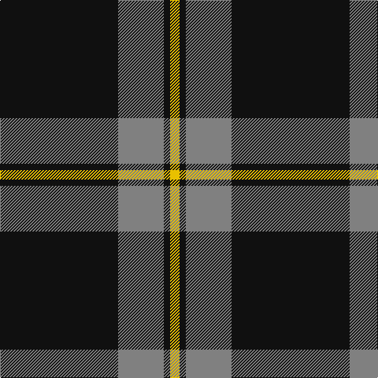

In pattern [KGGKY](/patterns/kggky/).

This was sourced from register-of-tartans.  It is a [5 stripes tartan](/stripes/stripes5/).

Original link https://www.tartanregister.gov.uk/tartanDetails.aspx?ref=4806

## Thread count
K/150 N52 N6 K8 Y/12

## Palette
Each colour and its ΔE from the base-6 reference it is a variant of.

| Colour | Shade | Base | ΔE (OKLab) |
|---|---|---|---|
| K | <code style="background-color:#101010;">#101010</code> `#101010` | K <code style="background-color:#000000;">#000000</code> | 0.17 |
| N | <code style="background-color:#808080;">#808080</code> `#808080` | G <code style="background-color:#006100;">#006100</code> | 0.23 |
| Y | <code style="background-color:#E8C000;">#E8C000</code> `#E8C000` | Y <code style="background-color:#F2BF00;">#F2BF00</code> | 0.02 |

# Sample pattern

## Nearest tartans

The nearest existing variants by ΔTartan distance.

1. [Dobelman (Personal)](/setts/s4/r4k80w20r4-k101010-r880000-wc0c0c0/) — ΔT 0.89
1. [Black Isle](/setts/s6/k106r44k20r20k4r8-k101010-r888888/) — ΔT 1.12
1. [Sunderland of Scotland (Fashion)](/setts/s7/r4k84r20k12r20k36ra4-k101010-r888888-rac80000/) — ΔT 1.14
1. [DDB Canada (Fashion)](/setts/s7/k2r4k14r22k36y4k2-k101010-r888888-ye8c000/) — ΔT 1.16
1. [Rogues, The (Corporate)](/setts/s4/r6b24k100y6-b5c8ca8-k101010-rc80000-yfccc00/) — ΔT 1.23
1. [Pride of New Zealand, The](/setts/s4/b124k60w1k2-b505050-k000000-we0e0e0/) — ΔT 1.25
1. [Westgate Fashion Tartan Tartan Number: 6019. Earliest known date: pre 2003 A fashion tartan See products available Copyright © Blair Urquhart, Comrie, 2015](/setts/s4/g28k160g28y10-g5c6428-k101010-ye8c000/) — ΔT 1.26
1. [Rogues (United States), The](/setts/s4/r6b24k100y6-b506987-k101010-rff2400-yffc125/) — ΔT 1.29
1. [Harley Davidson (Corporate)](/setts/s6/r4b6k4ra8k49r2-b5c5c5c-k101010-r888888-rab84c00/) — ΔT 1.37
1. [C-Tec N.I. Ltd](/setts/s4/k124b30w12y8-b000080-k1c1714-wf8f8f8-yfccc00/) — ΔT 1.39

## Neighbour map

Every grey dot is one of 15726 variants placed by the first two principal components of the ΔTartan feature space (44% of its variance). Red is this tartan; blue dots are its nearest — click one to open its page.

<svg viewBox="0 0 640 380" role="img" style="max-width:100%;height:auto;border:1px solid #e0e0e0;border-radius:4px;display:block" xmlns="http://www.w3.org/2000/svg"><image href="/nn/cloud.v1.png" width="640" height="380"/><a href="/setts/s4/r4k80w20r4-k101010-r880000-wc0c0c0/"><circle cx="479.2" cy="199.2" r="4" fill="#3465a4"><title>Dobelman (Personal)</title></circle></a><a href="/setts/s6/k106r44k20r20k4r8-k101010-r888888/"><circle cx="449.4" cy="198.0" r="4" fill="#3465a4"><title>Black Isle</title></circle></a><a href="/setts/s7/r4k84r20k12r20k36ra4-k101010-r888888-rac80000/"><circle cx="479.3" cy="193.3" r="4" fill="#3465a4"><title>Sunderland of Scotland (Fashion)</title></circle></a><a href="/setts/s7/k2r4k14r22k36y4k2-k101010-r888888-ye8c000/"><circle cx="394.1" cy="187.5" r="4" fill="#3465a4"><title>DDB Canada (Fashion)</title></circle></a><a href="/setts/s4/r6b24k100y6-b5c8ca8-k101010-rc80000-yfccc00/"><circle cx="455.3" cy="196.0" r="4" fill="#3465a4"><title>Rogues, The (Corporate)</title></circle></a><a href="/setts/s4/b124k60w1k2-b505050-k000000-we0e0e0/"><circle cx="482.5" cy="178.7" r="4" fill="#3465a4"><title>Pride of New Zealand, The</title></circle></a><a href="/setts/s4/g28k160g28y10-g5c6428-k101010-ye8c000/"><circle cx="475.3" cy="228.0" r="4" fill="#3465a4"><title>Westgate Fashion Tartan Tartan Number: 6019. Earliest known date: pre 2003 A fashion tartan See products available Copyright © Blair Urquhart, Comrie, 2015</title></circle></a><a href="/setts/s4/r6b24k100y6-b506987-k101010-rff2400-yffc125/"><circle cx="465.1" cy="199.6" r="4" fill="#3465a4"><title>Rogues (United States), The</title></circle></a><a href="/setts/s6/r4b6k4ra8k49r2-b5c5c5c-k101010-r888888-rab84c00/"><circle cx="487.7" cy="162.1" r="4" fill="#3465a4"><title>Harley Davidson (Corporate)</title></circle></a><a href="/setts/s4/k124b30w12y8-b000080-k1c1714-wf8f8f8-yfccc00/"><circle cx="423.4" cy="199.4" r="4" fill="#3465a4"><title>C-Tec N.I. Ltd</title></circle></a><circle cx="461.6" cy="182.1" r="5" fill="#c00000"/></svg>

ID: /setts/s5/k150g52g6k8y12-g808080-k101010-ye8c000/
