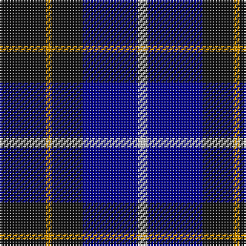

In pattern [KYKBW](/stripes/kykbw/).

This was sourced from register-of-tartans.  It is a [5 stripe tartan](/stripes/stripes5/).

Original link https://www.tartanregister.gov.uk/tartanDetails.aspx?ref=710

## Attestations

This cloth appears in 2 source records; the oldest owns this page.

- 01/01/1988 — College of Radiographers (register-of-tartans, [record](https://www.tartanregister.gov.uk/tartanDetails.aspx?ref=710))
- pre 1988 — College of Radiographers (Corporate) (tartans-authority, [record](http://www.tartansauthority.com/tartan-ferret/display/1274/))

## Register references

External register numbers recorded for this tartan.

- Scottish Register of Tartans: [710](https://www.tartanregister.gov.uk/tartanDetails.aspx?ref=710)
- Scottish Tartans Authority (ITI): 1274
- Scottish Tartans World Register: 1274

## Thread count
K/30 DY4 K20 DB36 N/6

## Palette
Each colour and its ΔE from the base-6 reference it is a variant of.

| Colour | Shade | Base | ΔE (OKLab) |
|---|---|---|---|
| DB | <code style="background-color:#00008C;">#00008C</code> `#00008C` | B <code style="background-color:#2A418A;">#2A418A</code> | 0.13 |
| DY | <code style="background-color:#C88C00;">#C88C00</code> `#C88C00` | Y <code style="background-color:#F2BF00;">#F2BF00</code> | 0.15 |
| K | <code style="background-color:#101010;">#101010</code> `#101010` | K <code style="background-color:#000000;">#000000</code> | 0.17 |
| N | <code style="background-color:#C8C8C8;">#C8C8C8</code> `#C8C8C8` | W <code style="background-color:#F7F7F7;">#F7F7F7</code> | 0.14 |

# Sample pattern

## Nearest tartans

The nearest existing variants by ΔTartan distance.

1. [College of Radiographers Corporate Tartan Tartan Number: 1274. Earliest known date: 1988 Marketed in Edinburgh around 1930s but no longer seen. See products available Copyright © Blair Urquhart, Comrie, 2015](/setts/s5/k15ly2k10db18w3~x2/) — ΔT 0.68
1. [Scottish Express International](/setts/s6/k6db50k29b6k29db6/) — ΔT 1.04
1. [Old Brigade](/setts/s6/db9k9r3db9k9ly1~x4/) — ΔT 1.04
1. [Britannia](/setts/s5/k14r4k25db30w4~x2/) — ΔT 1.12
1. [Scottish Express International](/setts/s6/k1db7k4lb1k4p1~x4/) — ΔT 1.19
1. [Wallace (Personal)](/setts/s4/k1db7k7ly1~x10/) — ΔT 1.21
1. [College of Radiographers](/setts/s5/k15y2k10db18w3~x2/) — ΔT 1.24
1. [H.M.S. DUNCAN](/setts/s6/o3k15r2k15n15p3~x2/) — ΔT 1.25
1. [Marchmont](/setts/s7/k1db12k12g1k12db12w1~x4/) — ΔT 1.31
1. [Allianz Deutschland 2012](/setts/s7/n6db3n6db20k20db8w4~x2/) — ΔT 1.31

## Neighbour map

Every grey dot is one of 14299 variants placed by the first two principal components of the ΔTartan feature space (44% of its variance). Red is this tartan; blue dots are its nearest — click one to open its page.

<svg viewBox="0 0 640 380" role="img" style="max-width:100%;height:auto;border:1px solid #e0e0e0;border-radius:4px;display:block" xmlns="http://www.w3.org/2000/svg"><image href="/nn/cloud.v1.png" width="640" height="380"/><a href="/setts/s5/k15ly2k10db18w3~x2/"><circle cx="267.5" cy="244.6" r="4" fill="#3465a4"><title>College of Radiographers Corporate Tartan Tartan Number: 1274. Earliest known date: 1988 Marketed in Edinburgh around 1930s but no longer seen. See products available Copyright © Blair Urquhart, Comrie, 2015</title></circle></a><a href="/setts/s6/k6db50k29b6k29db6/"><circle cx="255.9" cy="234.7" r="4" fill="#3465a4"><title>Scottish Express International</title></circle></a><a href="/setts/s6/db9k9r3db9k9ly1~x4/"><circle cx="233.7" cy="264.0" r="4" fill="#3465a4"><title>Old Brigade</title></circle></a><a href="/setts/s5/k14r4k25db30w4~x2/"><circle cx="285.5" cy="262.5" r="4" fill="#3465a4"><title>Britannia</title></circle></a><a href="/setts/s6/k1db7k4lb1k4p1~x4/"><circle cx="285.7" cy="256.9" r="4" fill="#3465a4"><title>Scottish Express International</title></circle></a><a href="/setts/s4/k1db7k7ly1~x10/"><circle cx="308.7" cy="281.6" r="4" fill="#3465a4"><title>Wallace (Personal)</title></circle></a><a href="/setts/s5/k15y2k10db18w3~x2/"><circle cx="250.7" cy="240.1" r="4" fill="#3465a4"><title>College of Radiographers</title></circle></a><a href="/setts/s6/o3k15r2k15n15p3~x2/"><circle cx="252.0" cy="221.0" r="4" fill="#3465a4"><title>H.M.S. DUNCAN</title></circle></a><a href="/setts/s7/k1db12k12g1k12db12w1~x4/"><circle cx="284.8" cy="218.0" r="4" fill="#3465a4"><title>Marchmont</title></circle></a><a href="/setts/s7/n6db3n6db20k20db8w4~x2/"><circle cx="199.7" cy="236.2" r="4" fill="#3465a4"><title>Allianz Deutschland 2012</title></circle></a><circle cx="273.8" cy="252.7" r="5" fill="#c00000"/></svg>

ID: /setts/s5/k15lo2k10db18lb3~x2/
