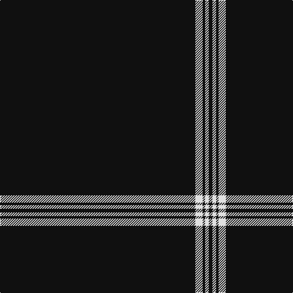

This page is one **sett** — a single exact thread-count. It belongs to the [tartan](/tartans/k160ln6k2ln3k3/)
(the same proportion at any scale), whose colour order is pattern [KWKWK](/stripes/kwkwk/).

Sourced from house-of-tartan.  It is a [5 stripe tartan](/stripes/stripes5/).

Original link http://www.house-of-tartan.scotland.net/house/TartanViewjs.asp?colr=Def&tnam=3333

## Thread count
K/320 LN12 K4 LN6 K/6

## Palette
Each colour and the base-6 reference it is a variant of.

| Colour | Shade | Base |
|---|---|---|
| K | <code style="background-color:#101010;">#101010</code> `oklch(17.3% 0.000 89.9)` <small>#101010</small> | K <code style="background-color:#000000;">#000000</code> |
| LN | <code style="background-color:#E0E0E0;">#E0E0E0</code> `oklch(90.7% 0.000 89.9)` <small>#E0E0E0</small> | W <code style="background-color:#F7F7F7;">#F7F7F7</code> |

# Sample pattern

## Nearest tartans

The nearest existing variants by ΔTartan distance, with this tartan at the top so the swatches line up against it.

ΔTartan

Tartan

Sett

—

<a href="/ttd/edit/#slug=k160w6k2w3k3~x2">Black Camel Tartan Tartan Number: 3333. Earliest known date: Marton Mills Jura./Threadcount and colours aren't 100% original. Generated manually./ See products available Copyright © Blair Urquhart, Comrie, 2015</a> <a class="nn-out" href="/setts/s5/k160w6k2w3k3~x2/" title="open its dictionary page">↗</a>

1.53

<a href="/ttd/edit/#slug=k8ly3k120ly3k40t2k4~x2">Lochaber (Hesketh)</a> <a class="nn-out" href="/setts/s7/k8ly3k120ly3k40t2k4~x2/" title="open its dictionary page">↗</a>

1.91

<a href="/ttd/edit/#slug=r2k50y2r1~x2">Galloway Family</a> <a class="nn-out" href="/setts/s4/r2k50y2r1~x2/" title="open its dictionary page">↗</a>

2.11

<a href="/ttd/edit/#slug=k31r2k10db1k1w1~x4">NewGeneration Alchemy (NGA) Inc</a> <a class="nn-out" href="/setts/s6/k31r2k10db1k1w1~x4/" title="open its dictionary page">↗</a>

2.17

<a href="/ttd/edit/#slug=dg60r2dg8r1dg5w2">St. David's Welsh District Tartan Tartan Number: 5746. Earliest known date: 2002 Representing the colours of Wales, this national tartan is recognised in Wales as The Brithwe Dewi Sant, or The Saint Davids Tartan, exclusively woven in Wales by The Cambrian Woollen Mill, in Llanwrtyd Wells, Powys. Launched at Cardiff Castle in honour of the Welsh Patron Saint, and worn by Welsh folk around the world for special occasions including St Davids Day, March 1st. A differing warp and weft create a vertical stripe in these Welsh Tartans. See products available Copyright © Blair Urquhart, Comrie, 2015</a> <a class="nn-out" href="/setts/s6/dg60r2dg8r1dg5w2/" title="open its dictionary page">↗</a>

2.30

<a href="/ttd/edit/#slug=r2k50n2r1~x2">Galloway (Name)</a> <a class="nn-out" href="/setts/s4/r2k50n2r1~x2/" title="open its dictionary page">↗</a>

2.41

<a href="/ttd/edit/#slug=k72r3k11t9k11r3k37">Chafyn House (School)</a> <a class="nn-out" href="/setts/s7/k72r3k11t9k11r3k37/" title="open its dictionary page">↗</a>

2.46

<a href="/ttd/edit/#slug=k72w3k11db9">Dunnotar (School)</a> <a class="nn-out" href="/setts/s4/k72w3k11db9/" title="open its dictionary page">↗</a>

2.47

<a href="/ttd/edit/#slug=dt30ly2dt1w1dt10w1dt2ly2~x2">Royal Warrant Holders (Corporate)</a> <a class="nn-out" href="/setts/s8/dt30ly2dt1w1dt10w1dt2ly2~x2/" title="open its dictionary page">↗</a>

2.49

<a href="/ttd/edit/#slug=k60t3k9g7">Wallington (Corporate?)</a> <a class="nn-out" href="/setts/s4/k60t3k9g7/" title="open its dictionary page">↗</a>

2.57

<a href="/ttd/edit/#slug=k200dy3lo3dy3lo3">SmartWool</a> <a class="nn-out" href="/setts/s5/k200dy3lo3dy3lo3/" title="open its dictionary page">↗</a>

## Neighbour map

Every grey dot is one of 14299 variants placed by the first two principal components of the ΔTartan feature space (44% of its variance). Red is this tartan; blue dots are its nearest — click one to open its page.

<svg viewBox="0 0 640 380" role="img" style="max-width:100%;height:auto;border:1px solid #e0e0e0;border-radius:4px;display:block" xmlns="http://www.w3.org/2000/svg"><image href="/nn/cloud.v1.png" width="640" height="380"/><a href="/setts/s7/k8ly3k120ly3k40t2k4~x2/"><circle cx="626.0" cy="169.5" r="4" fill="#3465a4"><title>Lochaber (Hesketh)</title></circle></a><a href="/setts/s4/r2k50y2r1~x2/"><circle cx="626.0" cy="184.4" r="4" fill="#3465a4"><title>Galloway Family</title></circle></a><a href="/setts/s6/k31r2k10db1k1w1~x4/"><circle cx="626.0" cy="172.4" r="4" fill="#3465a4"><title>NewGeneration Alchemy (NGA) Inc</title></circle></a><a href="/setts/s6/dg60r2dg8r1dg5w2/"><circle cx="626.0" cy="171.3" r="4" fill="#3465a4"><title>St. David's Welsh District Tartan Tartan Number: 5746. Earliest known date: 2002 Representing the colours of Wales, this national tartan is recognised in Wales as The Brithwe Dewi Sant, or The Saint Davids Tartan, exclusively woven in Wales by The Cambrian Woollen Mill, in Llanwrtyd Wells, Powys. Launched at Cardiff Castle in honour of the Welsh Patron Saint, and worn by Welsh folk around the world for special occasions including St Davids Day, March 1st. A differing warp and weft create a vertical stripe in these Welsh Tartans. See products available Copyright © Blair Urquhart, Comrie, 2015</title></circle></a><a href="/setts/s4/r2k50n2r1~x2/"><circle cx="626.0" cy="204.2" r="4" fill="#3465a4"><title>Galloway (Name)</title></circle></a><a href="/setts/s7/k72r3k11t9k11r3k37/"><circle cx="626.0" cy="213.8" r="4" fill="#3465a4"><title>Chafyn House (School)</title></circle></a><a href="/setts/s4/k72w3k11db9/"><circle cx="626.0" cy="233.0" r="4" fill="#3465a4"><title>Dunnotar (School)</title></circle></a><a href="/setts/s8/dt30ly2dt1w1dt10w1dt2ly2~x2/"><circle cx="626.0" cy="152.2" r="4" fill="#3465a4"><title>Royal Warrant Holders (Corporate)</title></circle></a><a href="/setts/s4/k60t3k9g7/"><circle cx="626.0" cy="231.3" r="4" fill="#3465a4"><title>Wallington (Corporate?)</title></circle></a><a href="/setts/s5/k200dy3lo3dy3lo3/"><circle cx="626.0" cy="191.1" r="4" fill="#3465a4"><title>SmartWool</title></circle></a><circle cx="626.0" cy="177.4" r="5" fill="#c00000"/></svg>

ID: /setts/s5/k160w6k2w3k3~x2/
