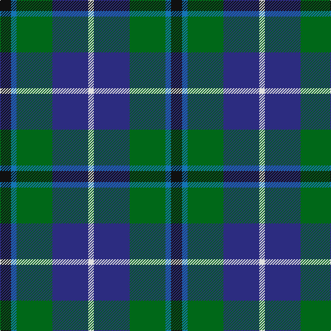

In pattern [KBGBW](/patterns/kbgbw/).

This was sourced from register-of-tartans.  It is a [5 stripes tartan](/stripes/stripes5/).

Original link https://www.tartanregister.gov.uk/tartanDetails.aspx?ref=228

## Thread count
K/16 B8 G52 DB52 LN/8

## Palette
Each colour and its ΔE from the base-6 reference it is a variant of.

| Colour | Shade | Base | ΔE (OKLab) |
|---|---|---|---|
| B | <code style="background-color:#1474B4;">#1474B4</code> `#1474B4` | B <code style="background-color:#2C4084;">#2C4084</code> | 0.15 |
| DB | <code style="background-color:#2C2C80;">#2C2C80</code> `#2C2C80` | B <code style="background-color:#2C4084;">#2C4084</code> | 0.05 |
| G | <code style="background-color:#006818;">#006818</code> `#006818` | G <code style="background-color:#006400;">#006400</code> | 0.02 |
| K | <code style="background-color:#101010;">#101010</code> `#101010` | K <code style="background-color:#000000;">#000000</code> | 0.17 |
| LN | <code style="background-color:#E0E0E0;">#E0E0E0</code> `#E0E0E0` | W <code style="background-color:#F4F4F0;">#F4F4F0</code> | 0.06 |

# Sample pattern

## Nearest tartans

The nearest existing variants by ΔTartan distance.

1. [Bhatti (Name)](/setts/s5/k14w6g36b36wa4-b2c2c80-g006818-k101010-w98c8e8-wae0e0e0/) — ΔT 0.59
1. [Davidson of Tulloch #2](/setts/s5/r4b24k12g24w4-b2c4084-g005020-k101010-rdc0000-we0e0e0/) — ΔT 0.76
1. [Turnbull Hunting Clan Tartan Tartan Number: 1265. Earliest known date: pre 2003 An unusual dress tartan having no white. See products available Copyright © Blair Urquhart, Comrie, 2015](/setts/s5/k14y6g56b56w6-b2c2c80-g006818-k101010-we0e0e0-ye8c000/) — ΔT 0.81
1. [Douglas, Green (Wilsons)](/setts/s5/k4b4g32ba32w4-b2c2c80-ba202060-g006818-k101010-wfcfcfc/) — ΔT 0.86
1. [Wellington No 229](/setts/s5/k8b6ba22g28w4-b3c82af-ba5a008c-g005020-k101010-we0e0e0/) — ΔT 0.89
1. [DeLoughery (Personal)](/setts/s6/b40k12y8b6g40w4-b38409c-g006818-k101010-wfcfcfc-ya08858/) — ΔT 0.91
1. [Inglis (Name)](/setts/s6/y8g48b20r6b24ya8-b1c0070-g006818-rc80000-yb8b8b8-yad09800/) — ΔT 0.95
1. [MacLean, Donald (Personal)](/setts/s7/g32w6g6k20b24r4b6-b1c0070-g006818-k101010-r880000-wa8ace8/) — ΔT 0.97
1. [Highlander Highland Laddie](/setts/s5/k14r6g60b56w6-b1c0070-g006818-k101010-r880000-wc0c0c0/) — ΔT 0.99
1. [Wellington](/setts/s6/b2r2b12k12g12w2-b2c4084-g005020-k101010-rdc0000-we0e0e0/) — ΔT 1.00

## Neighbour map

Every grey dot is one of 15726 variants placed by the first two principal components of the ΔTartan feature space (44% of its variance). Red is this tartan; blue dots are its nearest — click one to open its page.

<svg viewBox="0 0 640 380" role="img" style="max-width:100%;height:auto;border:1px solid #e0e0e0;border-radius:4px;display:block" xmlns="http://www.w3.org/2000/svg"><image href="/nn/cloud.v1.png" width="640" height="380"/><a href="/setts/s5/k14w6g36b36wa4-b2c2c80-g006818-k101010-w98c8e8-wae0e0e0/"><circle cx="164.0" cy="218.0" r="4" fill="#3465a4"><title>Bhatti (Name)</title></circle></a><a href="/setts/s5/r4b24k12g24w4-b2c4084-g005020-k101010-rdc0000-we0e0e0/"><circle cx="143.3" cy="243.9" r="4" fill="#3465a4"><title>Davidson of Tulloch #2</title></circle></a><a href="/setts/s5/k14y6g56b56w6-b2c2c80-g006818-k101010-we0e0e0-ye8c000/"><circle cx="200.6" cy="208.9" r="4" fill="#3465a4"><title>Turnbull Hunting Clan Tartan Tartan Number: 1265. Earliest known date: pre 2003 An unusual dress tartan having no white. See products available Copyright © Blair Urquhart, Comrie, 2015</title></circle></a><a href="/setts/s5/k4b4g32ba32w4-b2c2c80-ba202060-g006818-k101010-wfcfcfc/"><circle cx="215.4" cy="214.1" r="4" fill="#3465a4"><title>Douglas, Green (Wilsons)</title></circle></a><a href="/setts/s5/k8b6ba22g28w4-b3c82af-ba5a008c-g005020-k101010-we0e0e0/"><circle cx="169.9" cy="228.7" r="4" fill="#3465a4"><title>Wellington No 229</title></circle></a><a href="/setts/s6/b40k12y8b6g40w4-b38409c-g006818-k101010-wfcfcfc-ya08858/"><circle cx="202.7" cy="199.9" r="4" fill="#3465a4"><title>DeLoughery (Personal)</title></circle></a><a href="/setts/s6/y8g48b20r6b24ya8-b1c0070-g006818-rc80000-yb8b8b8-yad09800/"><circle cx="180.1" cy="207.4" r="4" fill="#3465a4"><title>Inglis (Name)</title></circle></a><a href="/setts/s7/g32w6g6k20b24r4b6-b1c0070-g006818-k101010-r880000-wa8ace8/"><circle cx="160.0" cy="211.9" r="4" fill="#3465a4"><title>MacLean, Donald (Personal)</title></circle></a><a href="/setts/s5/k14r6g60b56w6-b1c0070-g006818-k101010-r880000-wc0c0c0/"><circle cx="218.4" cy="210.5" r="4" fill="#3465a4"><title>Highlander Highland Laddie</title></circle></a><a href="/setts/s6/b2r2b12k12g12w2-b2c4084-g005020-k101010-rdc0000-we0e0e0/"><circle cx="138.3" cy="232.7" r="4" fill="#3465a4"><title>Wellington</title></circle></a><circle cx="166.5" cy="232.5" r="5" fill="#c00000"/></svg>

ID: /setts/s5/k16b8g52ba52w8-b1474b4-ba2c2c80-g006818-k101010-we0e0e0/
