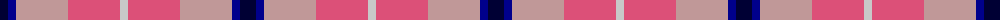
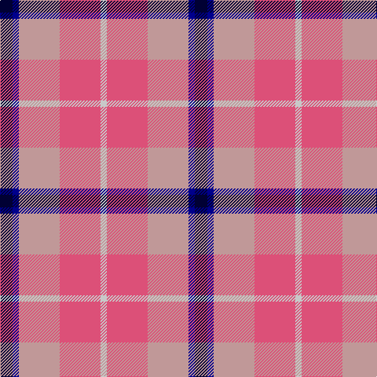

In pattern [KBYRW](/patterns/kbyrw/).

This was sourced from register-of-tartans.  It is a [5 stripes tartan](/stripes/stripes5/).

Original link https://www.tartanregister.gov.uk/tartanDetails.aspx?ref=4100

## Attestations

This cloth appears in 2 source records; the oldest owns this page.

- 01/01/2002 — Think Pink (ICF) (register-of-tartans, [record](https://www.tartanregister.gov.uk/tartanDetails.aspx?ref=4100))
- pre 2002 — Think Pink (Corporate) (tartans-authority, [record](http://www.tartansauthority.com/tartan-ferret/display/5134/))

## Thread count
DB/16 DBa8 Na52 LR52 N/8

## Palette
Each colour and its ΔE from the base-6 reference it is a variant of.

| Colour | Shade | Base | ΔE (OKLab) |
|---|---|---|---|
| DB | <code style="background-color:#000034;">#000034</code> `#000034` | K <code style="background-color:#000000;">#000000</code> | 0.18 |
| DBa | <code style="background-color:#00008C;">#00008C</code> `#00008C` | B <code style="background-color:#2C4084;">#2C4084</code> | 0.13 |
| LR | <code style="background-color:#DC5078;">#DC5078</code> `#DC5078` | R <code style="background-color:#C80000;">#C80000</code> | 0.14 |
| N | <code style="background-color:#C8C8C8;">#C8C8C8</code> `#C8C8C8` | W <code style="background-color:#F4F4F0;">#F4F4F0</code> | 0.13 |
| Na | <code style="background-color:#C09898;">#C09898</code> `#C09898` | Y <code style="background-color:#E8C000;">#E8C000</code> | 0.19 |

# Sample pattern

ID: /setts/s5/k16b8y52r52w8-b00008c-k000034-rdc5078-wc8c8c8-yc09898/
