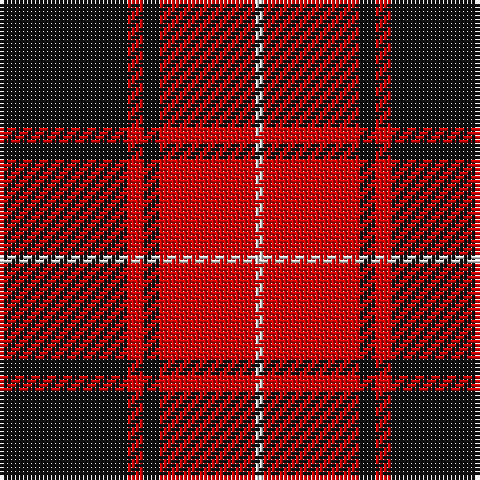

This page is one **sett** — a single exact thread-count. It belongs to the [tartan](/tartans/k16r2k2r12w1/)
(the same proportion at any scale), whose colour order is pattern [KRKRW](/stripes/krkrw/).

Sourced from register-of-tartans.  It is a [5 stripe tartan](/stripes/stripes5/).

Original link https://www.tartanregister.gov.uk/tartanDetails.aspx?ref=2489

2 attestations — the source records this cloth was collapsed from (oldest owns this page)

<ul>
<li>undated — MacIver (register-of-tartans, <a href="https://www.tartanregister.gov.uk/tartanDetails.aspx?ref=2489">record</a>)</li>
<li>undated — MacIver (weddslist, <a href="http://www.weddslist.com/cgi-bin/tartans/pg.pl?source=sts">record</a>)</li>
</ul>

## Register references

External register numbers recorded for this tartan.

- Scottish Register of Tartans: [2489](https://www.tartanregister.gov.uk/tartanDetails.aspx?ref=2489)
- Scottish Tartans World Register: 1202

## Thread count
K/32 R4 K4 R24 LN/2

## Palette

Palette: <strong>Tartan Register</strong>
<table><thead><tr><th>Colour</th><th>Threads</th><th>Shade</th><th>Base</th><th>OKLCh</th></tr></thead><tbody><tr><td>K/</td><td style="text-align:right;font-variant-numeric:tabular-nums">32</td><td><code style="background-color:#101010;">#101010</code> <small style="color:#888">#101010</small></td><td>K <code style="background-color:#000000;">#000000</code></td><td><small style="color:#888">oklch(17.3% 0.000 89.9)</small></td></tr><tr><td>R</td><td style="text-align:right;font-variant-numeric:tabular-nums">4</td><td><code style="background-color:#DC0000;">#DC0000</code> <small style="color:#888">#DC0000</small></td><td>R <code style="background-color:#CC0000;">#CC0000</code></td><td><small style="color:#888">oklch(56.2% 0.230 29.2)</small></td></tr><tr><td>K</td><td style="text-align:right;font-variant-numeric:tabular-nums">4</td><td><code style="background-color:#101010;">#101010</code> <small style="color:#888">#101010</small></td><td>K <code style="background-color:#000000;">#000000</code></td><td><small style="color:#888">oklch(17.3% 0.000 89.9)</small></td></tr><tr><td>R</td><td style="text-align:right;font-variant-numeric:tabular-nums">24</td><td><code style="background-color:#DC0000;">#DC0000</code> <small style="color:#888">#DC0000</small></td><td>R <code style="background-color:#CC0000;">#CC0000</code></td><td><small style="color:#888">oklch(56.2% 0.230 29.2)</small></td></tr><tr><td>LN/</td><td style="text-align:right;font-variant-numeric:tabular-nums">2</td><td><code style="background-color:#E0E0E0;">#E0E0E0</code> <small style="color:#888">#E0E0E0</small></td><td>W <code style="background-color:#F7F7F7;">#F7F7F7</code></td><td><small style="color:#888">oklch(90.7% 0.000 89.9)</small></td></tr></tbody></table>

# Sample pattern

## Nearest tartans

The nearest existing variants by ΔTartan distance, with this tartan at the top so the swatches line up against it.

ΔTartan

Tartan

Sett

—

<a href="/ttd/edit/#slug=k16r2k2r12w1~x2">MacIver</a> <a class="nn-out" href="/setts/s5/k16r2k2r12w1~x2/" title="open its dictionary page">↗</a>

0.68

<a href="/ttd/edit/#slug=r20k2r2k15w1~x2">Masai Shuka 15 (Artefact)</a> <a class="nn-out" href="/setts/s5/r20k2r2k15w1~x2/" title="open its dictionary page">↗</a>

0.77

<a href="/ttd/edit/#slug=k2r16k8ly1k8r2~x4">Brodie (Clan)</a> <a class="nn-out" href="/setts/s6/k2r16k8ly1k8r2~x4/" title="open its dictionary page">↗</a>

0.84

<a href="/ttd/edit/#slug=k8r1k8r11ly1r1~x4">Swanstrom (Personal)</a> <a class="nn-out" href="/setts/s6/k8r1k8r11ly1r1~x4/" title="open its dictionary page">↗</a>

0.86

<a href="/ttd/edit/#slug=k4r33k24w3k4r3~x2">Monmouth College</a> <a class="nn-out" href="/setts/s6/k4r33k24w3k4r3~x2/" title="open its dictionary page">↗</a>

0.86

<a href="/ttd/edit/#slug=k2r6k2r6k12ly1~x4">MacQueen</a> <a class="nn-out" href="/setts/s6/k2r6k2r6k12ly1~x4/" title="open its dictionary page">↗</a>

0.94

<a href="/ttd/edit/#slug=r36k18r4k7w2~x2">Hopkins (Name)</a> <a class="nn-out" href="/setts/s5/r36k18r4k7w2~x2/" title="open its dictionary page">↗</a>

0.97

<a href="/setts/s6/r28k4w2k13~x2/">Dunbar Ancient</a>

1.00

<a href="/ttd/edit/#slug=r28k4w2k13~x2">Dunbar (District)</a> <a class="nn-out" href="/setts/s4/r28k4w2k13~x2/" title="open its dictionary page">↗</a>

1.06

<a href="/ttd/edit/#slug=r41k19r7k9w3~x2">MacGregor, Black (Personal)</a> <a class="nn-out" href="/setts/s5/r41k19r7k9w3~x2/" title="open its dictionary page">↗</a>

1.08

<a href="/ttd/edit/#slug=k3r2k30r28k2r2w3~x2">Cunningham #2</a> <a class="nn-out" href="/setts/s7/k3r2k30r28k2r2w3~x2/" title="open its dictionary page">↗</a>

## Neighbour map

Every grey dot is one of 14299 variants placed by the first two principal components of the ΔTartan feature space (44% of its variance). Red is this tartan; blue dots are its nearest — click one to open its page.

<svg viewBox="0 0 640 380" role="img" style="max-width:100%;height:auto;border:1px solid #e0e0e0;border-radius:4px;display:block" xmlns="http://www.w3.org/2000/svg"><image href="/nn/cloud.v1.png" width="640" height="380"/><a href="/setts/s5/r20k2r2k15w1~x2/"><circle cx="386.4" cy="183.9" r="4" fill="#3465a4"><title>Masai Shuka 15 (Artefact)</title></circle></a><a href="/setts/s6/k2r16k8ly1k8r2~x4/"><circle cx="341.2" cy="198.6" r="4" fill="#3465a4"><title>Brodie (Clan)</title></circle></a><a href="/setts/s6/k8r1k8r11ly1r1~x4/"><circle cx="336.5" cy="214.7" r="4" fill="#3465a4"><title>Swanstrom (Personal)</title></circle></a><a href="/setts/s6/k4r33k24w3k4r3~x2/"><circle cx="335.4" cy="193.5" r="4" fill="#3465a4"><title>Monmouth College</title></circle></a><a href="/setts/s6/k2r6k2r6k12ly1~x4/"><circle cx="342.4" cy="216.7" r="4" fill="#3465a4"><title>MacQueen</title></circle></a><a href="/setts/s5/r36k18r4k7w2~x2/"><circle cx="399.6" cy="189.5" r="4" fill="#3465a4"><title>Hopkins (Name)</title></circle></a><a href="/setts/s6/r28k4w2k13~x2/"><circle cx="334.4" cy="176.8" r="4" fill="#3465a4"><title>Dunbar Ancient</title></circle></a><a href="/setts/s4/r28k4w2k13~x2/"><circle cx="375.2" cy="209.8" r="4" fill="#3465a4"><title>Dunbar (District)</title></circle></a><a href="/setts/s5/r41k19r7k9w3~x2/"><circle cx="382.7" cy="201.8" r="4" fill="#3465a4"><title>MacGregor, Black (Personal)</title></circle></a><a href="/setts/s7/k3r2k30r28k2r2w3~x2/"><circle cx="350.9" cy="166.8" r="4" fill="#3465a4"><title>Cunningham #2</title></circle></a><circle cx="360.3" cy="195.2" r="5" fill="#c00000"/></svg>

ID: /setts/s5/k16r2k2r12w1~x2/
