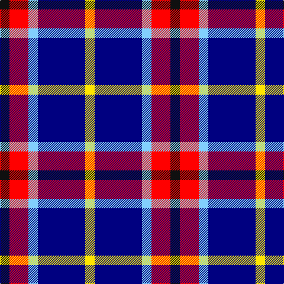

In pattern [KRWBY](/patterns/krwby/).

This was sourced from register-of-tartans.  It is a [5 stripes tartan](/stripes/stripes5/).

Original link https://www.tartanregister.gov.uk/tartanDetails.aspx?ref=10211

## Thread count
K/16 R32 LB16 DB80 Y/16

## Palette
Each colour and its ΔE from the base-6 reference it is a variant of.

| Colour | Shade | Base | ΔE (OKLab) |
|---|---|---|---|
| DB | <code style="background-color:#000080;">#000080</code> `#000080` | B <code style="background-color:#2C4084;">#2C4084</code> | 0.14 |
| K | <code style="background-color:#101010;">#101010</code> `#101010` | K <code style="background-color:#000000;">#000000</code> | 0.17 |
| LB | <code style="background-color:#82CFFD;">#82CFFD</code> `#82CFFD` | W <code style="background-color:#F4F4F0;">#F4F4F0</code> | 0.18 |
| R | <code style="background-color:#FF0000;">#FF0000</code> `#FF0000` | R <code style="background-color:#C80000;">#C80000</code> | 0.11 |
| Y | <code style="background-color:#FFE600;">#FFE600</code> `#FFE600` | Y <code style="background-color:#E8C000;">#E8C000</code> | 0.10 |

# Sample pattern

## Nearest tartans

The nearest existing variants by ΔTartan distance.

1. [Hawick Rugby Club (Corporate)](/setts/s6/b12y6b42w6k42w12-b2c2c80-k101010-we0e0e0-ye8c000/) — ΔT 1.36
1. [Wilson's, No 111](/setts/s5/b38w4g24ba6k8-b800080-ba5480b0-g008000-k000000-we0e0e0/) — ΔT 1.38
1. [Bryson (1988) (Name)](/setts/s5/y16r8b56ba56w8-b78849c-ba000064-rc80000-wc8d8dc-ya0a0a0/) — ΔT 1.42
1. [Lands of Liberty (Fashion)](/setts/s5/r30w20b96ba64r12-b202060-ba2888c4-rc80000-wfcfcfc/) — ΔT 1.42
1. [University of Notre Dame](/setts/s6/r10b70k50b16y20r10-b2c2c80-k101010-rc80000-yfccc00/) — ΔT 1.49
1. [Kellogg College University of Oxford](/setts/s4/r42b122y16w42-b00008c-rff0000-wffffff-yd87c00/) — ΔT 1.51
1. [MacTavish / Thom(p)son, dress](/setts/s6/r8b56k12w24k24y6-b5480b0-k000000-rc00000-we0e0e0-yf0c000/) — ΔT 1.53
1. [Kile (Red line) (Personal)](/setts/s8/b36w6b6w6r6w6k10y24-b1c0070-k101010-r880000-wfcfcfc-yd8b000/) — ΔT 1.54
1. [Ballater Victoria Week](/setts/s5/b64y48k16g8w8-b5a008c-g808080-k101010-wf9f5ef-ye8c000/) — ΔT 1.55
1. [Fife](/setts/s6/b62ba8b12k38r40y8-b304080-ba5480b0-k000000-rc00000-yf0c000/) — ΔT 1.55

## Neighbour map

Every grey dot is one of 15726 variants placed by the first two principal components of the ΔTartan feature space (44% of its variance). Red is this tartan; blue dots are its nearest — click one to open its page.

<svg viewBox="0 0 640 380" role="img" style="max-width:100%;height:auto;border:1px solid #e0e0e0;border-radius:4px;display:block" xmlns="http://www.w3.org/2000/svg"><image href="/nn/cloud.v1.png" width="640" height="380"/><a href="/setts/s6/b12y6b42w6k42w12-b2c2c80-k101010-we0e0e0-ye8c000/"><circle cx="194.5" cy="217.5" r="4" fill="#3465a4"><title>Hawick Rugby Club (Corporate)</title></circle></a><a href="/setts/s5/b38w4g24ba6k8-b800080-ba5480b0-g008000-k000000-we0e0e0/"><circle cx="206.8" cy="191.8" r="4" fill="#3465a4"><title>Wilson's, No 111</title></circle></a><a href="/setts/s5/y16r8b56ba56w8-b78849c-ba000064-rc80000-wc8d8dc-ya0a0a0/"><circle cx="157.8" cy="211.0" r="4" fill="#3465a4"><title>Bryson (1988) (Name)</title></circle></a><a href="/setts/s5/r30w20b96ba64r12-b202060-ba2888c4-rc80000-wfcfcfc/"><circle cx="184.1" cy="223.2" r="4" fill="#3465a4"><title>Lands of Liberty (Fashion)</title></circle></a><a href="/setts/s6/r10b70k50b16y20r10-b2c2c80-k101010-rc80000-yfccc00/"><circle cx="218.9" cy="221.0" r="4" fill="#3465a4"><title>University of Notre Dame</title></circle></a><a href="/setts/s4/r42b122y16w42-b00008c-rff0000-wffffff-yd87c00/"><circle cx="230.1" cy="224.3" r="4" fill="#3465a4"><title>Kellogg College University of Oxford</title></circle></a><a href="/setts/s6/r8b56k12w24k24y6-b5480b0-k000000-rc00000-we0e0e0-yf0c000/"><circle cx="145.3" cy="179.4" r="4" fill="#3465a4"><title>MacTavish / Thom(p)son, dress</title></circle></a><a href="/setts/s8/b36w6b6w6r6w6k10y24-b1c0070-k101010-r880000-wfcfcfc-yd8b000/"><circle cx="118.5" cy="173.0" r="4" fill="#3465a4"><title>Kile (Red line) (Personal)</title></circle></a><a href="/setts/s5/b64y48k16g8w8-b5a008c-g808080-k101010-wf9f5ef-ye8c000/"><circle cx="171.4" cy="186.4" r="4" fill="#3465a4"><title>Ballater Victoria Week</title></circle></a><a href="/setts/s6/b62ba8b12k38r40y8-b304080-ba5480b0-k000000-rc00000-yf0c000/"><circle cx="168.9" cy="202.3" r="4" fill="#3465a4"><title>Fife</title></circle></a><circle cx="163.2" cy="212.1" r="5" fill="#c00000"/></svg>

ID: /setts/s5/k16r32w16b80y16-b000080-k101010-rff0000-w82cffd-yffe600/
