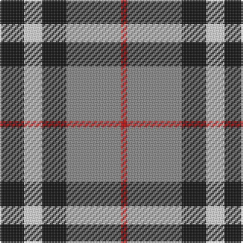

In pattern [KWKRR](/patterns/kwkrr/).

This was sourced from house-of-tartan.  It is a [5 stripes tartan](/stripes/stripes5/).

Original link http://www.house-of-tartan.scotland.net/house/TartanViewjs.asp?colr=Def&tnam=1237

## Thread count
K/16 LN12 K16 N36 R/4

## Palette
Each colour and its ΔE from the base-6 reference it is a variant of.

| Colour | Shade | Base | ΔE (OKLab) |
|---|---|---|---|
| K | <code style="background-color:#101010;">#101010</code> `#101010` | K <code style="background-color:#000000;">#000000</code> | 0.17 |
| LN | <code style="background-color:#E0E0E0;">#E0E0E0</code> `#E0E0E0` | W <code style="background-color:#F4F4F0;">#F4F4F0</code> | 0.06 |
| N | <code style="background-color:#888888;">#888888</code> `#888888` | R <code style="background-color:#C80000;">#C80000</code> | 0.24 |
| R | <code style="background-color:#C80000;">#C80000</code> `#C80000` | R <code style="background-color:#C80000;">#C80000</code> | 0.00 |

# Sample pattern

## Nearest tartans

The nearest existing variants by ΔTartan distance.

1. [Oban Grey](/setts/s5/k16w12k16g36r4-g808080-k101010-rdc0000-we0e0e0/) — ΔT 0.09
1. [Oban, Grey](/setts/s5/k16w12k16g36r4-g808080-k000000-rc00000-we0e0e0/) — ΔT 0.80
1. [Thompson Grey Family Tartan Tartan Number: 1611. Earliest known date: pre 2003 Designed for Lord Thomson of Fleet in 1958 based on a sample in the Moy Hall collection dating from the mid 19th century. The tartan is also suitable for MacTavishs and Thompsons, who claim descent from the Clan MacIntosh. See products available Copyright © Blair Urquhart, Comrie, 2015](/setts/s6/r4ra40k10w20k20r4-k101010-rc80000-ra888888-we0e0e0/) — ΔT 0.91
1. [Thom(p)son, Grey](/setts/s6/r4g40k10w20k20r4-g808080-k000000-rc00000-we0e0e0/) — ΔT 0.93
1. [Loganair Uniform Skirt Corporate Tartan Tartan Number: 1629. Earliest known date: c.1985 Half actual count for display. Used until 1988 See products available Copyright © Blair Urquhart, Comrie, 2015](/setts/s4/r5ra32k31w5-k101010-rc80000-ra888888-we0e0e0/) — ΔT 0.94
1. [Delroeux, John Michael (Personal)](/setts/s4/b30g60y10r30-b0000cd-g125d24-rff0000-yffe600/) — ΔT 0.97
1. [Loganair](/setts/s4/r10ra64k62w10-k101010-r880000-ra888888-we0e0e0/) — ΔT 0.97
1. [Burberry Hunting](/setts/s5/k18w18k18g60r6-g406054-k101010-rc80000-wfcfcfc/) — ΔT 0.98
1. [Kilgour](/setts/s6/b28g42b8r42b28y4-b000050-g008000-rc00000-yf0c000/) — ΔT 1.04
1. [Thom(p)son camel](/setts/s6/r8ra60k12w26k26w6-k000000-rc00000-ra806050-we0e0e0/) — ΔT 1.05

## Neighbour map

Every grey dot is one of 15726 variants placed by the first two principal components of the ΔTartan feature space (44% of its variance). Red is this tartan; blue dots are its nearest — click one to open its page.

<svg viewBox="0 0 640 380" role="img" style="max-width:100%;height:auto;border:1px solid #e0e0e0;border-radius:4px;display:block" xmlns="http://www.w3.org/2000/svg"><image href="/nn/cloud.v1.png" width="640" height="380"/><a href="/setts/s5/k16w12k16g36r4-g808080-k101010-rdc0000-we0e0e0/"><circle cx="186.4" cy="225.1" r="4" fill="#3465a4"><title>Oban Grey</title></circle></a><a href="/setts/s5/k16w12k16g36r4-g808080-k000000-rc00000-we0e0e0/"><circle cx="174.6" cy="223.3" r="4" fill="#3465a4"><title>Oban, Grey</title></circle></a><a href="/setts/s6/r4ra40k10w20k20r4-k101010-rc80000-ra888888-we0e0e0/"><circle cx="172.8" cy="194.0" r="4" fill="#3465a4"><title>Thompson Grey Family Tartan Tartan Number: 1611. Earliest known date: pre 2003 Designed for Lord Thomson of Fleet in 1958 based on a sample in the Moy Hall collection dating from the mid 19th century. The tartan is also suitable for MacTavishs and Thompsons, who claim descent from the Clan MacIntosh. See products available Copyright © Blair Urquhart, Comrie, 2015</title></circle></a><a href="/setts/s6/r4g40k10w20k20r4-g808080-k000000-rc00000-we0e0e0/"><circle cx="162.9" cy="192.7" r="4" fill="#3465a4"><title>Thom(p)son, Grey</title></circle></a><a href="/setts/s4/r5ra32k31w5-k101010-rc80000-ra888888-we0e0e0/"><circle cx="208.5" cy="240.8" r="4" fill="#3465a4"><title>Loganair Uniform Skirt Corporate Tartan Tartan Number: 1629. Earliest known date: c.1985 Half actual count for display. Used until 1988 See products available Copyright © Blair Urquhart, Comrie, 2015</title></circle></a><a href="/setts/s4/b30g60y10r30-b0000cd-g125d24-rff0000-yffe600/"><circle cx="170.5" cy="258.1" r="4" fill="#3465a4"><title>Delroeux, John Michael (Personal)</title></circle></a><a href="/setts/s4/r10ra64k62w10-k101010-r880000-ra888888-we0e0e0/"><circle cx="209.3" cy="242.1" r="4" fill="#3465a4"><title>Loganair</title></circle></a><a href="/setts/s5/k18w18k18g60r6-g406054-k101010-rc80000-wfcfcfc/"><circle cx="230.5" cy="211.4" r="4" fill="#3465a4"><title>Burberry Hunting</title></circle></a><a href="/setts/s6/b28g42b8r42b28y4-b000050-g008000-rc00000-yf0c000/"><circle cx="183.7" cy="224.5" r="4" fill="#3465a4"><title>Kilgour</title></circle></a><a href="/setts/s6/r8ra60k12w26k26w6-k000000-rc00000-ra806050-we0e0e0/"><circle cx="183.4" cy="189.7" r="4" fill="#3465a4"><title>Thom(p)son camel</title></circle></a><circle cx="184.7" cy="224.1" r="5" fill="#c00000"/></svg>

ID: /setts/s5/k16w12k16r36ra4-k101010-r888888-rac80000-we0e0e0/
