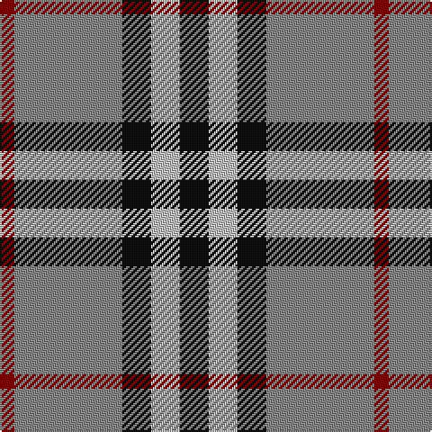

In pattern [KWKRR](/patterns/kwkrr/).

This was sourced from tartans-authority.  It is a [5 stripes tartan](/stripes/stripes5/).

Original link http://www.tartansauthority.com/tartan-ferret/display/1237/

## Thread count
DR/8 Na60 K16 N16 K/16

## Palette
Each colour and its ΔE from the base-6 reference it is a variant of.

| Colour | Shade | Base | ΔE (OKLab) |
|---|---|---|---|
| DR | <code style="background-color:#880000;">#880000</code> `#880000` | R <code style="background-color:#C80000;">#C80000</code> | 0.14 |
| K | <code style="background-color:#101010;">#101010</code> `#101010` | K <code style="background-color:#000000;">#000000</code> | 0.17 |
| N | <code style="background-color:#C0C0C0;">#C0C0C0</code> `#C0C0C0` | W <code style="background-color:#F4F4F0;">#F4F4F0</code> | 0.16 |
| Na | <code style="background-color:#888888;">#888888</code> `#888888` | R <code style="background-color:#C80000;">#C80000</code> | 0.24 |

# Sample pattern

## Nearest tartans

The nearest existing variants by ΔTartan distance.

1. [New York State Police Pipe Band](/setts/s5/r20b12r72k64y12-b780078-k101010-r888888-ye8c000/) — ΔT 0.66
1. [Bronte House Check (Fashion)](/setts/s6/r10g60b13w24b24g8-b003c64-g604000-re87878-we8ccb8/) — ΔT 0.84
1. [Burberry Hunting](/setts/s5/k18w18k18g60r6-g406054-k101010-rc80000-wfcfcfc/) — ΔT 0.89
1. [Downside (Corporate)](/setts/s6/r8ra82k10w28k36r8-k101010-rc80000-ra888888-we0e0e0/) — ΔT 0.94
1. [Burberry Check Corporate Tartan Tartan Number: 1239. Earliest known date: 1984 Nothing See products available Copyright © Blair Urquhart, Comrie, 2015](/setts/s5/k24w24k24y84r8-k101010-rc80000-we0e0e0-ya08858/) — ΔT 0.99
1. [MacNab 7](/setts/s4/g30r6b22ba4-b800080-ba5480b0-g008000-rc00000/) — ΔT 1.04
1. [Loganair Uniform Skirt Corporate Tartan Tartan Number: 1629. Earliest known date: c.1985 Half actual count for display. Used until 1988 See products available Copyright © Blair Urquhart, Comrie, 2015](/setts/s4/r5ra32k31w5-k101010-rc80000-ra888888-we0e0e0/) — ΔT 1.07
1. [All as One (Corporate)](/setts/s5/k22b76r22g22k10-b2888c4-g006818-k101010-rc80000/) — ΔT 1.09
1. [Loganair](/setts/s4/r10ra64k62w10-k101010-r880000-ra888888-we0e0e0/) — ΔT 1.09
1. [Hill of Banchory Primary (School)](/setts/s7/b4y24b32r4b32g24y4-b2c2c80-g289c18-rc80000-ye8c000/) — ΔT 1.13

## Neighbour map

Every grey dot is one of 15726 variants placed by the first two principal components of the ΔTartan feature space (44% of its variance). Red is this tartan; blue dots are its nearest — click one to open its page.

<svg viewBox="0 0 640 380" role="img" style="max-width:100%;height:auto;border:1px solid #e0e0e0;border-radius:4px;display:block" xmlns="http://www.w3.org/2000/svg"><image href="/nn/cloud.v1.png" width="640" height="380"/><a href="/setts/s5/r20b12r72k64y12-b780078-k101010-r888888-ye8c000/"><circle cx="234.8" cy="235.0" r="4" fill="#3465a4"><title>New York State Police Pipe Band</title></circle></a><a href="/setts/s6/r10g60b13w24b24g8-b003c64-g604000-re87878-we8ccb8/"><circle cx="231.1" cy="220.0" r="4" fill="#3465a4"><title>Bronte House Check (Fashion)</title></circle></a><a href="/setts/s5/k18w18k18g60r6-g406054-k101010-rc80000-wfcfcfc/"><circle cx="230.5" cy="211.4" r="4" fill="#3465a4"><title>Burberry Hunting</title></circle></a><a href="/setts/s6/r8ra82k10w28k36r8-k101010-rc80000-ra888888-we0e0e0/"><circle cx="222.6" cy="183.1" r="4" fill="#3465a4"><title>Downside (Corporate)</title></circle></a><a href="/setts/s5/k24w24k24y84r8-k101010-rc80000-we0e0e0-ya08858/"><circle cx="244.3" cy="199.8" r="4" fill="#3465a4"><title>Burberry Check Corporate Tartan Tartan Number: 1239. Earliest known date: 1984 Nothing See products available Copyright © Blair Urquhart, Comrie, 2015</title></circle></a><a href="/setts/s4/g30r6b22ba4-b800080-ba5480b0-g008000-rc00000/"><circle cx="251.6" cy="248.0" r="4" fill="#3465a4"><title>MacNab 7</title></circle></a><a href="/setts/s4/r5ra32k31w5-k101010-rc80000-ra888888-we0e0e0/"><circle cx="208.5" cy="240.8" r="4" fill="#3465a4"><title>Loganair Uniform Skirt Corporate Tartan Tartan Number: 1629. Earliest known date: c.1985 Half actual count for display. Used until 1988 See products available Copyright © Blair Urquhart, Comrie, 2015</title></circle></a><a href="/setts/s5/k22b76r22g22k10-b2888c4-g006818-k101010-rc80000/"><circle cx="226.4" cy="230.2" r="4" fill="#3465a4"><title>All as One (Corporate)</title></circle></a><a href="/setts/s4/r10ra64k62w10-k101010-r880000-ra888888-we0e0e0/"><circle cx="209.3" cy="242.1" r="4" fill="#3465a4"><title>Loganair</title></circle></a><a href="/setts/s7/b4y24b32r4b32g24y4-b2c2c80-g289c18-rc80000-ye8c000/"><circle cx="232.9" cy="213.1" r="4" fill="#3465a4"><title>Hill of Banchory Primary (School)</title></circle></a><circle cx="241.6" cy="218.6" r="5" fill="#c00000"/></svg>

ID: /setts/s5/k16w16k16r60ra8-k101010-r888888-ra880000-wc0c0c0/
