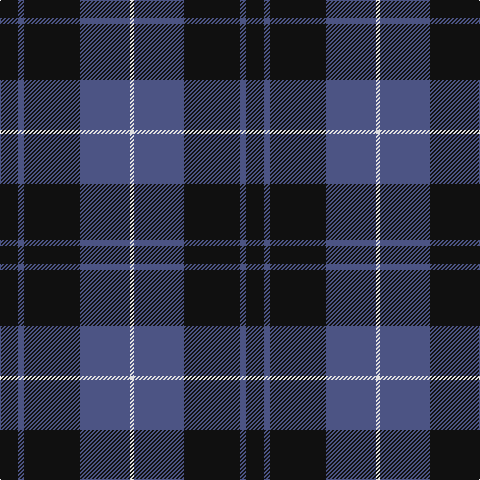

In pattern [KBKBW](/patterns/kbkbw/).

This was sourced from register-of-tartans.  It is a [5 stripes tartan](/stripes/stripes5/).

Original link https://www.tartanregister.gov.uk/tartanDetails.aspx?ref=3368

## Attestations

This cloth appears in 2 source records; the oldest owns this page.

- 01/02/2007 — Press & Journal (register-of-tartans, [record](https://www.tartanregister.gov.uk/tartanDetails.aspx?ref=3368))
- February 2007 — Press & Journal (Corporate) (tartans-authority, [record](http://www.tartansauthority.com/tartan-ferret/display/7099/))

## Thread count
K/18 B6 K56 B50 LN/4

## Palette
Each colour and its ΔE from the base-6 reference it is a variant of.

| Colour | Shade | Base | ΔE (OKLab) |
|---|---|---|---|
| B | <code style="background-color:#4C5484;">#4C5484</code> `#4C5484` | B <code style="background-color:#2C4084;">#2C4084</code> | 0.08 |
| K | <code style="background-color:#101010;">#101010</code> `#101010` | K <code style="background-color:#000000;">#000000</code> | 0.17 |
| LN | <code style="background-color:#E0E0E0;">#E0E0E0</code> `#E0E0E0` | W <code style="background-color:#F4F4F0;">#F4F4F0</code> | 0.06 |

# Sample pattern

ID: /setts/s5/k18b6k56b50w4-b4c5484-k101010-we0e0e0/
