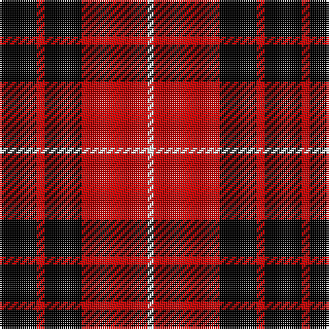

This page is one **sett** — a single exact thread-count. It belongs to the [tartan](/tartans/k18r4k18r32n3/)
(the same proportion at any scale), whose colour order is pattern [KRKRW](/stripes/krkrw/).

Sourced from weddslist.  It is a [5 stripe tartan](/stripes/stripes5/).

Original link http://www.weddslist.com/cgi-bin/tartans/pg.pl?source=rb

## Thread count
K/18 R4 K18 R32 N/3

## Palette
Each colour and the base-6 reference it is a variant of.

| Colour | Shade | Base |
|---|---|---|
| K | <code style="background-color:#000000;">#000000</code> `oklch(0.0% 0.000 0.0)` <small>#000000</small> | K <code style="background-color:#000000;">#000000</code> |
| N | <code style="background-color:#D0D0D0;">#D0D0D0</code> `oklch(85.8% 0.000 89.9)` <small>#D0D0D0</small> | W <code style="background-color:#F7F7F7;">#F7F7F7</code> |
| R | <code style="background-color:#C80000;">#C80000</code> `oklch(52.3% 0.215 29.2)` <small>#C80000</small> | R <code style="background-color:#CC0000;">#CC0000</code> |

# Sample pattern

## Nearest tartans

The nearest existing variants by ΔTartan distance, with this tartan at the top so the swatches line up against it.

ΔTartan

Tartan

Sett

—

<a href="/ttd/edit/#slug=k18r4k18r32lb3">Munro VS</a> <a class="nn-out" href="/setts/s5/k18r4k18r32lb3/" title="open its dictionary page">↗</a>

0.46

<a href="/ttd/edit/#slug=k18r4k18r32lr3~x2">Munro VS</a> <a class="nn-out" href="/setts/s5/k18r4k18r32lr3~x2/" title="open its dictionary page">↗</a>

0.46

<a href="/ttd/edit/#slug=k18r4k18r32lr3">Munro VS</a> <a class="nn-out" href="/setts/s5/k18r4k18r32lr3/" title="open its dictionary page">↗</a>

0.74

<a href="/ttd/edit/#slug=k1r8k8ly1">Wallace</a> <a class="nn-out" href="/setts/s4/k1r8k8ly1/" title="open its dictionary page">↗</a>

0.88

<a href="/ttd/edit/#slug=r4k8r4k8r12k1ly2~x2">MacIain</a> <a class="nn-out" href="/setts/s7/r4k8r4k8r12k1ly2~x2/" title="open its dictionary page">↗</a>

0.88

<a href="/ttd/edit/#slug=k2r6k2r6k12ly1~x2">MacQueen</a> <a class="nn-out" href="/setts/s6/k2r6k2r6k12ly1~x2/" title="open its dictionary page">↗</a>

0.89

<a href="/ttd/edit/#slug=k2r16k8ly1k8r2">Brodie Dress</a> <a class="nn-out" href="/setts/s6/k2r16k8ly1k8r2/" title="open its dictionary page">↗</a>

0.90

<a href="/ttd/edit/#slug=k2r16k8ly1k8r2~x2">Brodie</a> <a class="nn-out" href="/setts/s6/k2r16k8ly1k8r2~x2/" title="open its dictionary page">↗</a>

0.91

<a href="/ttd/edit/#slug=k1r8k8ly1~x2">Wallace</a> <a class="nn-out" href="/setts/s4/k1r8k8ly1~x2/" title="open its dictionary page">↗</a>

0.94

<a href="/ttd/edit/#slug=k18r4k18r32w3~x2">Munro (Black and Red)</a> <a class="nn-out" href="/setts/s5/k18r4k18r32w3~x2/" title="open its dictionary page">↗</a>

1.12

<a href="/ttd/edit/#slug=r3k25r25k10lb3~x2">Bodog.com</a> <a class="nn-out" href="/setts/s5/r3k25r25k10lb3~x2/" title="open its dictionary page">↗</a>

## Neighbour map

Every grey dot is one of 14299 variants placed by the first two principal components of the ΔTartan feature space (44% of its variance). Red is this tartan; blue dots are its nearest — click one to open its page.

<svg viewBox="0 0 640 380" role="img" style="max-width:100%;height:auto;border:1px solid #e0e0e0;border-radius:4px;display:block" xmlns="http://www.w3.org/2000/svg"><image href="/nn/cloud.v1.png" width="640" height="380"/><a href="/setts/s5/k18r4k18r32lr3~x2/"><circle cx="296.9" cy="232.4" r="4" fill="#3465a4"><title>Munro VS</title></circle></a><a href="/setts/s5/k18r4k18r32lr3/"><circle cx="296.9" cy="232.4" r="4" fill="#3465a4"><title>Munro VS</title></circle></a><a href="/setts/s4/k1r8k8ly1/"><circle cx="289.3" cy="239.1" r="4" fill="#3465a4"><title>Wallace</title></circle></a><a href="/setts/s7/r4k8r4k8r12k1ly2~x2/"><circle cx="287.9" cy="209.9" r="4" fill="#3465a4"><title>MacIain</title></circle></a><a href="/setts/s6/k2r6k2r6k12ly1~x2/"><circle cx="324.5" cy="212.7" r="4" fill="#3465a4"><title>MacQueen</title></circle></a><a href="/setts/s6/k2r16k8ly1k8r2/"><circle cx="320.5" cy="192.3" r="4" fill="#3465a4"><title>Brodie Dress</title></circle></a><a href="/setts/s6/k2r16k8ly1k8r2~x2/"><circle cx="322.2" cy="194.0" r="4" fill="#3465a4"><title>Brodie</title></circle></a><a href="/setts/s4/k1r8k8ly1~x2/"><circle cx="296.4" cy="245.8" r="4" fill="#3465a4"><title>Wallace</title></circle></a><a href="/setts/s5/k18r4k18r32w3~x2/"><circle cx="301.7" cy="227.1" r="4" fill="#3465a4"><title>Munro (Black and Red)</title></circle></a><a href="/setts/s5/r3k25r25k10lb3~x2/"><circle cx="317.5" cy="237.3" r="4" fill="#3465a4"><title>Bodog.com</title></circle></a><circle cx="289.3" cy="225.1" r="5" fill="#c00000"/></svg>

ID: /setts/s5/k18r4k18r32lb3/
