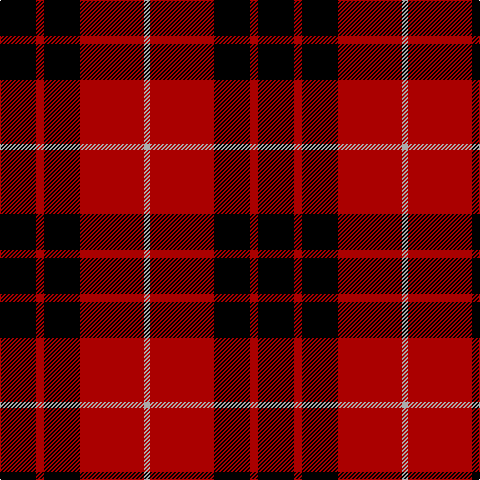

In pattern [KRKRY](/patterns/krkry/).

This was sourced from weddslist.  It is a [5 stripes tartan](/stripes/stripes5/).

Original link http://www.weddslist.com/cgi-bin/tartans/pg.pl?source=tinsel

## Thread count
K/36 DR8 K36 DR64 N/6

## Palette
Each colour and its ΔE from the base-6 reference it is a variant of.

| Colour | Shade | Base | ΔE (OKLab) |
|---|---|---|---|
| DR | <code style="background-color:#AA0000;">#AA0000</code> `#AA0000` | R <code style="background-color:#CC0000;">#CC0000</code> | 0.07 |
| K | <code style="background-color:#000000;">#000000</code> `#000000` | K <code style="background-color:#000000;">#000000</code> | 0.00 |
| N | <code style="background-color:#AAAAAA;">#AAAAAA</code> `#AAAAAA` | Y <code style="background-color:#F2BF00;">#F2BF00</code> | 0.19 |

# Sample pattern

## Nearest tartans

The nearest existing variants by ΔTartan distance.

1. [Munro VS](/setts/s5/k18r4k18r32y3~k000000-raa0000-yaaaaaa/) — ΔT 0.00
1. [Munro](/setts/s5/k18r4k18r32w3~k000000-rc00000-we0e0e0~x2/) — ΔT 0.39
1. [Munro VS](/setts/s5/k18r4k18r32w3~k000000-rc80000-wd0d0d0/) — ΔT 0.46
1. [Wallace](/setts/s4/k1r8k8y1~k000000-raa0000-yaaaa00~x2/) — ΔT 0.73
1. [Wallace](/setts/s4/k1r8k8y1~k000000-raa0000-yaaaa00/) — ΔT 0.73
1. [Wallace](/setts/s4/k1r8k8y1~k000000-rc00000-yf0c000~x4/) — ΔT 0.79
1. [MacQueen](/setts/s6/k2r6k2r6k12y1~k000000-rc00000-yf0c000~x2/) — ΔT 0.79
1. [MacQueen](/setts/s6/k2r6k2r6k12y1~k000000-rc80000-yc8c800~x2/) — ΔT 0.80
1. [Wallace](/setts/s4/k1r8k8y1~k000000-rc80000-yc8c800/) — ΔT 0.82
1. [Brodie](/setts/s6/k3r15k11y2k4r3~k000000-rc00000-yf0c000~x2/) — ΔT 0.83

## Neighbour map

Every grey dot is one of 15726 variants placed by the first two principal components of the ΔTartan feature space (44% of its variance). Red is this tartan; blue dots are its nearest — click one to open its page.

<svg viewBox="0 0 640 380" role="img" style="max-width:100%;height:auto;border:1px solid #e0e0e0;border-radius:4px;display:block" xmlns="http://www.w3.org/2000/svg"><image href="/nn/cloud.v1.png" width="640" height="380"/><a href="/setts/s5/k18r4k18r32y3~k000000-raa0000-yaaaaaa/"><circle cx="295.5" cy="239.0" r="4" fill="#3465a4"><title>Munro VS</title></circle></a><a href="/setts/s5/k18r4k18r32w3~k000000-rc00000-we0e0e0~x2/"><circle cx="288.5" cy="233.8" r="4" fill="#3465a4"><title>Munro</title></circle></a><a href="/setts/s5/k18r4k18r32w3~k000000-rc80000-wd0d0d0/"><circle cx="288.1" cy="233.0" r="4" fill="#3465a4"><title>Munro VS</title></circle></a><a href="/setts/s4/k1r8k8y1~k000000-raa0000-yaaaa00~x2/"><circle cx="294.9" cy="252.8" r="4" fill="#3465a4"><title>Wallace</title></circle></a><a href="/setts/s4/k1r8k8y1~k000000-raa0000-yaaaa00/"><circle cx="294.9" cy="252.8" r="4" fill="#3465a4"><title>Wallace</title></circle></a><a href="/setts/s4/k1r8k8y1~k000000-rc00000-yf0c000~x4/"><circle cx="289.3" cy="247.9" r="4" fill="#3465a4"><title>Wallace</title></circle></a><a href="/setts/s6/k2r6k2r6k12y1~k000000-rc00000-yf0c000~x2/"><circle cx="324.6" cy="221.1" r="4" fill="#3465a4"><title>MacQueen</title></circle></a><a href="/setts/s6/k2r6k2r6k12y1~k000000-rc80000-yc8c800~x2/"><circle cx="323.2" cy="220.2" r="4" fill="#3465a4"><title>MacQueen</title></circle></a><a href="/setts/s4/k1r8k8y1~k000000-rc80000-yc8c800/"><circle cx="288.0" cy="247.2" r="4" fill="#3465a4"><title>Wallace</title></circle></a><a href="/setts/s6/k3r15k11y2k4r3~k000000-rc00000-yf0c000~x2/"><circle cx="270.9" cy="232.0" r="4" fill="#3465a4"><title>Brodie</title></circle></a><circle cx="295.5" cy="239.0" r="5" fill="#c00000"/></svg>

ID: /setts/s5/k18r4k18r32y3~k000000-raa0000-yaaaaaa~x2/
