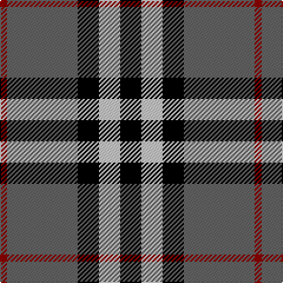

In pattern [KWKBR](/patterns/kwkbr/).

This was sourced from register-of-tartans.  It is a [5 stripes tartan](/stripes/stripes5/).

Original link https://www.tartanregister.gov.uk/tartanDetails.aspx?ref=1549

## Attestations

This cloth appears in 2 source records; the oldest owns this page.

- 01/01/2002 — Greystone (Burberry Grey) (register-of-tartans, [record](https://www.tartanregister.gov.uk/tartanDetails.aspx?ref=1549))
- pre 2002 — Greystone (Fashion) (tartans-authority, [record](http://www.tartansauthority.com/tartan-ferret/display/5123/))

## Thread count
DR/6 Na60 K18 N18 K/18

## Palette
Each colour and its ΔE from the base-6 reference it is a variant of.

| Colour | Shade | Base | ΔE (OKLab) |
|---|---|---|---|
| DR | <code style="background-color:#8C0000;">#8C0000</code> `#8C0000` | R <code style="background-color:#C80000;">#C80000</code> | 0.13 |
| K | <code style="background-color:#000000;">#000000</code> `#000000` | K <code style="background-color:#000000;">#000000</code> | 0.00 |
| N | <code style="background-color:#C8C8C8;">#C8C8C8</code> `#C8C8C8` | W <code style="background-color:#F4F4F0;">#F4F4F0</code> | 0.13 |
| Na | <code style="background-color:#646464;">#646464</code> `#646464` | B <code style="background-color:#2C4084;">#2C4084</code> | 0.16 |

# Sample pattern

ID: /setts/s5/k18w18k18b60r6-b646464-k000000-r8c0000-wc8c8c8/
