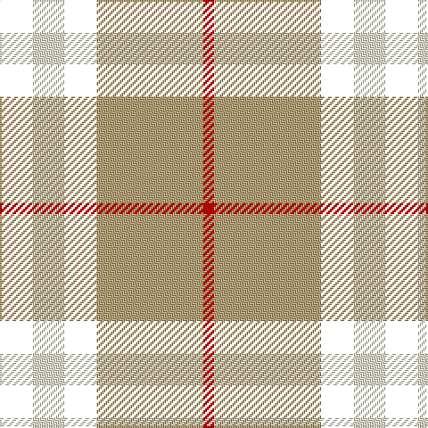

In pattern [KWKYR](/patterns/kwkyr/).

This was sourced from weddslist.  It is a [5 stripes tartan](/stripes/stripes5/).

Original link http://www.weddslist.com/cgi-bin/tartans/pg.pl?source=misc

## Thread count
K/18 LY18 K18 LG60 R/6

## Palette
Each colour and its ΔE from the base-6 reference it is a variant of.

| Colour | Shade | Base | ΔE (OKLab) |
|---|---|---|---|
| LG | <code style="background-color:#B8A47C;">#B8A47C</code> `#B8A47C` | Y <code style="background-color:#F2BF00;">#F2BF00</code> | 0.15 |
| LY | <code style="background-color:#F8F4D0;">#F8F4D0</code> `#F8F4D0` | W <code style="background-color:#F7F7F7;">#F7F7F7</code> | 0.05 |
| R | <code style="background-color:#C80000;">#C80000</code> `#C80000` | R <code style="background-color:#CC0000;">#CC0000</code> | 0.01 |

# Sample pattern

## Nearest tartans

The nearest existing variants by ΔTartan distance.

1. [Burberry (Genuine)](/setts/s5/k18w18k18y60r6-k101010-rc80000-wf8f4d0-yb8a47c/) — ΔT 0.57
1. [Burberry Check Corporate Tartan Tartan Number: 1239. Earliest known date: 1984 Nothing See products available Copyright © Blair Urquhart, Comrie, 2015](/setts/s5/k24w24k24y84r8-k101010-rc80000-we0e0e0-ya08858/) — ΔT 0.67
1. [Thomson Camel](/setts/s6/r8y60k12w26k26w6-k101010-rc80000-we0e0e0-ya08858/) — ΔT 0.96
1. [Black & White Golf (Corporate)](/setts/s7/y18k64g12w40y6w18k10-g006818-k101010-we8ccb8-ybc8c00/) — ΔT 0.96
1. [Ikelman No 2](/setts/s5/g52k20r20y20g6-g808080-k000000-rc00000-yf0c000/) — ΔT 0.97
1. [Louisburg Canadian District Tartan Tartan Number: 5500. Earliest known date: 1994 Louisburg is a tiny seaside town in Nova Scotia about 20 miles southeast of Sydney and site of the 1758 Battle of Louisburgh. It was designed by Edith MacIntyre of Louisbourg with the assistance of Jean Kyte and Jean composed the following poem about the colours. CIDD count slightly different - RB/20 W8 Y20 LN/34 (John Fitzpatrick's July 2008 review of Canadian tartans). Gray fog and sea and rocks. The yellow sun. white spindrift on the harbour restless beneath an azure sky. Curent owners (2008): The Louisbourg Heritage Society P.O. Box 396 Louisbourg, B0A 1M0 Nova Scotia, Canada See products available Copyright © Blair Urquhart, Comrie, 2015](/setts/s4/r44y20w6k16-k000000-r888888-wf8f8f8-ye8c000/) — ΔT 1.00
1. [Burberry, Check](/setts/s5/k24w24k24r84ra8-k000000-r906030-rac00000-we0e0e0/) — ΔT 1.01
1. [Macleod, Winnifred (Personal)](/setts/s5/k46y6k46w72r8-k101010-rc80000-we0e0e0-ye8c000/) — ΔT 1.02
1. [Macleod, Winnifred Mary, Dress](/setts/s5/k46y6k46w72r8-k101010-rc80028-we0e0e0-ye8c000/) — ΔT 1.03
1. [Thompson Camel Clan Tartan Tartan Number: 2421. Earliest known date: 1967 Designed by Scotty Thompson. It it a simple colour variation on the usual blue Thompson, but is often confused with the Burberry Check. See products available Copyright © Blair Urquhart, Comrie, 2015](/setts/s6/r4y40k10w20k20w4-k101010-rc80000-we0e0e0-ya08858/) — ΔT 1.04

## Neighbour map

Every grey dot is one of 15726 variants placed by the first two principal components of the ΔTartan feature space (44% of its variance). Red is this tartan; blue dots are its nearest — click one to open its page.

<svg viewBox="0 0 640 380" role="img" style="max-width:100%;height:auto;border:1px solid #e0e0e0;border-radius:4px;display:block" xmlns="http://www.w3.org/2000/svg"><image href="/nn/cloud.v1.png" width="640" height="380"/><a href="/setts/s5/k18w18k18y60r6-k101010-rc80000-wf8f4d0-yb8a47c/"><circle cx="223.2" cy="197.8" r="4" fill="#3465a4"><title>Burberry (Genuine)</title></circle></a><a href="/setts/s5/k24w24k24y84r8-k101010-rc80000-we0e0e0-ya08858/"><circle cx="244.3" cy="199.8" r="4" fill="#3465a4"><title>Burberry Check Corporate Tartan Tartan Number: 1239. Earliest known date: 1984 Nothing See products available Copyright © Blair Urquhart, Comrie, 2015</title></circle></a><a href="/setts/s6/r8y60k12w26k26w6-k101010-rc80000-we0e0e0-ya08858/"><circle cx="189.3" cy="189.1" r="4" fill="#3465a4"><title>Thomson Camel</title></circle></a><a href="/setts/s7/y18k64g12w40y6w18k10-g006818-k101010-we8ccb8-ybc8c00/"><circle cx="188.5" cy="181.9" r="4" fill="#3465a4"><title>Black &amp; White Golf (Corporate)</title></circle></a><a href="/setts/s5/g52k20r20y20g6-g808080-k000000-rc00000-yf0c000/"><circle cx="200.0" cy="217.9" r="4" fill="#3465a4"><title>Ikelman No 2</title></circle></a><a href="/setts/s4/r44y20w6k16-k000000-r888888-wf8f8f8-ye8c000/"><circle cx="201.1" cy="230.8" r="4" fill="#3465a4"><title>Louisburg Canadian District Tartan Tartan Number: 5500. Earliest known date: 1994 Louisburg is a tiny seaside town in Nova Scotia about 20 miles southeast of Sydney and site of the 1758 Battle of Louisburgh. It was designed by Edith MacIntyre of Louisbourg with the assistance of Jean Kyte and Jean composed the following poem about the colours. CIDD count slightly different - RB/20 W8 Y20 LN/34 (John Fitzpatrick's July 2008 review of Canadian tartans). Gray fog and sea and rocks. The yellow sun. white spindrift on the harbour restless beneath an azure sky. Curent owners (2008): The Louisbourg Heritage Society P.O. Box 396 Louisbourg, B0A 1M0 Nova Scotia, Canada See products available Copyright © Blair Urquhart, Comrie, 2015</title></circle></a><a href="/setts/s5/k24w24k24r84ra8-k000000-r906030-rac00000-we0e0e0/"><circle cx="239.3" cy="199.3" r="4" fill="#3465a4"><title>Burberry, Check</title></circle></a><a href="/setts/s5/k46y6k46w72r8-k101010-rc80000-we0e0e0-ye8c000/"><circle cx="247.2" cy="201.9" r="4" fill="#3465a4"><title>Macleod, Winnifred (Personal)</title></circle></a><a href="/setts/s5/k46y6k46w72r8-k101010-rc80028-we0e0e0-ye8c000/"><circle cx="247.3" cy="201.9" r="4" fill="#3465a4"><title>Macleod, Winnifred Mary, Dress</title></circle></a><a href="/setts/s6/r4y40k10w20k20w4-k101010-rc80000-we0e0e0-ya08858/"><circle cx="175.0" cy="192.2" r="4" fill="#3465a4"><title>Thompson Camel Clan Tartan Tartan Number: 2421. Earliest known date: 1967 Designed by Scotty Thompson. It it a simple colour variation on the usual blue Thompson, but is often confused with the Burberry Check. See products available Copyright © Blair Urquhart, Comrie, 2015</title></circle></a><circle cx="214.5" cy="196.4" r="5" fill="#c00000"/></svg>

ID: /setts/s5/k18w18k18y60r6-k000000-rc80000-wf8f4d0-yb8a47c/
