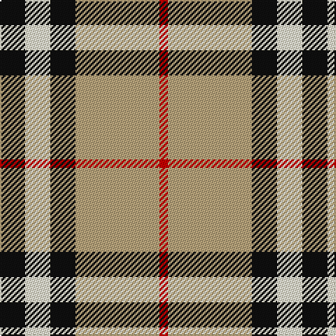

In pattern [KWKYR](/patterns/kwkyr/).

This was sourced from register-of-tartans.  It is a [5 stripes tartan](/stripes/stripes5/).

Original link https://www.tartanregister.gov.uk/tartanDetails.aspx?ref=440

## Attestations

This cloth appears in 2 source records; the oldest owns this page.

- 01/01/1920 — Burberry (Genuine) (register-of-tartans, [record](https://www.tartanregister.gov.uk/tartanDetails.aspx?ref=440))
- 1927 — Burberry (Original) (Corporate) (tartans-authority, [record](http://www.tartansauthority.com/tartan-ferret/display/1239/))

## Thread count
K/18 LY18 K18 LG60 R/6

## Palette
Each colour and its ΔE from the base-6 reference it is a variant of.

| Colour | Shade | Base | ΔE (OKLab) |
|---|---|---|---|
| K | <code style="background-color:#101010;">#101010</code> `#101010` | K <code style="background-color:#000000;">#000000</code> | 0.17 |
| LG | <code style="background-color:#B8A47C;">#B8A47C</code> `#B8A47C` | Y <code style="background-color:#E8C000;">#E8C000</code> | 0.14 |
| LY | <code style="background-color:#F8F4D0;">#F8F4D0</code> `#F8F4D0` | W <code style="background-color:#F4F4F0;">#F4F4F0</code> | 0.04 |
| R | <code style="background-color:#C80000;">#C80000</code> `#C80000` | R <code style="background-color:#C80000;">#C80000</code> | 0.00 |

# Sample pattern

ID: /setts/s5/k18w18k18y60r6-k101010-rc80000-wf8f4d0-yb8a47c/
