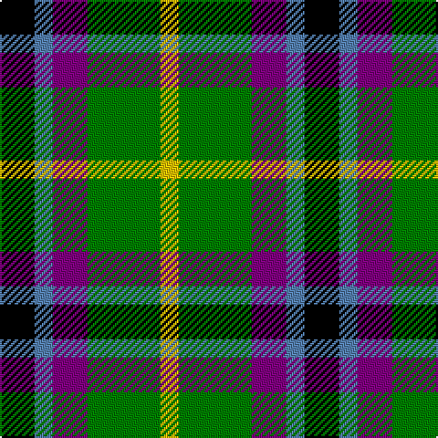

In pattern [KBBGY](/patterns/kbbgy/).

This was sourced from weddslist.  It is a [5 stripes tartan](/stripes/stripes5/).

Original link http://www.weddslist.com/cgi-bin/tartans/pg.pl?source=sts

## Thread count
K/19 B10 P19 G40 Y/10

## Palette
Each colour and its ΔE from the base-6 reference it is a variant of.

| Colour | Shade | Base | ΔE (OKLab) |
|---|---|---|---|
| B | <code style="background-color:#5480B0;">#5480B0</code> `#5480B0` | B <code style="background-color:#2A418A;">#2A418A</code> | 0.19 |
| G | <code style="background-color:#008000;">#008000</code> `#008000` | G <code style="background-color:#006100;">#006100</code> | 0.10 |
| K | <code style="background-color:#000000;">#000000</code> `#000000` | K <code style="background-color:#000000;">#000000</code> | 0.00 |
| P | <code style="background-color:#800080;">#800080</code> `#800080` | B <code style="background-color:#2A418A;">#2A418A</code> | 0.17 |
| Y | <code style="background-color:#F0C000;">#F0C000</code> `#F0C000` | Y <code style="background-color:#F2BF00;">#F2BF00</code> | 0.00 |

# Sample pattern

## Nearest tartans

The nearest existing variants by ΔTartan distance.

1. [Gallowater Old District Tartan Tartan Number: 1025. Earliest known date: 1819 Both 'Old' and 'New' appear in Wilson's 1819 pattern book. See products available Copyright © Blair Urquhart, Comrie, 2015](/setts/s5/k19b10ba19g40y10-b5c8ca8-ba780078-g006818-k101010-ye8c000/) — ΔT 0.75
1. [Davidson of Tulloch](/setts/s5/r4b20k10g24w4-b2c2c80-g289c18-k101010-rc80000-wfcfcfc/) — ΔT 1.07
1. [Gala Water Old](/setts/s5/k19b10ba19g40y10-b3c82af-ba5a008c-g005020-k101010-ye8c000/) — ΔT 1.14
1. [Davidson](/setts/s5/r4b24k12g24w4-b304080-g008000-k000000-rc00000-we0e0e0/) — ΔT 1.15
1. [Russell (Clan)](/setts/s6/k6g20k20r6b16w6-b2c2c80-g006818-k101010-rc80000-wfcfcfc/) — ΔT 1.18
1. [Inspiration](/setts/s5/r10b24y22ba42ya10-b5f749c-ba14283c-rc8002c-yc4bc68-yae0a126/) — ΔT 1.24
1. [Wilson's, No 194](/setts/s6/b6w2k6g10r2k6-b800080-g008000-k000000-rc00000-we0e0e0/) — ΔT 1.29
1. [Wellington, No 122](/setts/s5/k8b6ba22g28y4-b5480b0-ba800080-g008000-k000000-yf0c000/) — ΔT 1.29
1. [Dalmeny](/setts/s5/r8g30k30b30w8-b304080-g008000-k000000-rc00000-we0e0e0/) — ΔT 1.30
1. [Casely](/setts/s6/r16g44k44g8b44ga12-b304080-g008000-ga607030-k000000-rc00000/) — ΔT 1.32

## Neighbour map

Every grey dot is one of 15726 variants placed by the first two principal components of the ΔTartan feature space (44% of its variance). Red is this tartan; blue dots are its nearest — click one to open its page.

<svg viewBox="0 0 640 380" role="img" style="max-width:100%;height:auto;border:1px solid #e0e0e0;border-radius:4px;display:block" xmlns="http://www.w3.org/2000/svg"><image href="/nn/cloud.v1.png" width="640" height="380"/><a href="/setts/s5/k19b10ba19g40y10-b5c8ca8-ba780078-g006818-k101010-ye8c000/"><circle cx="107.0" cy="255.2" r="4" fill="#3465a4"><title>Gallowater Old District Tartan Tartan Number: 1025. Earliest known date: 1819 Both 'Old' and 'New' appear in Wilson's 1819 pattern book. See products available Copyright © Blair Urquhart, Comrie, 2015</title></circle></a><a href="/setts/s5/r4b20k10g24w4-b2c2c80-g289c18-k101010-rc80000-wfcfcfc/"><circle cx="116.7" cy="224.9" r="4" fill="#3465a4"><title>Davidson of Tulloch</title></circle></a><a href="/setts/s5/k19b10ba19g40y10-b3c82af-ba5a008c-g005020-k101010-ye8c000/"><circle cx="111.2" cy="259.8" r="4" fill="#3465a4"><title>Gala Water Old</title></circle></a><a href="/setts/s5/r4b24k12g24w4-b304080-g008000-k000000-rc00000-we0e0e0/"><circle cx="108.0" cy="229.2" r="4" fill="#3465a4"><title>Davidson</title></circle></a><a href="/setts/s6/k6g20k20r6b16w6-b2c2c80-g006818-k101010-rc80000-wfcfcfc/"><circle cx="64.9" cy="257.0" r="4" fill="#3465a4"><title>Russell (Clan)</title></circle></a><a href="/setts/s5/r10b24y22ba42ya10-b5f749c-ba14283c-rc8002c-yc4bc68-yae0a126/"><circle cx="96.7" cy="246.9" r="4" fill="#3465a4"><title>Inspiration</title></circle></a><a href="/setts/s6/b6w2k6g10r2k6-b800080-g008000-k000000-rc00000-we0e0e0/"><circle cx="82.8" cy="238.4" r="4" fill="#3465a4"><title>Wilson's, No 194</title></circle></a><a href="/setts/s5/k8b6ba22g28y4-b5480b0-ba800080-g008000-k000000-yf0c000/"><circle cx="145.6" cy="213.9" r="4" fill="#3465a4"><title>Wellington, No 122</title></circle></a><a href="/setts/s5/r8g30k30b30w8-b304080-g008000-k000000-rc00000-we0e0e0/"><circle cx="33.5" cy="258.8" r="4" fill="#3465a4"><title>Dalmeny</title></circle></a><a href="/setts/s6/r16g44k44g8b44ga12-b304080-g008000-ga607030-k000000-rc00000/"><circle cx="70.1" cy="235.2" r="4" fill="#3465a4"><title>Casely</title></circle></a><circle cx="85.1" cy="246.6" r="5" fill="#c00000"/></svg>

ID: /setts/s5/k19b10ba19g40y10-b5480b0-ba800080-g008000-k000000-yf0c000/
